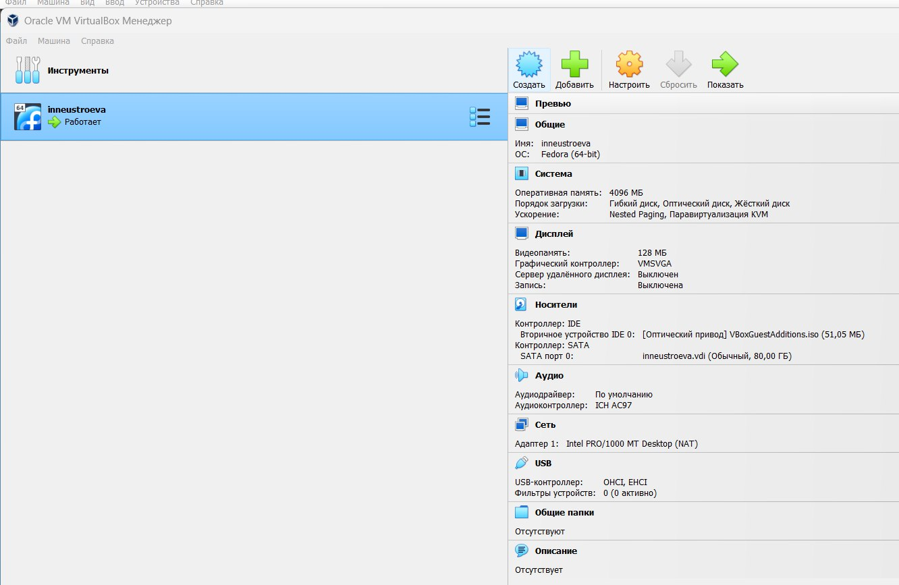
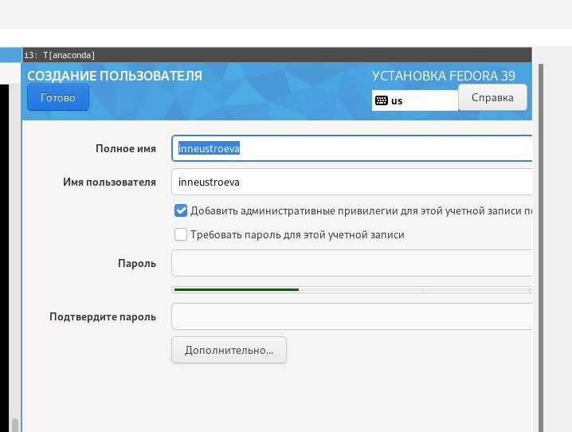
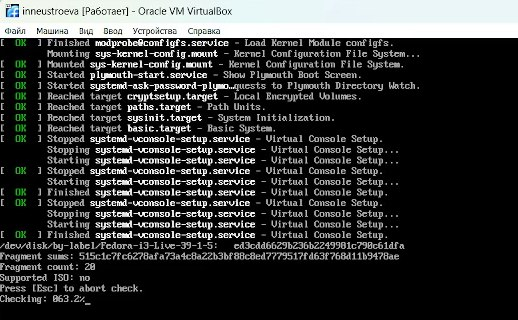
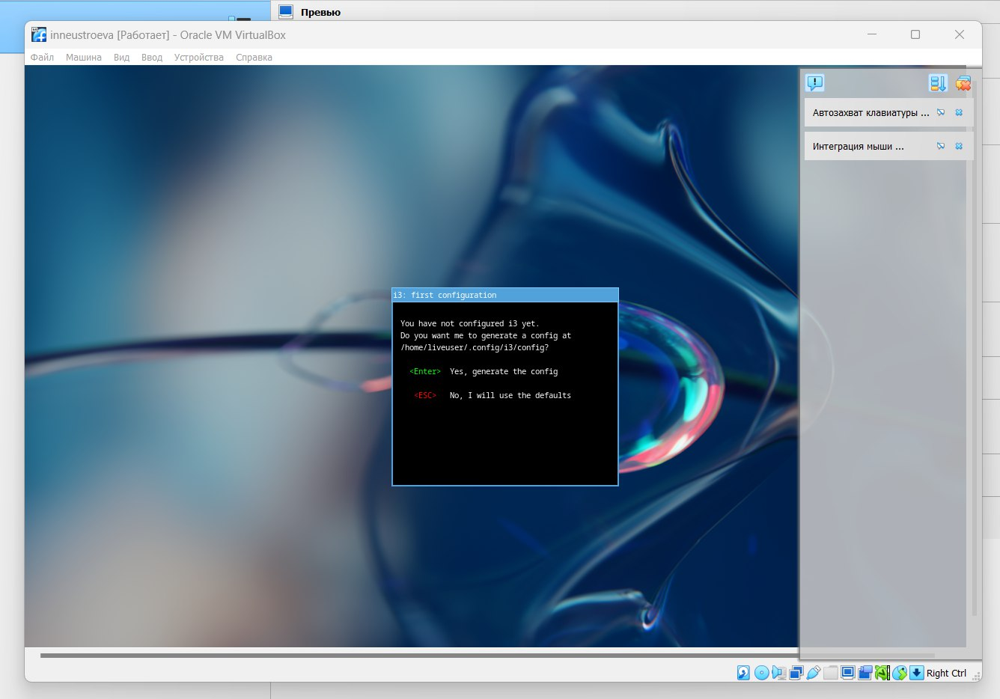

---
## Front matter
lang: ru-RU
title: Презентация по лабораторной работе № 1
subtitle: Установка и конфигурация операционной системы на вертуальную машину
author:
  - Неустроева И.Н.
institute:
  - Российский университет дружбы народов, Москва, Россия
  - Объединённый институт ядерных исследований, Дубна, Россия
date: 24 февраля 2024

## i18n babel
babel-lang: russian
babel-otherlangs: english

## Formatting pdf
toc: false
toc-title: Содержание
slide_level: 2
aspectratio: 169
section-titles: true
theme: metropolis
header-includes:
 - \metroset{progressbar=frametitle,sectionpage=progressbar,numbering=fraction}
 - '\makeatletter'
 - '\beamer@ignorenonframefalse'
 - '\makeatother'

## Fonts
mainfont: PT Serif
romanfont: PT Serif
sansfont: PT Sans
monofont: PT Mono
mainfontoptions: Ligatures=TeX
romanfontoptions: Ligatures=TeX
sansfontoptions: Ligatures=TeX,Scale=MatchLowercase
monofontoptions: Scale=MatchLowercase,Scale=0.9
---

# Информация

## Докладчик

:::::::::::::: {.columns align=center}
::: {.column width="70%"}

  * Неустроева Ирина Николаевна 
  * студентка группы НБИ-02-23
  * Факультет физико-математических и естественных наук
  * Российский университет дружбы народов
  * <https://github.com/inneustroeva>

:::
::: {.column width="30%"}

:::
::::::::::::::

# Вводная часть

## Актуальность

Навык установки операционных систем на виртуальную машину является очень полезным и актуальным в работе. 

## Объект и предмет исследования

Операционная система Linux Fedora

## Цели и задачи

1. Установить ОС Linux Fedora на виртуальную машину.
2. Произвести минимальную настройку системы.
3. Выполнить задания.
4. Ответить на вопросы.

## Материалы и методы

- Процессор `pandoc` для входного формата Markdown
- Результирующие форматы
	- `pdf`
	- `html`
- Автоматизация процесса создания: `Makefile`

# Элементы презентации

## Содержание исследования

Создаю и настраиваю виртуальную машину. В качестве имени пишу: inneustroeva, Тип: Linux(Fedora ), Объем памяти 4096, Создаю новый вируальный жесткий диск, Тип файла: VDI, Динамический виртуальный жесткий диск и выделим под него 80 гигабайт.Машину создала, после добавила образ диска Федоры.

{#fig:001 width=70%}

Устанавливаю имя для пользователя root и пароль  

{#fig:002 width=70%}

Запускаю процесс установки Федоры
{#fig:003 width=70%}

Так выглядит интерфейс Linux(Fedora )

{#fig:004 width=70%}

## Результаты

* Попрактиковалась в установке ОС на виртуальную машину;
* Вспомнила основные команды Linux 
* Попрактиковалась в создании и компиляции шаблонов в формате markdown

## Итоговый слайд

Выполнение лабораторной работы было довольно сложным, возникало много вопросов, но тем не менее у меня получилось это сделать, благодаря помощи преподавателей. Я вспомнила навыки работы в терминале и поработала в markdown, что было полезно и познавательно для меня.

:::

