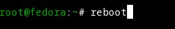

---
## Front matter
title: "Отчет по Лабораторной работе № 1"
subtitle: "Дисциплина: Операционные системы"
author: "Неустроева Ирина Николаевна"

## Generic otions
lang: ru-RU
toc-title: "Содержание"

## Bibliography
bibliography: bib/cite.bib
csl: pandoc/csl/gost-r-7-0-5-2008-numeric.csl

## Pdf output format
toc: true # Table of contents
toc-depth: 2
lof: true # List of figures
lot: true # List of tables
fontsize: 12pt
linestretch: 1.5
papersize: a4
documentclass: scrreprt
## I18n polyglossia
polyglossia-lang:
  name: russian
  options:
	- spelling=modern
	- babelshorthands=true
polyglossia-otherlangs:
  name: english
## I18n babel
babel-lang: russian
babel-otherlangs: english
## Fonts
mainfont: PT Serif
romanfont: PT Serif
sansfont: PT Sans
monofont: PT Mono
mainfontoptions: Ligatures=TeX
romanfontoptions: Ligatures=TeX
sansfontoptions: Ligatures=TeX,Scale=MatchLowercase
monofontoptions: Scale=MatchLowercase,Scale=0.9
## Biblatex
biblatex: true
biblio-style: "gost-numeric"
biblatexoptions:
  - parentracker=true
  - backend=biber
  - hyperref=auto
  - language=auto
  - autolang=other*
  - citestyle=gost-numeric
## Pandoc-crossref LaTeX customization
figureTitle: "Рис."
tableTitle: "Таблица"
listingTitle: "Листинг"
lofTitle: "Список иллюстраций"
lotTitle: "Список таблиц"
lolTitle: "Листинги"
## Misc options
indent: true
header-includes:
  - \usepackage{indentfirst}
  - \usepackage{float} # keep figures where there are in the text
  - \floatplacement{figure}{H} # keep figures where there are in the text
---

# Цель работы

    Целью данной работы является приобретение практических навыков установки операционной системы на виртуальную машину, настройки минимально необходимых для дальнейшей работы сервисов.

# Задание
	
    Установить на VirtualBox операционную систему Linux (дистрибутив Fedora).

# Выполнение лабораторной работы

*1*
Для начала перехожу по ссылке из ТУИС для скачивания VirtualBox (рис. [-@fig:001]).

{#fig:001 width=70%}

*2*
Скачиваю Linux (дистрибутив Fedora) (рис. [-@fig:002]).

{#fig:002 width=70%}

*3*
Открываю VirtualBox и начинаем создавать машину (рис. [-@fig:003]).

{#fig:003 width=70%}

*4*
Создаю и настраиваю виртуальную машину. В качестве имени пишу: inneustroeva, Тип: Linux(Fedora ), Объем памяти 4096, Создаю новый вируальный жесткий диск, Тип файла: VDI, Динамический виртуальный жесткий диск и выделим под него 80 гигабайт.Машину создала, после добавила образ Федоры  . (рис. [-@fig:004]).

{#fig:004 width=70%}

*5*
Запускаю процесс установки Федоры (рис. [-@fig:005]).

{#fig:005 width=70%}

*6*
Нажмимаю Enter, чтобы выбрать в качестве модификатора клавишу Win (рис. [-@fig:006]).

{#fig:006 width=70%}

*7*
В терминале запускаю liveinst (рис. [-@fig:007]).

{#fig:007 width=70%}

*8*
Выбираю язык интерфейса и перехожу к настройкам установки операционной системы (рис. [-@fig:008]).

{#fig:008 width=70%}

*9*
Устанавливаю пароль для пользователя root (рис. [-@fig:009]).

{#fig:009 width=70%}

*10*
Устанавливаю имя для пользователя root (рис. [-@fig:010]).

{#fig:010 width=70%}

*11*
Дальше устанавливаю программное обеспечение (рис. [-@fig:011]).

{#fig:011 width=70%}

*12*
В VirtualBox отключаю носитель информации с образом (рис. [-@fig:012]).

{#fig:012 width=70%}

*13*
Вхожу в ОС под заданной учётной записью. Нажимаю комбинацию Win+Enter для запуска терминала. Переключаюсь на роль супер-пользователя:sudo -i (рис. [-@fig:013]).

{#fig:013 width=70%}

*14*
Обновляю все пакеты командой: dnf -y update (рис. [-@fig:014]).

{#fig:014 width=70%}

*15*
Устанавливаю обновление программы для удобства работы в консоли: dnf -y install tmux mc (рис. [-@fig:015]).

{#fig:015 width=70%}

*16*
Устанавливаю программного обеспечения:dnf install dnf-automatic (рис. [-@fig:016]).

{#fig:016 width=70%}

*17*
Устанавливаю таймер, который будет обновлять систему: systemctl enable --now dnf-automatic.timer (рис. [-@fig:017]).

{#fig:017 width=70%}

*18*
В файле /etc/selinux/config заменяю значение SELINUX=enforcing на значение SELINUX=permissive (рис. [-@fig:018]).

{#fig:018 width=70%}

*19*
Перегружаю виртуальную машину: reboot (рис. [-@fig:019]).

{#fig:019 width=70%}

*20*
Вошла в ОС под заданной учётной записью. Нажала комбинацию Win+Enter для запуска терминала. Запустила терминальный мультиплексор tmux: tmux. Переключилась на роль супер-пользователя: sudo -i. Установила средства разработки: dnf -y group install "Development Tools". Установила пакет DKMS: dnf -y install dkms (рис. [-@fig:020]).

{#fig:020 width=70%}

*21*
В меню виртуальной машины подключила образ диска дополнений гостевой ОС. Подмонтировала диск: ```mount /dev/sr0 /media```  (рис. [-@fig:021]).

{#fig:021 width=70%}
*22*
Установила драйвера:/media/VBoxLinuxAdditions.run Перегрузила виртуальную машину:reboot (рис. [-@fig:022]).

{#fig:022 width=70%}

*23*
Открыла терминал в режиме супер-пользователя,отредактировала конфигурационный файл /etc/X11/xorg.conf.d/00-keyboard.conf и перезагрузила машину (рис. [-@fig:023]).

{#fig:023 width=70%}

*24*
Открыла терминал в режиме супер-пользователя. Установила имя хоста: hostnamectl set-hostname username (рис. [-@fig:024]).

{#fig:024 width=70%}

*25*
Установила pandoc с помощью менеджера пакетов: dnf -y install pandoc (рис. [-@fig:025]).

{#fig:025 width=70%}

*26*
Установила pandoc и pandoc-crossref вручную и поместила их в каталог /usr/local/bin (рис. [-@fig:026]).

{#fig:026 width=70%}

*27*
Установила дистрибутив TeXlive: dnf -y install texlive-scheme-full (рис. [-@fig:027]).

{#fig:027 width=70%}

*28*
Выполняю домашнее задание и ищу Модель процессора (CPU0): dmesg | grep -i "то, что ищем"  (рис. [-@fig:028]).

{#fig:028 width=70%}
 
*29*
Выполняю домашнее задание и ищу Объём доступной оперативной памяти (Memory available): dmesg | grep -i "то, что ищем"  (рис. [-@fig:029]).

{#fig:029 width=70%}
 
*30*
Выполняю домашнее задание и ищу Тип обнаруженного гипервизора (Hypervisor detected): dmesg | grep -i "то, что ищем"  (рис. [-@fig:030]).

{#fig:030 width=70%}
 
*31*
Выполняю домашнее задание и ищу Версия ядра Linux (Linux version): dmesg | grep -i "то, что ищем"  (рис. [-@fig:031]).

{#fig:031 width=70%} 
 
*31*
Выполняю домашнее задание и ищу Частота процессора (Detected Mhz processor): dmesg | grep -i "то, что ищем"  (рис. [-@fig:032]).

{#fig:032 width=70%} 
  
 
 
 
#  Вывод 
    Я приобрела практические навыки в установки операционной системы на виртуальную машину и выполнила настройки минимально необходимого для дальнейшей работы сервисов. Вспомнила необходимые команды при работе в терминале. 
  
# Ответы на контрольные вопросы
    1) Учетная запись пользоаптеля содержит  имя и пароль. 
    2) Команды в терминале:для получения справки по команде: info; для перемещения по файловой системе: mv; для просмотра содержимого каталога: ls; для определения объёма каталога:du ; для создания / удаления каталогов / файлов: mkdir; для задания определённых прав на файл / каталог: chmod; для просмотра истории команд: History.
    3)Файловая система (ФС) - предоставляет пользователям (и процессам) ресурсы долговременной памяти компьютера. Операционная система Windows может быть установлена на файловую систему NTFS, поэтому обычно у пользователей не возникает вопросов какую ФС лучше использовать. ОС Linux имеет значительные отличия. Чтобы на каждом разделе можно было работать с файлами и каталогами, необходима файловая система. Кроме записи содержимого файлов на диск нужно еще хранить данные о папках, имена файлов, их размер, адрес на жестком диске, атрибуты доступа. Всем этим занимается файловая система. От файловой системы зависит очень многое: скорость работы с файлами, скорость записи и даже размер файлов. Также от стабильности файловой системы будет зависеть сохранность файлов. Файловые системы в Linux используются не только для работы с файлами на диске, но и для хранения данных в оперативной памяти или доступа к конфигурации ядра во время работы системы.основные файловые системы, используемые для ОС Linux. Ext2; Ext3; Ext4; JFS; ReiserFS; XFS; Btrfs; ZFS;
    4)Чтобы посмотреть, какие файловые системы подмонтированы в ОС нужно воспользоваться командой:mount
    5)Чтобы удалить зависший процесс: kill
  
  
    

::: {#refs} 
:::


