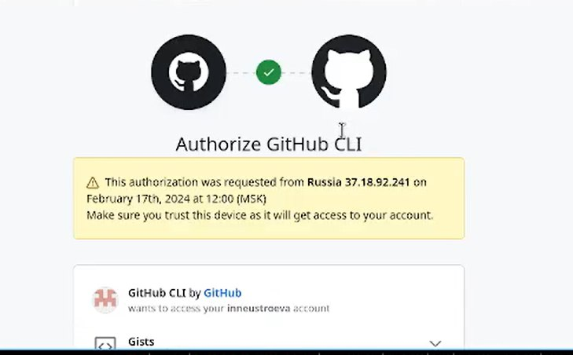
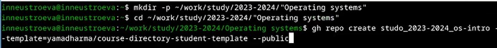

---
## Front matter
lang: ru-RU
title: Лабораторная работа 2
subtitle: 
author:
  - Неустроева.И.Н.
institute:
  - Российский университет дружбы народов, Москва, Россия
date: 25.02.24

## i18n babel
babel-lang: russian
babel-otherlangs: english

## Formatting pdf
toc: false
toc-title: Содержание
slide_level: 2
aspectratio: 169
section-titles: true
theme: metropolis
header-includes:
 - \metroset{progressbar=frametitle,sectionpage=progressbar,numbering=fraction}
 - '\makeatletter'
 - '\beamer@ignorenonframefalse'
 - '\makeatother'

## Fonts
mainfont: PT Serif
romanfont: PT Serif
sansfont: PT Sans
monofont: PT Mono
mainfontoptions: Ligatures=TeX
romanfontoptions: Ligatures=TeX
sansfontoptions: Ligatures=TeX,Scale=MatchLowercase
monofontoptions: Scale=MatchLowercase,Scale=0.9

---

# Информация

## Докладчик

:::::::::::::: {.columns align=center}
::: {.column width="70%"}

  * Неустроева Ирина Николаевна
  * студентка группы НБИ -02-23 
  * Российский университет дружбы народов 

:::
::: {.column width="30%"}

:::
::::::::::::::

# Вводная часть

## Актуальность

- Навыки работы с системой контроля версией гит очень важны для программиста или любого другого работника информационной сферы.
- Система контроля версией гит широко применяются в разработке программ и крупных проектов.

## Цели и задачи

- Изучить идеалогию и применение средств контроля версией. Освоить умение по работе с гит
- Выполнить задания и настроить каталог курса.

## Материалы и методы

- Процессор `pandoc` для входного формата Markdown
- Результирующие форматы
	- `pdf`
	- `html`
- Автоматизация процесса создания: `Makefile`

# Создание презентации

## Регистрация на гитхабе 

Для начала я установида гит. Также зарегистрировалась на сайте, создав учетную запись на гитхабе и заполнив основную информацию 

## Базовая настройка 

Затем я задала гиту необходимые параметры, сгенерировала ключи ssh и gpg и связала свой аккаунт на гитхабе с локальным репозиторием

{#fig:011 width=70%}

## Создание каталога курса

Дале необходимо создали репозиторий курса на основе шаблона, как указано в соглашении об именовании, связала с локальным репозиторием.

{#fig:012 width=70%}

Теперь все лабораторные работы будут храниться там.

## Итог работы

Теперь я смогу добалять все измененные файлы и каталоги в свой репозиторий на гитхаб посредством локального репозитория. Это безусловно очень удобно.

## Результаты

- Я научилась работать с системой контроля версий гит и освоила умения по работе с git, сделала базовую настройку.

## Итоговый слайд
- Система контроля версией - безусловно удобная вещь. Она позволяет организовать данные в определенную структуру и делать откат к более ранним версиям, не удаляя при этом все остальные.

