---
## Front matter
title: "Отчёта по лабораторной работе № 2"
subtitle: "Дисциплина: Операционные системы"
author: "Неустроева Ирина Николаевна"

## Generic otions
lang: ru-RU
toc-title: "Содержание"

## Bibliography
bibliography: bib/cite.bib
csl: pandoc/csl/gost-r-7-0-5-2008-numeric.csl

## Pdf output format
toc: true # Table of contents
toc-depth: 2
lof: true # List of figures
lot: true # List of tables
fontsize: 12pt
linestretch: 1.5
papersize: a4
documentclass: scrreprt
## I18n polyglossia
polyglossia-lang:
  name: russian
  options:
	- spelling=modern
	- babelshorthands=true
polyglossia-otherlangs:
  name: english
## I18n babel
babel-lang: russian
babel-otherlangs: english
## Fonts
mainfont: PT Serif
romanfont: PT Serif
sansfont: PT Sans
monofont: PT Mono
mainfontoptions: Ligatures=TeX
romanfontoptions: Ligatures=TeX
sansfontoptions: Ligatures=TeX,Scale=MatchLowercase
monofontoptions: Scale=MatchLowercase,Scale=0.9
## Biblatex
biblatex: true
biblio-style: "gost-numeric"
biblatexoptions:
  - parentracker=true
  - backend=biber
  - hyperref=auto
  - language=auto
  - autolang=other*
  - citestyle=gost-numeric
## Pandoc-crossref LaTeX customization
figureTitle: "Рис."
tableTitle: "Таблица"
listingTitle: "Листинг"
lofTitle: "Список иллюстраций"
lotTitle: "Список таблиц"
lolTitle: "Листинги"
## Misc options
indent: true
header-includes:
  - \usepackage{indentfirst}
  - \usepackage{float} # keep figures where there are in the text
  - \floatplacement{figure}{H} # keep figures where there are in the text
---

# Цель работы

Изучить идеологию и применение средств контроля версий и освоить умения по работе с git.

# Задание

1. Установка программного обеспечения.
2. Сделать базовую настройку git.
3. Создать ключи ssh и pgp.
4. Авторизоваться в GitHub.
5. Настроить каталог курса.
6. Удалить лишние файлы и отправить файлы на сервер.

# Теоретическое введение

	Системы контроля версий (Version Control System, VCS) применяются при работе нескольких человек над одним проектом. Обычно основное дерево проекта хранится в локальном или удалённом репозитории, к которому настроен доступ для участников проекта. При внесении изменений в содержание проекта система контроля версий позволяет их фиксировать, совмещать изменения, произведённые разными участниками проекта, производить откат к любой более ранней версии проекта, если это требуется.

	В классических системах контроля версий используется централизованная модель, предполагающая наличие единого репозитория для хранения файлов. Выполнение большинства функций по управлению версиями осуществляется специальным сервером. Участник проекта (пользователь) перед началом работы посредством определённых команд получает нужную ему версию файлов. После внесения изменений, пользователь размещает новую версию в хранилище. При этом предыдущие версии не удаляются из центрального хранилища и к ним можно вернуться в любой момент. Сервер может сохранять не полную версию изменённых файлов, а производить так называемую дельта-компрессию — сохранять только изменения между последовательными версиями, что позволяет уменьшить объём хранимых данных.

	Системы контроля версий поддерживают возможность отслеживания и разрешения конфликтов, которые могут возникнуть при работе нескольких человек над одним файлом. Можно объединить (слить) изменения, сделанные разными участниками (автоматически или вручную), вручную выбрать нужную версию, отменить изменения вовсе или заблокировать файлы для изменения. В зависимости от настроек блокировка не позволяет другим пользователям получить рабочую копию или препятствует изменению рабочей копии файла средствами файловой системы ОС, обеспечивая таким образом, привилегированный доступ только одному пользователю, работающему с файлом.

	Системы контроля версий также могут обеспечивать дополнительные, более гибкие функциональные возможности. Например, они могут поддерживать работу с несколькими версиями одного файла, сохраняя общую историю изменений до точки ветвления версий и собственные истории изменений каждой ветви. Кроме того, обычно доступна информация о том, кто из участников, когда и какие изменения вносил. Обычно такого рода информация хранится в журнале изменений, доступ к которому можно ограничить.

В отличие от классических, в распределённых системах контроля версий центральный репозиторий не является обязательным.

Среди классических VCS наиболее известны CVS, Subversion, а среди распределённых — Git, Bazaar, Mercurial. Принципы их работы схожи, отличаются они в основном синтаксисом используемых в работе команд.

# Выполнение лабораторной работы

* **Установка программного обеспечения**

При помощи команды: dnf install git,  устанавливаем git (рис. [-@fig:001]).

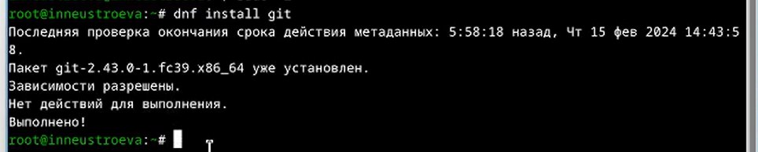{#fig:001 width=70%}

При помощи команды: dnf install gh, устанавливаем gh (рис. [-@fig:002]).

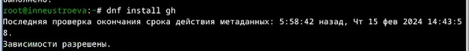{#fig:002 width=70%}

* **Базовая настройка git**

Задаем имя и email владельца репозитория, настраиваем utf-8 в выводе сообщений git, задаем  имя начальной ветки и параметры (рис. [-@fig:003]).

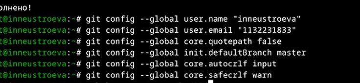{#fig:003 width=70%}

* **Создать ключи ssh и pgp**

Создали по алгоритму rsa с ключём размером 4096 бит командой: ssh-keygen -t rsa -b 4096 (рис. [-@fig:004]).

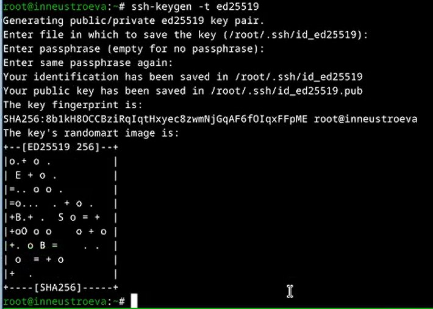{#fig:004 width=70%}

Создали по алгоритму ed25519 командой: ssh-keygen -t ed25519 (рис. [-@fig:005]).

{#fig:005 width=70%}

Сгенерировали ключ командой: gpg --full-generate-key и из предложенных опций выбирали: тип RSA and RSA; размер 4096; срок действия 0(срок действия не истекает никогда). Так же GPG запросил Имя и Адрес электронной почты. (рис. [-@fig:006])

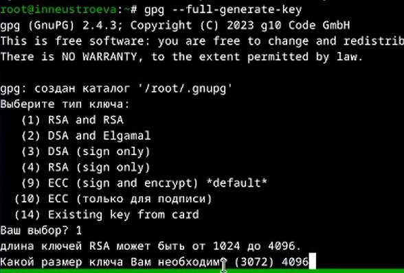{#fig:006 width=70%}

Далее необходимо настроить учетную запись  на https://github.com и заполнить основные данные. Я это уже сделала в прошлом семестре.

* **Добавление PGP ключа в GitHub**

Выводим список ключей и копируем отпечаток приватного ключа командой: gpg --list-secret-keys --keyid-format LONG. Далее скопировали наш сгенерированный PGP ключ в буфер обмена командой:gpg --armor --export 3С6993D86C710331 | xclip -sel clip (рис. [-@fig:007]).

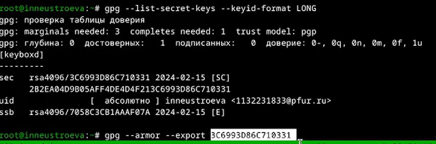{#fig:007 width=70%}

Переходим в настройки GitHub и вставляем полученный ключ в поле ввода (рис. [-@fig:008]). 

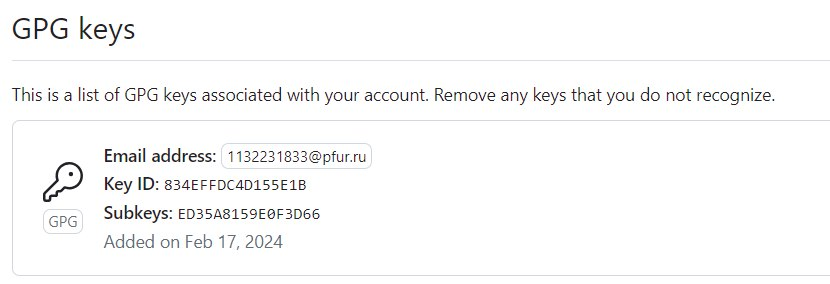{#fig:008 width=70%}

* **Настройка автоматических подписей коммитов git**

Далее используя введёный email, указывю Git и применяю его при подписи коммитов (рис. [-@fig:009]). 

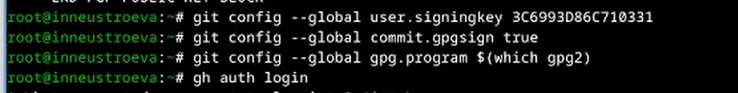{#fig:009 width=70%}

Потом нам необходимо авторизоваться командой:gh auth login, отвечаем на вопросы Утилиты (рис. [-@fig:010]). 

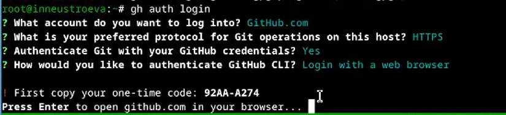{#fig:010 width=70%}

Авторизация прошла успешно (рис. [-@fig:011]). 

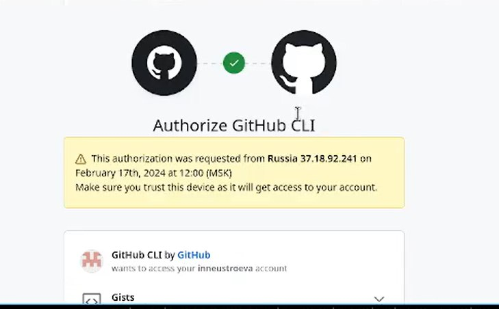{#fig:011 width=70%}

* **Сознание Шаблон для рабочего пространства**

Далее нам необходимо создать репозиторий курса на основе шаблона (рис. [-@fig:012]). 

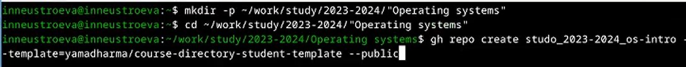{#fig:012 width=70%}

С помощью команды: git clone --recursive git@github.com: inneustroeva/study_2022-2023_os-intro.git os-intro, клонируем нужный нам шаблон из гитхаба (рис. [-@fig:013]). 

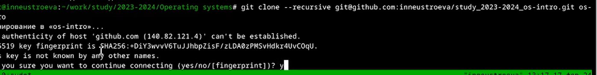{#fig:013 width=70%}.

Переходим в каталог курса,удаляем лишние файлы, создаем необходимые каталоги (рис. [-@fig:014]). 

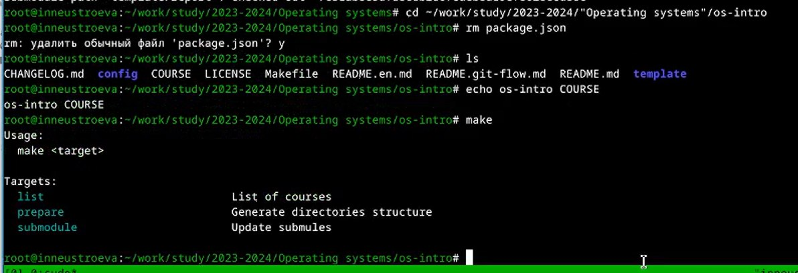{#fig:014 width=70%}.

Проверяем создание необходимых каталогов командой: ls. И начинаю отправлять файлы на гитхаб командой: git add . (рис. [-@fig:015]). 

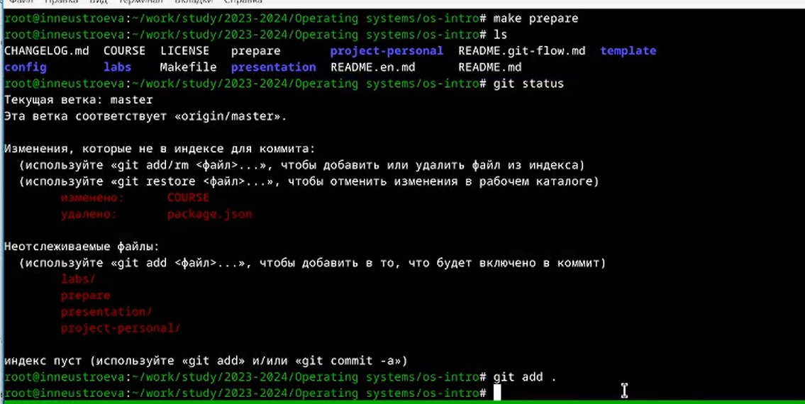{#fig:015 width=70%}.

Пишем команду: git commit -am 'feat(main): make course structure' (рис. [-@fig:016]). 

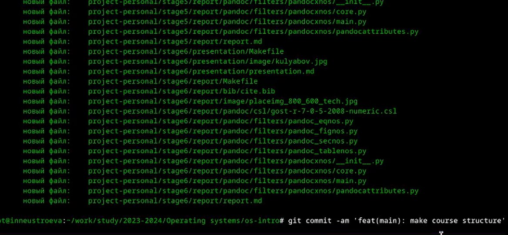{#fig:016 width=70%}.

С помощью команды: git push отправляем файлы на гитхаб (рис. [-@fig:017]). 

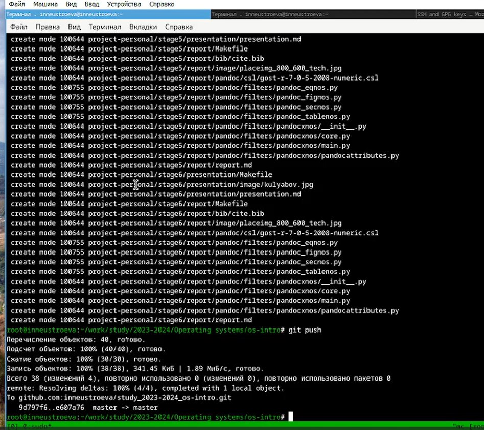{#fig:017 width=70%}.

Заходим на гитхаб и проверяем наши файлы (рис. [-@fig:018]). 

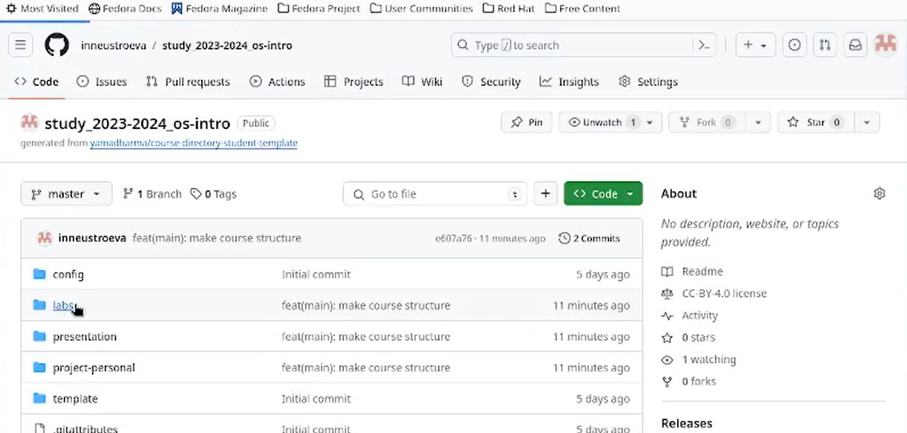{#fig:018 width=70%}.

# Выводы

Я научилась работать с системой контроля версий гит и освоить умения по работе с git, сделала базовую настройку.

# Ответы на контрольные вопросы
1 Что такое системы контроля версий (VCS) и для решения каких задач они
предназначаются? Это программное обеспечение для облегчения работы с
изменяющейся информацией. VCS позволяет хранить несколько версий одного
и того же документа, при необходимости возвращаться к более ранним версиям,
определять, кто и когда сделал то или иное изменение, и многое другое.

2 Объясните следующие понятия VCS и их отношения: хранилище, commit, ис-
тория, рабочая копия. Хранилище (repository), или репозитарий, — место хра-
нения всех версий и служебной информации. Commit («[трудовой] вклад», не
переводится) — синоним версии; процесс создания новой версии. История –
место, где сохраняются все коммиты, по которым можно посмотреть данные о
коммитах. Рабочая копия – текущее состояние файлов проекта, основанное на
версии, загруженной из хранилища.

3 Что представляют собой и чем отличаются централизованные и децентрализо-
ванные VCS? Приведите примеры VCS каждого вида. Централизованные VCS:
одно основное хранилище всего проекта и каждый пользователь копирует се-
бе необходимые ему файлы из этого репозитория, изменяет и, затем, добавляет
свои изменения обратно. Децентрализованные VCS: у каждого пользователя
свой вариант (возможно не один) репозитория.

4 Опишите действия с VCS при единоличной работе с хранилищем. Для начала создаём удаленный репозиторий и подключаем его к основному. Затем вносим изменения в проект посредством локального репозитория и отправляем изменения на сервер.

5 Опишите порядок работы с общим хранилищем VCS.

6 Каковы основные задачи, решаемые инструментальным средством git? Git —
это система управления версиями.У Git две основных задачи: первая —хранить информацию о всех изменениях в вашем коде, начиная с самой первой
строчки, а вторая — обеспечение удобства командной работы над кодом.

7 Назовите и дайте краткую характеристику командам git. git –version (Провер-
ка версии Git) git init (Инициализировать ваш текущий рабочий каталог как
Git-репозиторий) git clone https://www.github.com/username/repo-name (Ско-
пировать существующий удаленный Git-репозиторий) git remote (Просмотреть
список текущих удалённых репозиториев Git) git remote -v (Для более подроб-
ного вывода) git add my_script.py (Можете указать в команде конкретный
файл). git add . (Позволяет охватить все файлы в текущем каталоге, включая
файлы, чье имя начинается с точки) git commit -am “Commit message” (Вы
можете сжать все индексированные файлы и отправить коммит). git branch
(Просмотреть список текущих веток можно с помощью команды branch) git
–help (Чтобы узнать больше обо всех доступных параметрах и командах) git
push origin master (Передать локальные коммиты в ветку удаленного репози-
тория).

8 Приведите примеры использования при работе с локальным и удалённым
репозиториями.

9 Что такое и зачем могут быть нужны ветви (branches)? Ветки нужны, чтобы
несколько программистов могли вести работу над одним и тем же проектом
или даже файлом одновременно, при этом не мешая друг другу. Кроме того,
ветки используются для тестирования экспериментальных функций: чтобы не
повредить основному проекту, создается новая ветка специально для экспери-
ментов.
1
0 Как и зачем можно игнорировать некоторые файлы при commit? Игнорируемые
файлы — это, как правило, артефакты сборки и файлы, генерируемые машиной
из исходных файлов в вашем репозитории, либо файлы, которые по какой-либо
иной причине не должны попадать в коммиты.

::: {#refs}
:::
