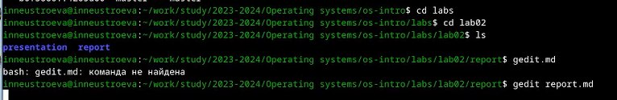
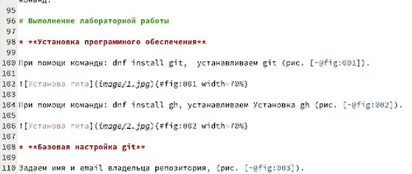
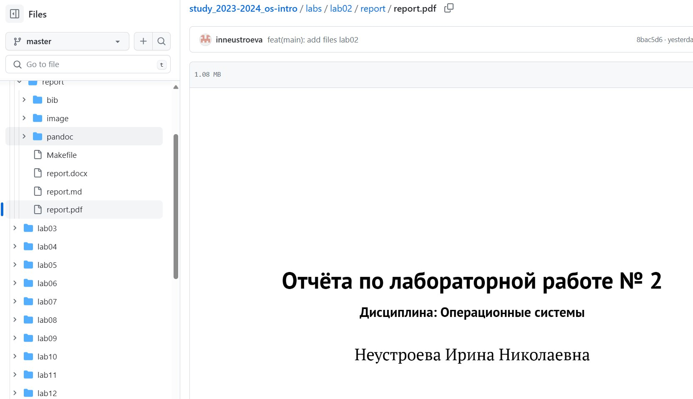

---
## Front matter
lang: ru-RU
title: Презентация по лабораторной работе № 3
subtitle: Язык разметки Markdown
author:
  - Неустроева И.Н.
institute:
  - Российский университет дружбы народов, Москва, Россия
date: 29 февраля 2024

## i18n babel
babel-lang: russian
babel-otherlangs: english

## Formatting pdf
toc: false
toc-title: Содержание
slide_level: 2
aspectratio: 169
section-titles: true
theme: metropolis
header-includes:
 - \metroset{progressbar=frametitle,sectionpage=progressbar,numbering=fraction}
 - '\makeatletter'
 - '\beamer@ignorenonframefalse'
 - '\makeatother'
 
 ## Fonts
mainfont: PT Serif
romanfont: PT Serif
sansfont: PT Sans
monofont: PT Mono
mainfontoptions: Ligatures=TeX
romanfontoptions: Ligatures=TeX
sansfontoptions: Ligatures=TeX,Scale=MatchLowercase
monofontoptions: Scale=MatchLowercase,Scale=0.9
 
---

# Информация

## Докладчик

:::::::::::::: {.columns align=center}
::: {.column width="70%"}

  * Неустроева Ирина Николаевна
  * студентка группы НБИ 02-23
  * Российский университет дружбы народов
  * <https://inneustroeva.github.io/ru/>

:::

:::
::::::::::::::

# Вводная часть

## Актуальность

- Язык маркдаун - интересная тема для изуучения, поскольку включает в себя множество особенностей

## Объект и предмет исследования

- Презентация как текст
- Программное обеспечение для создания презентаций
- Входные и выходные форматы презентаций

## Цели и задачи

- Научиться оформлять отчёты и презентации с помощью легковесного языка разметки Markdown
- Создать презентацию в Markdown, обрабатывать файлы в Markdown
- Подготовить отчет по лабораторной работе номер 2 в формате Markdown.
## Материалы и методы

- Процессор `pandoc` для входного формата Markdown
- Результирующие форматы
	- `pdf`
	- `html`
- Автоматизация процесса создания: `Makefile`

# Основная часть 

## Начало работы

Задание лабораторной работы № 3 было подготовить отчет по лабораторной работе номер 2 в формате Markdown.

Для начала я перешла в каталог с лабораторной работой № 2, после с помощью команды: gedit report.md открыла шаблон в Markdown.

## Процесс подготовки отчета

Далее я внесла в шаблон изменения и заполнила данные о себе: ФИО, название дисциплины 

Затем приступила к отчету по выполненным в ходе лабораторной работы действий и их описанию 

## Компиляция файлов в .doc .pdf

После завершения выполнения отчета я ввожу команду "make" и благодаря тому, что в папке репорт есть Makefile, можем скомпилировать отчет в формате .md .doc .pdf 

## Отправление файлов на гитхаб

Затем отправила полученные файлы на гитхаб посредством локального репозитория 

## Результаты

- В ходе выполнения лабораторной работы № 3 я научилась оформлять файлы в формате Markdown, познакомилась с синтаксисом этого языка и узнала как компилировать файлы .md в .doc .pdf

## Итоговый слайд

- Мне понравилось работать с языком разметки Markdown, изучать его синтаксис. Я узнала много нового и полезного.

:::

