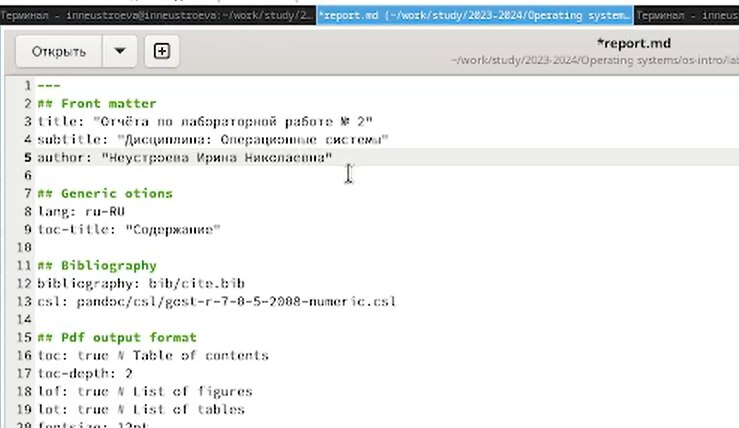
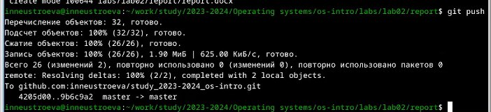

---
## Front matter
title: "Отчет по лабораторной работе № 3"
subtitle: "Дисциплина: Операционные системы"
author: "Неустроева Ирина Николаевна"

## Generic otions
lang: ru-RU
toc-title: "Содержание"

## Bibliography
bibliography: bib/cite.bib
csl: pandoc/csl/gost-r-7-0-5-2008-numeric.csl

## Pdf output format
toc: true # Table of contents
toc-depth: 2
lof: true # List of figures
lot: true # List of tables
fontsize: 12pt
linestretch: 1.5
papersize: a4
documentclass: scrreprt
## I18n polyglossia
polyglossia-lang:
  name: russian
  options:
	- spelling=modern
	- babelshorthands=true
polyglossia-otherlangs:
  name: english
## I18n babel
babel-lang: russian
babel-otherlangs: english
## Fonts
mainfont: PT Serif
romanfont: PT Serif
sansfont: PT Sans
monofont: PT Mono
mainfontoptions: Ligatures=TeX
romanfontoptions: Ligatures=TeX
sansfontoptions: Ligatures=TeX,Scale=MatchLowercase
monofontoptions: Scale=MatchLowercase,Scale=0.9
## Biblatex
biblatex: true
biblio-style: "gost-numeric"
biblatexoptions:
  - parentracker=true
  - backend=biber
  - hyperref=auto
  - language=auto
  - autolang=other*
  - citestyle=gost-numeric
## Pandoc-crossref LaTeX customization
figureTitle: "Рис."
tableTitle: "Таблица"
listingTitle: "Листинг"
lofTitle: "Список иллюстраций"
lotTitle: "Список таблиц"
lolTitle: "Листинги"
## Misc options
indent: true
header-includes:
  - \usepackage{indentfirst}
  - \usepackage{float} # keep figures where there are in the text
  - \floatplacement{figure}{H} # keep figures where there are in the text
---

# Цель работы

Научиться оформлять отчёты с помощью легковесного языка разметки Markdown

# Задание
   * Ознакомиться с синтаксисом языка разметки Markdown.
   * Сделать отчет по лабораторной работе номер 2 в формате Markdown.
   * Узнать как компилируются отчеты в различных форматах из файла с расширением .md
   * Прикрепить отчеты по лабораторной работе №2 и №3 в форматах .md .doc .pdf ( сделанные из .md)
   
# Теоретическое введение

- Оформление элементов текста в Markdown:

1. Заголовки: 

    Чтобы создать заголовок, используйте знак ( # ), например:
    
    1 # This is heading 1
    2 ## This is heading 2
    3 ### This is heading 3
    4 #### This is heading 

2. Полужирное начертание: 
    
    Чтобы задать для текста полужирное начертание, заключите его в двойные звездочки:
    
    1 This text is **bold**.
   
3. Курсивное начертание:
    
    Чтобы задать для текста курсивное начертание, заключите его в одинарные звездочки:
    
    1 This text is *italic*.

4. Полужирное и курсивное начертание: 
    
    Чтобы задать для текста полужирное и курсивное начертание, заключите его в тройные звездочки:
    
    1 This is text is both ***bold and italic***.

5. Блоки цитирования создаются с помощью символа >:

    > Ваша цитата...
    
6. Списки:

    Неупорядоченный (маркированный) список можно отформатировать с помощью звездочек или тире:
   
   - пункт 1
   - пункт 2
    
    Вложение списка:
    
   - пункт 1 
    - подпункт 1 
   - пункт 2 
    - подпункт 2
    
    Упорядочный список:
   
   1. пункт 1
   2. пункт 2
   
   Чтобы вложить один список в другой используем отступы.
    
7.  Гиперссылки:

    [Название ссылки](Адрес файла или сайта на который даем ссылку ).
    
8. Оформление кода:

    ``` language
     your code goes in here
     ```

- Обработка файлов в формате Markdown.
  
    Для обработки файлов в формате Markdown будем использовать Pandoc https://pandoc.org/. Конкретно, нам понадобится программа pandoc , pandoc-citeproc https://github.com/jgm/pandoc/releases, pandoc-crossref https://github.com lierdakil/pandoc-crossref/releases.
  
    Преобразовать файл README.md можно следующим образом:
  
    1 pandoc README.md -o README.pdf
    1 pandoc README.md -o README.docx

# Выполнение лабораторной работы

Для начала я перешла в каталог с лабораторной работой № 2, после с помощью команды: gedit report.md открыла шаблон в Markdown.  (рис. [-@fig:001]).

{#fig:001 width=200}

Далее я внесла в шаблон изменения и заполнила данные о себе: ФИО, название дисциплины  (рис. [-@fig:002]).

{#fig:002 width=200}

Затем приступила к отчету по выполненным в ходе лабораторной работы действий и их описанию (рис. [-@fig:003]).

{#fig:003 width=200}

!Важно! Используемые в файлах изображения должны располагаться в той же папке, что и отчет ( в таком случаее можем указать к папке краткий путь: (image/наше_изображение).

После завершения выполнения отчета я ввожу команду "make" и благодаря тому, что в папке репорт есть Makefile, можем скомпилировать отчет в формате .md .doc .pdf (рис. [-@fig:004]).

{#fig:004 width=200}

Затем отправила полученные файлы на гитхаб посредством локального репозитория (рис. [-@fig:005]).

{#fig:005 width=200}

Сначала у меня скомпилировались только .md .doc, после установления нужных щрифтов у меня получилось скомпилировать формат .pdf. Далее отправила изменения на гитхаб и проверела наличие всех трех файлов на гитхабе.(рис. [-@fig:006]).

{#fig:006 width=200}

# Выводы

В ходе выполнения лабораторной работы № 3 я научилась оформлять файлы в формате  Markdown, познакомилась  с синтаксисом этого языка и узнала как компилировать файлы .md в .doc .pdf.


::: {#refs}
:::
