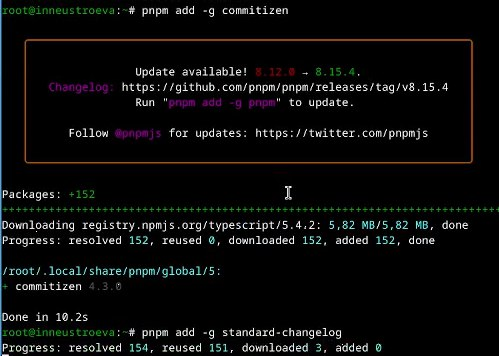

---
## Front matter
lang: ru-RU
title: Презентация по лабораторной работе № 4
subtitle: Продвинутое использование git
author:
  - Неустроева И.Н.
institute:
  - Российский университет дружбы народов, Москва, Россия
date: 29 февраля 2024

## i18n babel
babel-lang: russian
babel-otherlangs: english

## Formatting pdf
toc: false
toc-title: Содержание
slide_level: 2
aspectratio: 169
section-titles: true
theme: metropolis
header-includes:
 - \metroset{progressbar=frametitle,sectionpage=progressbar,numbering=fraction}
 - '\makeatletter'
 - '\beamer@ignorenonframefalse'
 - '\makeatother'
 
 ## Fonts
mainfont: PT Serif
romanfont: PT Serif
sansfont: PT Sans
monofont: PT Mono
mainfontoptions: Ligatures=TeX
romanfontoptions: Ligatures=TeX
sansfontoptions: Ligatures=TeX,Scale=MatchLowercase
monofontoptions: Scale=MatchLowercase,Scale=0.9
 
---

# Информация

## Докладчик

:::::::::::::: {.columns align=center}
::: {.column width="70%"}

  * Неустроева Ирина Николаевна
  * студентка группы НБИ 02-23
  * Российский университет дружбы народов
  * <https://inneustroeva.github.io/ru/>

:::
::::::::::::::

# Вводная часть

## Цели и задачи

Получение навыков правильной работы с репозиториями git.

## Материалы и методы

- Процессор `pandoc` для входного формата Markdown
- Результирующие форматы
	- `pdf`
	- `html`
- Автоматизация процесса создания: `Makefile`

# Основная часть 

## Начало работы

## Установка программного обеспечения

Установливаем git-flow 

Устанавливаем Node.js. На Node.js базируется программное обеспечение для семантического версионирования и общепринятых коммитов. 

Для работы с Node.js добавим каталог с исполняемыми файлами, устанавливаемыми yarn, в переменную PATH. 

## Добавление общепринятых коммитов.

При помощи утилиты pnpm добавляем две программы: standard changelog и commitizen. 

Создали новый репозиторий на на GitHub 

Делаем первый коммит и выкладываем на githu 

## Конфигурация общепринятых коммитов.

Введем команду pnpm init. Вывод команды демонстрирует содержание файла и его место в системе.
 

Откроем файл, адрес которого видим в выводе команды, и отредактируем его так, как указано в задании лабораторной работы 

После редактирования файла необходимо добавить файлы в репозиторий и выполнить коммит с помощью установленного ранее скрипта. 

Коммит успешно настроен и отправлен. 

## Конфигурация git-flow.

Инициализируем git-flow и проверим, что мы находимся на нужной ветке (develop) 

Отправляем изменения на гитхаб. Следующее, что нужно сделать - установить внешнюю ветку как вышестоящую для этой ветки.

После того, как работа с ветками закончена, создаем новый релиз: 1.0.0 

Далее настраиваем релиз: создаем журнал изменений, добавляем его в индекс и заливаем резиз в основную ветку 

После дого, как отправили данные, создаем релиз на гитхаб и получаем ссылку на него

## Разработка новой функциональности.

Создадим ветку для новой функциональности:

Далее работа с гит продолжается как обычно. Для тестового репозитория никакую новую функциональность разрабатывать не будем, переходим сразу к следующему шагу: объединение веток feature_branch и develop

## Создание релиза.

Создадим релиз с версией 1.2.3 и оказываемся на ветке release/1.2.3: 

В файле package.json обновляем номер версии. После обновляем журнал изменений и добавляем его на гитхаб

 

Заливаем релиз в основную ветку, после чего отправляем данные на гитхаб: 

Последним шагом закроем релиз и создадим на гитхаб новую версию - 1.2.3 

## Вывод

Получены навыки правильной работы с репозиториями git, выполнена работа для тестового репозитория и дальнейшие преобразования для основного репозитория курса.
:::

