---
## Front matter
title: " Отчет по лабораторной работе 4"
subtitle: Продвинутое использование git
author: "Неустроева Ирина Николаевна"

## Generic otions
lang: ru-RU
toc-title: "Содержание"

## Bibliography
bibliography: bib/cite.bib
csl: pandoc/csl/gost-r-7-0-5-2008-numeric.csl

## Pdf output format
toc: true # Table of contents
toc-depth: 2
lof: true # List of figures
lot: true # List of tables
fontsize: 12pt
linestretch: 1.5
papersize: a4
documentclass: scrreprt
## I18n polyglossia
polyglossia-lang:
  name: russian
  options:
	- spelling=modern
	- babelshorthands=true
polyglossia-otherlangs:
  name: english
## I18n babel
babel-lang: russian
babel-otherlangs: english
## Fonts
mainfont: PT Serif
romanfont: PT Serif
sansfont: PT Sans
monofont: PT Mono
mainfontoptions: Ligatures=TeX
romanfontoptions: Ligatures=TeX
sansfontoptions: Ligatures=TeX,Scale=MatchLowercase
monofontoptions: Scale=MatchLowercase,Scale=0.9
## Biblatex
biblatex: true
biblio-style: "gost-numeric"
biblatexoptions:
  - parentracker=true
  - backend=biber
  - hyperref=auto
  - language=auto
  - autolang=other*
  - citestyle=gost-numeric
## Pandoc-crossref LaTeX customization
figureTitle: "Рис."
tableTitle: "Таблица"
listingTitle: "Листинг"
lofTitle: "Список иллюстраций"
lotTitle: "Список таблиц"
lolTitle: "Листинги"
## Misc options
indent: true
header-includes:
  - \usepackage{indentfirst}
  - \usepackage{float} # keep figures where there are in the text
  - \floatplacement{figure}{H} # keep figures where there are in the text
---

# Цель работы

Получение навыков правильной работы с репозиториями git.

# Задание

1. Выполнить работу для тестового репозитория.

2. Преобразовать рабочий репозиторий в репозиторий с git-flow и conventional commits.

# Выполнение лабораторной работы

## Установка программного обеспечения

Установливаем git-flow  (рис. [-@fig:001]).

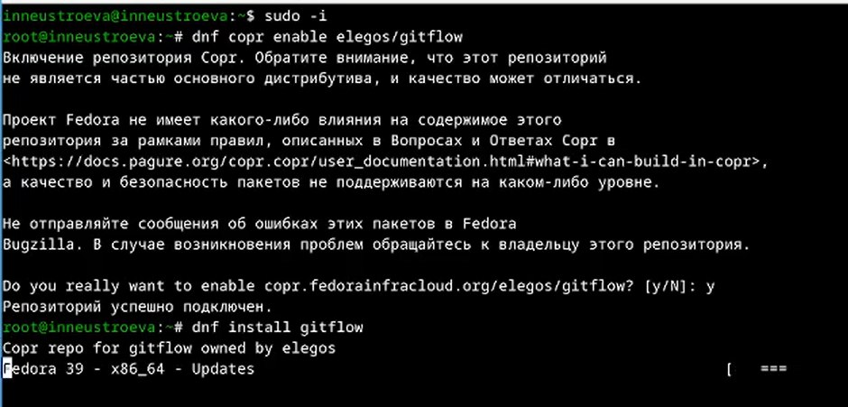{#fig:001 width=70%}

Устанавливаем Node.js. На Node.js базируется программное обеспечение для семантического версионирования и общепринятых коммитов. (рис. [-@fig:002]).

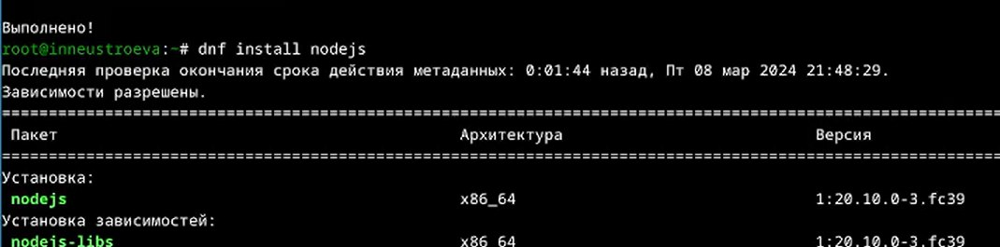{#fig:002 width=70%}

Для работы с Node.js добавим каталог с исполняемыми файлами, устанавливаемыми yarn, в переменную PATH. (рис. [-@fig:003]).

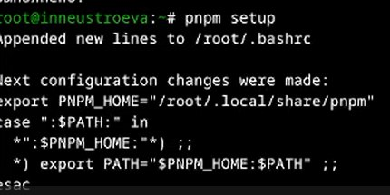{#fig:003 width=70%}

## Добавление общепринятых коммитов.

При помощи утилиты pnpm добавляем две программы: standard changelog и commitizen. (рис. [-@fig:004]).

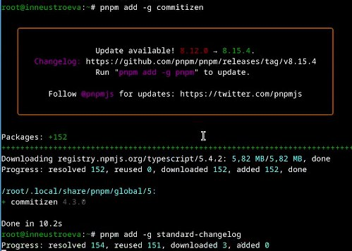{#fig:004 width=70%}

Создали новый репозиторий на на GitHub (рис. [-@fig:005]).

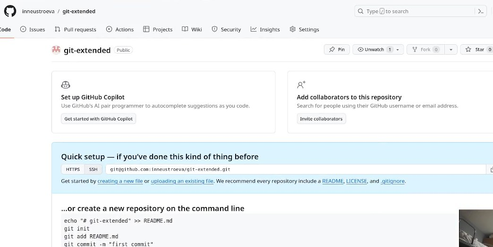{#fig:005 width=70%}

Делаем первый коммит и выкладываем на githu (рис. [-@fig:006]).

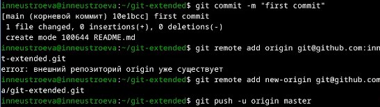{#fig:006 width=70%}

## Конфигурация общепринятых коммитов.

Введем команду pnpm init. Вывод команды демонстрирует содержание файла и его место в системе. (рис. [-@fig:007]).
 
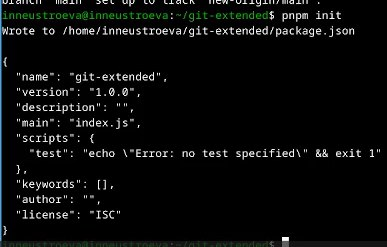{#fig:007 width=70%}

Откроем файл, адрес которого видим в выводе команды, и отредактируем его так, как указано в задании лабораторной работы (рис. [-@fig:008]).

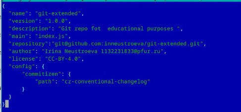{#fig:008 width=70%} 

После редактирования файла необходимо добавить файлы в репозиторий и выполнить коммит с помощью установленного ранее скрипта. (рис. [-@fig:009]).

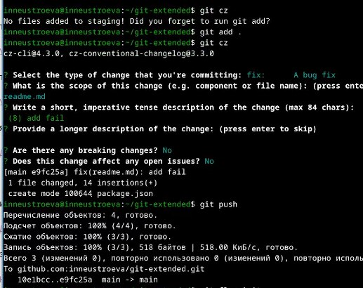{#fig:009 width=70%} 

Коммит успешно настроен и отправлен. 

## Конфигурация git-flow.

Инициализируем git-flow и проверим, что мы находимся на нужной ветке (develop) (рис. [-@fig:010]).

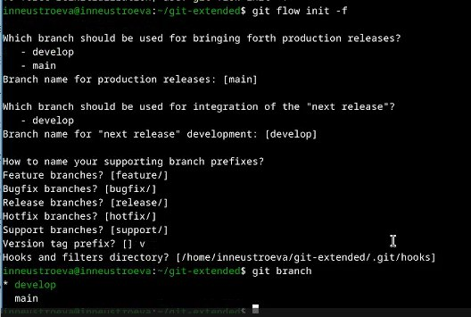{#fig:010 width=70%}

Отправляем изменения на гитхаб. Следующее, что нужно сделать - установить внешнюю ветку как вышестоящую для этой ветки.(рис. [-@fig:011]).

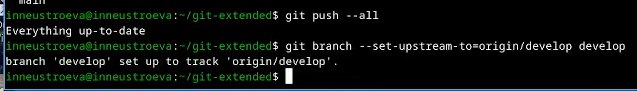{#fig:011 width=70%} 

После того, как работа с ветками закончена, создаем новый релиз: 1.0.0 (рис. [-@fig:012]).

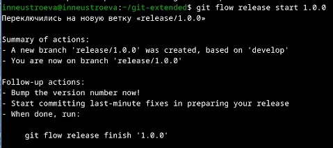{#fig:012 width=70%} 

Далее настраиваем релиз: создаем журнал изменений, добавляем его в индекс и заливаем резиз в основную ветку (рис. [-@fig:013])

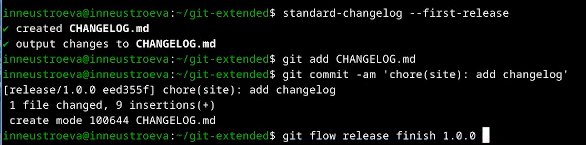{#fig:013 width=70%} 

После дого, как отправили данные, создаем релиз на гитхаб и получаем ссылку на него (рис. [-@fig:014])

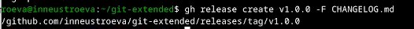{#fig:014 width=190%} 

## Разработка новой функциональности.

Создадим ветку для новой функциональности:(рис. [-@fig:015])

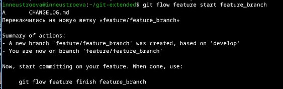{#fig:015 width=70%} 

Далее работа с гит продолжается как обычно. Для тестового репозитория никакую новую функциональность разрабатывать не будем, переходим сразу к следующему шагу: объединение веток feature_branch и develop:(рис. [-@fig:016])

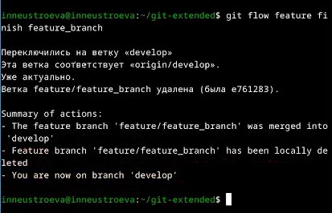{#fig:016 width=70%} 

## Создание релиза.

Создадим релиз с версией 1.2.3 и оказываемся на ветке release/1.2.3: (рис. [-@fig:017])

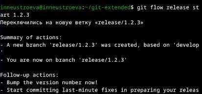{#fig:017 width=70%} 

В файле package.json обновляем номер версии. После обновляем журнал изменений и добавляем его на гитхаб: (рис. [-@fig:018])

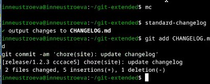{#fig:018 width=70%} 

Заливаем релиз в основную ветку, после чего отправляем данные на гитхаб: (рис. [-@fig:019])

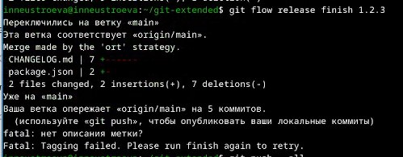{#fig:019 width=70%} 

Последним шагом закроем релиз и создадим на гитхаб новую версию - 1.2.3: (рис. [-@fig:020])

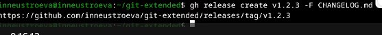{#fig:020 width=70%} 

# Вывод
Получены навыки правильной работы с репозиториями git, выполнена работа для тестового репозитория и дальнейшие преобразования для основного репозитория курса.

::: {#refs}
:::
