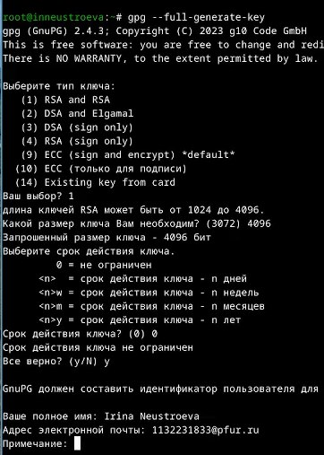
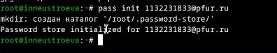
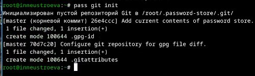
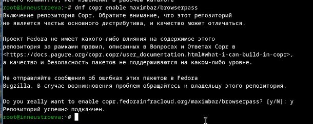
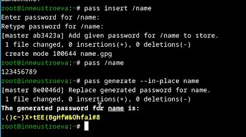
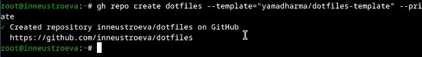
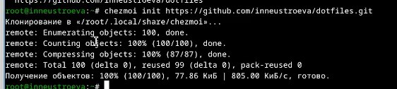
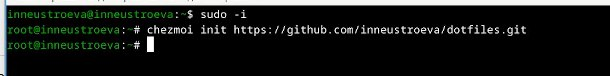
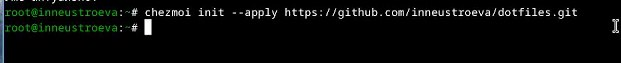
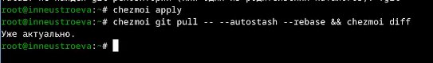

---
## Front matter
lang: ru-RU
title: Перезнтация по лабораторной работе 5
subtitle: Операционные системы 
author:
  - Неустроева И.Н.
institute:
  - Российский университет дружбы народов, Москва, Россия
date: 29 февраля 2024

## i18n babel
babel-lang: russian
babel-otherlangs: english

## Formatting pdf
toc: false
toc-title: Содержание
slide_level: 2
aspectratio: 169
section-titles: true
theme: metropolis
header-includes:
 - \metroset{progressbar=frametitle,sectionpage=progressbar,numbering=fraction}
 - '\makeatletter'
 - '\beamer@ignorenonframefalse'
 - '\makeatother'
 
 ## Fonts
mainfont: PT Serif
romanfont: PT Serif
sansfont: PT Sans
monofont: PT Mono
mainfontoptions: Ligatures=TeX
romanfontoptions: Ligatures=TeX
sansfontoptions: Ligatures=TeX,Scale=MatchLowercase
monofontoptions: Scale=MatchLowercase,Scale=0.9
 
---

# Информация

## Докладчик

:::::::::::::: {.columns align=center}
::: {.column width="70%"}

  * Неустроева Ирина Николаевна
  * студентка группы НБИ 02-23
  * Российский университет дружбы народов
  * <https://inneustroeva.github.io/ru/>

:::
::::::::::::::

# Вводная часть

## Цели 

Настройка рабочей среды. Установка менеджера паролей, шрифтов. Сохранение dotfiles.

# Основная часть
 
## Создание ключа

Создаем новый ключ 

## Иницализация хранилища

Инициализируем хранилище

## Синхронизация с git

Создадим структуру git

## Настройка интерфейса с броузером

Настраеваем интерфейс с броузером, далее устанавливаем его.

## Сохранение пароля

Добавляем новый пароль, отображаем пароль для указанного имени файла, затем заменяем существующий пароль 

## Создание собственного репозитория с помощью утилит

Создадим свой репозиторий для конфигурационных файлов на основе шаблона

## Подключение репозитория к своей системе

Инициализируем chezmoi с нашим репозиторием dotfiles и соглашаемся с внесенными изменениями.

## Использование chezmoi на нескольких машинах

На второй машине инициализируем chezmoi с нашим репозиторием dotfiles и принимаем изменения, внесённые chezmoi.

## Настройка новой машины с помощью одной команды

Установливаем свои dotfiles на новый компьютер 

## Ежедневные операции c chezmoi

Извлекаем последние изменения из своего репозитория.

## Итоговый слайд

Работа удалась, цель достигнута !
:::

