---
## Front matter
title: "Лабораторная работа 5"
subtitle: "Дисциплина: Операционные системы"
author: "Неустроева Ирина Николаевна"

## Generic otions
lang: ru-RU
toc-title: "Содержание"

## Bibliography
bibliography: bib/cite.bib
csl: pandoc/csl/gost-r-7-0-5-2008-numeric.csl

## Pdf output format
toc: true # Table of contents
toc-depth: 2
lof: true # List of figures
lot: true # List of tables
fontsize: 12pt
linestretch: 1.5
papersize: a4
documentclass: scrreprt
## I18n polyglossia
polyglossia-lang:
  name: russian
  options:
	- spelling=modern
	- babelshorthands=true
polyglossia-otherlangs:
  name: english
## I18n babel
babel-lang: russian
babel-otherlangs: english
## Fonts
mainfont: PT Serif
romanfont: PT Serif
sansfont: PT Sans
monofont: PT Mono
mainfontoptions: Ligatures=TeX
romanfontoptions: Ligatures=TeX
sansfontoptions: Ligatures=TeX,Scale=MatchLowercase
monofontoptions: Scale=MatchLowercase,Scale=0.9
## Biblatex
biblatex: true
biblio-style: "gost-numeric"
biblatexoptions:
  - parentracker=true
  - backend=biber
  - hyperref=auto
  - language=auto
  - autolang=other*
  - citestyle=gost-numeric
## Pandoc-crossref LaTeX customization
figureTitle: "Рис."
tableTitle: "Таблица"
listingTitle: "Листинг"
lofTitle: "Список иллюстраций"
lotTitle: "Список таблиц"
lolTitle: "Листинги"
## Misc options
indent: true
header-includes:
  - \usepackage{indentfirst}
  - \usepackage{float} # keep figures where there are in the text
  - \floatplacement{figure}{H} # keep figures where there are in the text
---

# Цель работы

Настройка рабочей среды. Установка менеджера паролей, шрифтов. Сохранение dotfiles.

# Выполнение лабораторной работы 

## Менеджер паролей pass

Установка на Fedora pass (рис. [-@fig:001]).

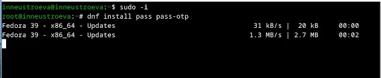{#fig:001 width=70%}

Установка на Fedora gopass(рис. [-@fig:002]).

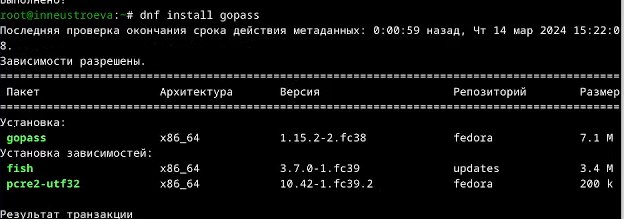{#fig:002 width=70%}

## Настройка  

Просмотрим список ключей: (рис. [-@fig:003]).

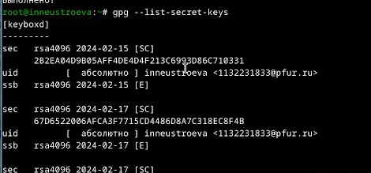{#fig:003 width=70%}

Создаем новый ключ (рис. [-@fig:004]).

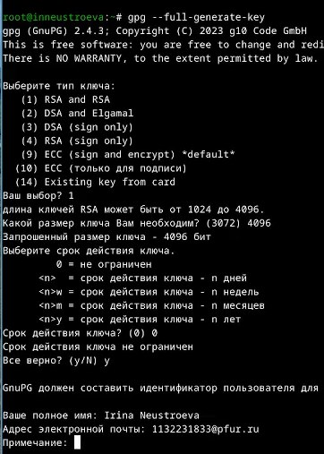{#fig:004 width=70%}

Инициализируем хранилище (рис. [-@fig:005]).

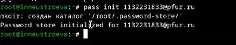{#fig:005 width=70%}

Создадим структуру git (рис. [-@fig:006]).

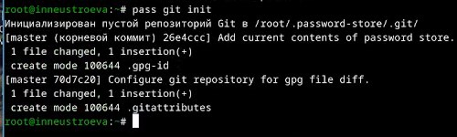{#fig:006 width=70%} 

## Настройка интерфейса с броузером

Настраеваем интерфейс с броузером, командой: dnf copr enable maximbaz/browserpass(рис. [-@fig:007]).

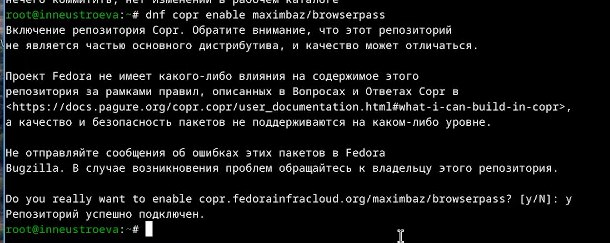{#fig:007 width=70%}

 Устанавливаем броузер командой, dnf install browserpass (рис. [-@fig:008]).

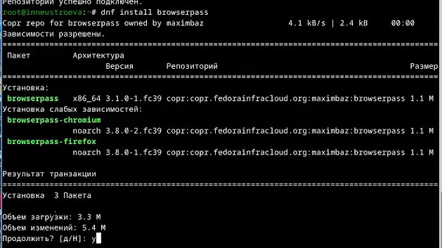{#fig:008 width=70%}

## Сохранение пароля

Добавляем новый пароль, отображаем пароль для указанного имени файла, затем заменяем существующий пароль  (рис. [-@fig:009]).

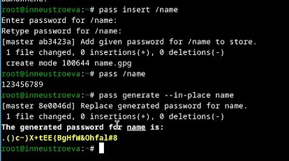{#fig:009 width=70%}

 
## Управление файлами конфигурации.

Установливаем дополнительное программное обеспечение , командой sudo dnf -y install \ то что хотим установить. Провожу эту команду с каждым файлом (рис. [-@fig:010]).
     dunst \
     fontawesome-fonts \
     powerline-fonts \
     light \
     fuzzel \
     swaylock \
     kitty \
     waybar swaybg \
     wl-clipboard \
     mpv \
     grim \
     slurp\

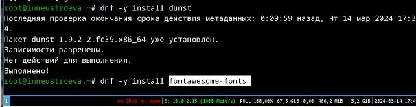{#fig:010 width=70%}

 Установливаем необходимые шрифты (рис. [-@fig:011]). (рис. [-@fig:012]). (рис. [-@fig:013]).

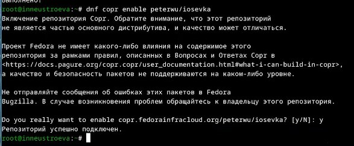{#fig:011 width=70%}

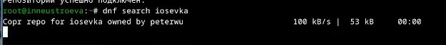{#fig:012 width=70%}

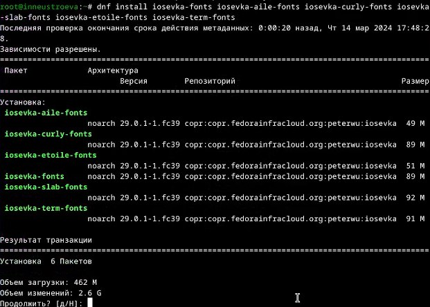{#fig:013 width=70%}

## Установка.

Устанавливаем бинарный файл. Скрипт определяет архитектуру процессора и операционную систему и скачивает необходимый файл: (рис. [-@fig:014]).

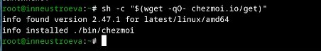{#fig:014 width=70%}

## Создание собственного репозитория с помощью утилит.

Создадим свой репозиторий для конфигурационных файлов на основе шаблона (рис. [-@fig:015]).

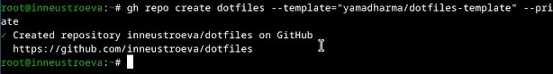{#fig:015 width=70%}

## Подключение репозитория к своей системе.

Инициализируем chezmoi с нашим репозиторием dotfiles (рис. [-@fig:016]).

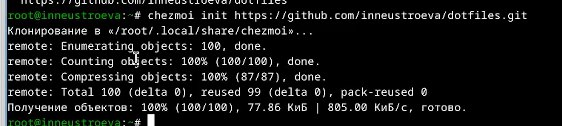{#fig:016 width=70%}

Проверим, какие изменения внесёт chezmoi в домашний каталог, запустив: chezmoi diff (рис. [-@fig:017]).

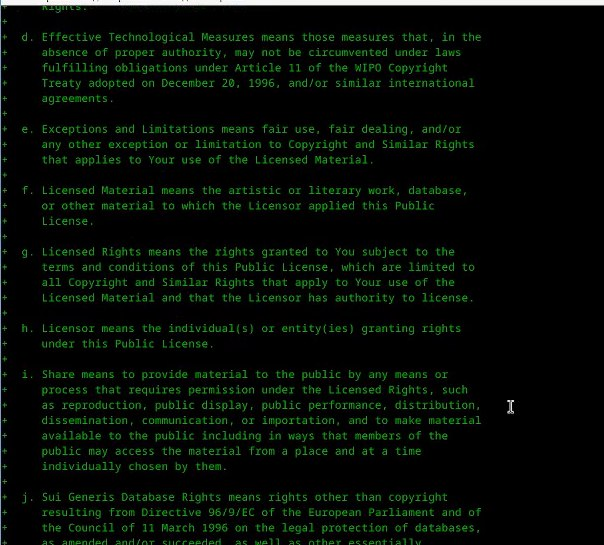{#fig:017 width=70%}

 Далее, нас устраивают изменения, поэтому вводим команду chezmoi apply -v (рис. [-@fig:018])

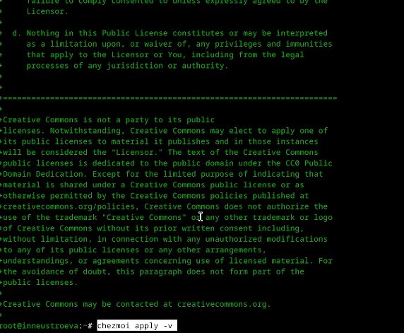{#fig:018 width=70%}

## Использование chezmoi на нескольких машинах

На второй машине инициализируем chezmoi с нашим репозиторием dotfiles (рис. [-@fig:019])

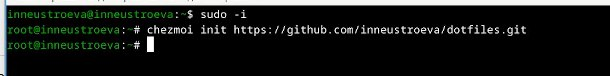{#fig:019 width=70%}

После, проверили какие изменения внесёт chezmoi в домашний каталог, запустив: chezmoi diff. Далее, нас устраивают изменения, поэтому вводим команду chezmoi apply -v (рис. [-@fig:020])

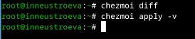{#fig:020 width=70%}

## Настройка новой машины с помощью одной команды.

Установливаем свои dotfiles на новый компьютер (рис. [-@fig:021])

{#fig:021 width=70%}

## Ежедневные операции c chezmoi 
 
Извлекаем последние изменения из репозитория и применяем их (рис. [-@fig:022])

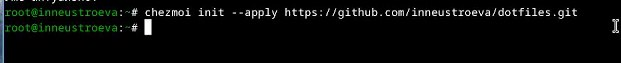{#fig:022 width=70%}

Извлекаем последние изменения из своего репозитория и посмотрим, что изменится, фактически не применяя изменения.(рис. [-@fig:023]).

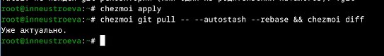{#fig:023 width=70%}

Далее мы довольны изменениями, поэтому вводим команду chezmoi apply  (рис. [-@fig:024]).

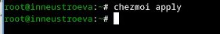{#fig:024 width=70%}

Можно автоматически фиксировать и отправлять изменения в исходный каталог в репозиторий, для этотго редактиркем файл  (рис. [-@fig:025]).

{#fig:025 width=70%}

# Вывод

В ходе выполнения работы была настроена рабочая среда, установлен менеджер паролей pass, chezmoi и сохранены dotfiles.

::: {#refs}
:::

