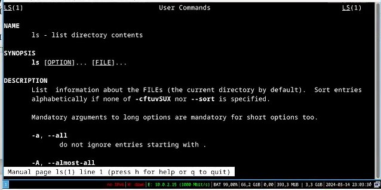

---
## Front matter
lang: ru-RU
title: Перезнтация по лабораторной работе 6
subtitle: Основы интерфейса взаимодействия пользователя с системой Unix на уровне командной строки
author:
  - Неустроева И.Н.
institute:
  - Российский университет дружбы народов, Москва, Россия
date: 29 февраля 2024

## i18n babel
babel-lang: russian
babel-otherlangs: english

## Formatting pdf
toc: false
toc-title: Содержание
slide_level: 2
aspectratio: 169
section-titles: true
theme: metropolis
header-includes:
 - \metroset{progressbar=frametitle,sectionpage=progressbar,numbering=fraction}
 - '\makeatletter'
 - '\beamer@ignorenonframefalse'
 - '\makeatother'
 
 ## Fonts
mainfont: PT Serif
romanfont: PT Serif
sansfont: PT Sans
monofont: PT Mono
mainfontoptions: Ligatures=TeX
romanfontoptions: Ligatures=TeX
sansfontoptions: Ligatures=TeX,Scale=MatchLowercase
monofontoptions: Scale=MatchLowercase,Scale=0.9
 
---

# Информация

## Докладчик

:::::::::::::: {.columns align=center}
::: {.column width="70%"}

  * Неустроева Ирина Николаевна
  * студентка группы НБИ 02-23
  * Российский университет дружбы народов
  * <https://inneustroeva.github.io/ru/>

:::
::::::::::::::

# Вводная часть

## Актуальность 

Мне, как будущему специалисту в сфере инфармационных технологий, важно научиться работать с командной строкой Линукс

## Цели 

Приобретение практических навыков взаимодействия пользователя с системой по-средством командной строки

# Основная часть
 
## Начало работы

Для работы нам понадобиться терминал, где мы будем вводить разные команды

## Получение справки по команде

Для того, чтобы получить подробную информацию о команде, исползуем следующее: man имя_команды

## Модификация команд

Можно также изменять команды из буфера команд( напирмер изменить опцию или её добавить)

# Заключительная часть

## Результаты

В ходе выполнения лабораторной работы я научилась взаимодействовать с Линуксом на уровне командной строки.

## Итоговый слайд

Работа удалась, цель достигнута !
:::

