---
## Front matter
title: "Лабораторная работа 6"
subtitle: "Основы интерфейса взаимодействия
пользователя с системой Unix на уровне командной строки"
author: "Неустроева Ирина Николаевна"

## Generic otions
lang: ru-RU
toc-title: "Содержание"

## Bibliography
bibliography: bib/cite.bib
csl: pandoc/csl/gost-r-7-0-5-2008-numeric.csl

## Pdf output format
toc: true # Table of contents
toc-depth: 2
lof: true # List of figures
lot: true # List of tables
fontsize: 12pt
linestretch: 1.5
papersize: a4
documentclass: scrreprt
## I18n polyglossia
polyglossia-lang:
  name: russian
  options:
	- spelling=modern
	- babelshorthands=true
polyglossia-otherlangs:
  name: english
## I18n babel
babel-lang: russian
babel-otherlangs: english
## Fonts
mainfont: PT Serif
romanfont: PT Serif
sansfont: PT Sans
monofont: PT Mono
mainfontoptions: Ligatures=TeX
romanfontoptions: Ligatures=TeX
sansfontoptions: Ligatures=TeX,Scale=MatchLowercase
monofontoptions: Scale=MatchLowercase,Scale=0.9
## Biblatex
biblatex: true
biblio-style: "gost-numeric"
biblatexoptions:
  - parentracker=true
  - backend=biber
  - hyperref=auto
  - language=auto
  - autolang=other*
  - citestyle=gost-numeric
## Pandoc-crossref LaTeX customization
figureTitle: "Рис."
tableTitle: "Таблица"
listingTitle: "Листинг"
lofTitle: "Список иллюстраций"
lotTitle: "Список таблиц"
lolTitle: "Листинги"
## Misc options
indent: true
header-includes:
  - \usepackage{indentfirst}
  - \usepackage{float} # keep figures where there are in the text
  - \floatplacement{figure}{H} # keep figures where there are in the text
---

# Цель работы

Приобретение практических навыков взаимодействия пользователя с системой по-средством командной строки

# Задание

1. Определите полное имя вашего домашнего каталога. Далее относительно этого каталога будут выполняться последующие упражнения.

2. Выполните следующие действия:
* Перейдите в каталог /tmp.
* Выведите на экран содержимое каталога /tmp. Для этого используйте команду ls с различными опциями. Поясните разницу в выводимой на экран информации.
* Определите, есть ли в каталоге /var/spool подкаталог с именем cron?
* Перейдите в Ваш домашний каталог и выведите на экран его содержимое. Определите, кто является владельцем файлов и подкаталогов?

3. Выполните следующие действия:
* В домашнем каталоге создайте новый каталог с именем newdir.
* В каталоге ~/newdir создайте новый каталог с именем morefun.
* В домашнем каталоге создайте одной командой три новых каталога с именами
letters, memos, misk. Затем удалите эти каталоги одной командой.
* Попробуйте удалить ранее созданный каталог ~/newdir командой rm. Проверьте,
был ли каталог удалён.
* Удалите каталог ~/newdir/morefun из домашнего каталога. Проверьте, был ли
каталог удалён.

4. С помощью команды man определите, какую опцию команды ls нужно использовать для просмотра содержимое не только указанного каталога, но и подкаталогов,
входящих в него.

5. С помощью команды man определите набор опций команды ls, позволяющий отсортировать по времени последнего изменения выводимый список содержимого каталога
с развёрнутым описанием файлов.

6. Используйте команду man для просмотра описания следующих команд: cd, pwd, mkdir,
rmdir, rm. Поясните основные опции этих команд.

7. Используя информацию, полученную при помощи команды history, выполните модификацию и исполнение нескольких команд из буфера команд

# Теоретическое введение 

Команда man. Команда man используется для просмотра (оперативная помощь) в диа-
логовом режиме руководства (manual) по основным командам операционной системы
типа Linux.

Команда cd. Команда cd используется для перемещения по файловой системе опера-
ционной системы типа Linux.

Команда pwd. Для определения абсолютного пути к текущему каталогу используется(print working directory).

Команда ls. Команда ls используется для просмотра содержимого каталога.

Команда mkdir. Команда mkdir используется для создания каталогов.

Команда rm. Команда rm используется для удаления файлов и/или каталогов.

Команда history. Для вывода на экран списка ранее выполненных команд исполь-
зуется команда history. Выводимые на экран команды в списке нумеруются. К любой
команде из выведенного на экран списка можно обратиться по её номеру в списке,
воспользовавшись конструкцией !<номер_команды>.

# Выполнение лабораторной работы 

1. Определите полное имя вашего домашнего каталога. Делаю я это командой pwd (рис. [-@fig:001]).

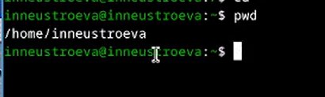{#fig:001 width=70%}

2. Выполним следующие команды:

* Перейдём в каталог /tmp и выведим на экран содержимое каталога, для этого использую команду cd, далее с помощью команды ls вывожу список файлов без дополнительной информации (рис. [-@fig:002]).

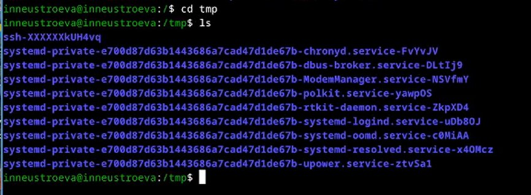{#fig:002 width=70%}

* Вывод содержимого каталог, используя опцию -l. Получаем не только список файлов, но и их владельца, дату последнего изменения и др.  (рис. [-@fig:003]).

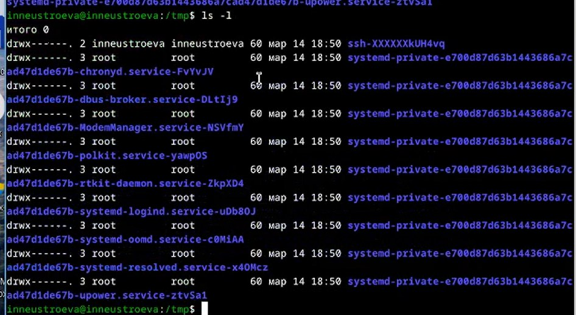{#fig:003 width=70%}

Вывод содержимого каталог, используя опцию -a. Получаем список файлов, даже скрытых. (рис. [-@fig:005]).

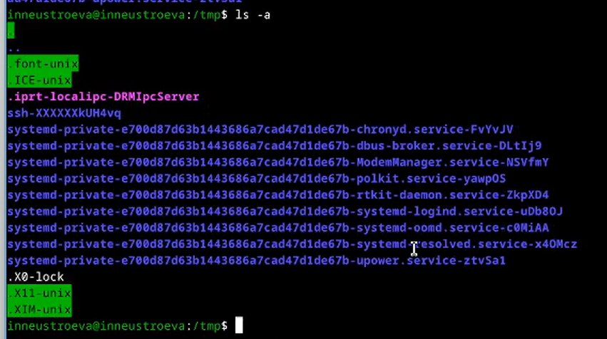{#fig:004 width=70%}

Вывод содержимого каталог, используя опцию -F. Получаем просто спиоск всех файлов, структурируя их по папкам, ставя / для наглядности. (рис. [-@fig:005]).

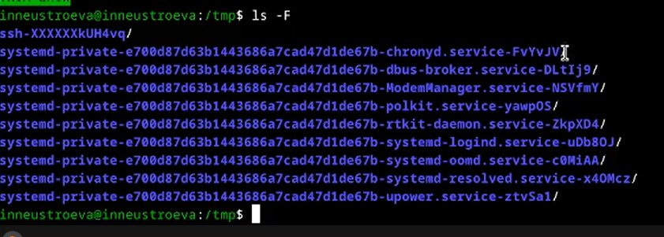{#fig:005 width=70%}

Вывод содержимого каталог, используя опцию -AlF. Получаем фалы, которые отсортированы по папкам, для наглядности ставится / после каждого файла, при этом выводися подробная информация о всех файлах.(рис. [-@fig:006]).

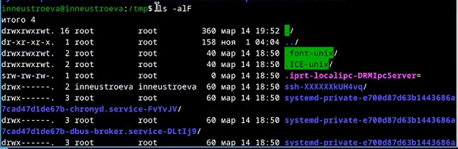{#fig:006 width=70%} 

* Перейдем в каталоге /var/spool и определим, есть ли в нем подкаталог с именем cron, для этого используя команду cd, ls. Как видно, подкаталог с таким именем существует. (рис. [-@fig:007]).

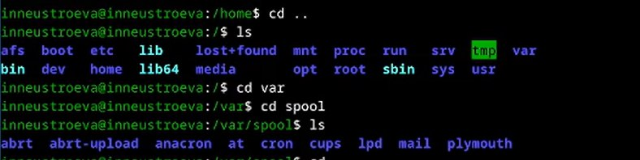{#fig:007 width=70%}

* Следующим шагом, выведем содержание домашнего каталога, как видем, владельцем всех файлов и каталогов являюсь я (рис. [-@fig:008]).

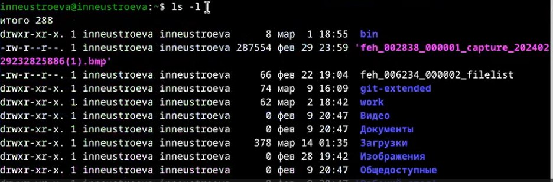{#fig:008 width=70%}

3. Выполним следующее 

* В домашнем каталоге создали новый каталог с именем newdir, при помощи команды mkdir. (рис. [-@fig:009]).

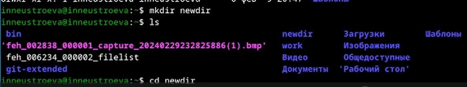{#fig:009 width=70%}

* В каталоге ~/newdir создали новый каталог с именем morefun (рис. [-@fig:010]).

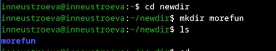{#fig:010 width=70%}

* В домашнем каталоге создали одной командой три новых каталога с именами letters, memos, misk. Затем удалили эти каталоги одной командой, с помощью команды rmdir. (рис. [-@fig:011]).

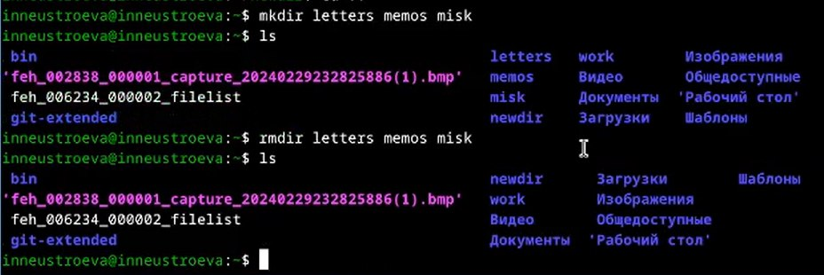{#fig:011 width=70%}

* Попробовали удалить ранее созданный каталог ~/newdir командой rm, выяснили, что каталог не может удалиться это командой, тк он является не пустым каталогом. Далее удалили каталог ~/newdir/morefun из домашнего каталога, командой rmdir (рис. [-@fig:012]).

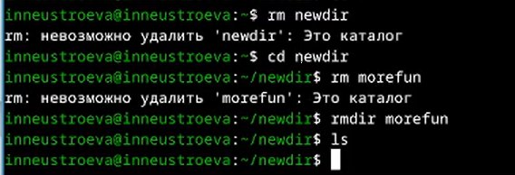{#fig:012 width=70%}

4. Далее С помощью команды man нужно определить, какую опцию команды ls нужно использовать для просмотра содержимое не только указанного каталога, но и подкаталогов, входящих в него. Ввели команду man ls, и нашли эту опцию в списке команд: -R (рис. [-@fig:013]).

{#fig:013 width=70%}

5. С помощью команды man нужно определить набор опций команды ls, позволяющий отсортировать по времени последнего изменения выводимый список содержимого каталога с развёрнутым описанием файлов. Для этого вводим команду man ls и ищем нужную опцию: -с -lt  (рис. [-@fig:014]).

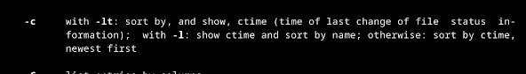{#fig:014 width=70%}

Вводим команду ls с опциями позволяющими отсортировать по времени последнего изменения выводимый список содержимого каталога с развёрнутым описанием файлов.(рис. [-@fig:015]).

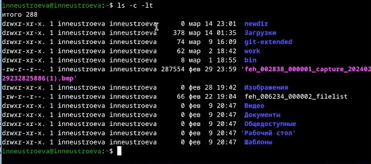{#fig:015 width=70%}

6. При помощи команды man узнаем опции для следующих команд: cd(рис. [-@fig:016]), pwd(рис. [-@fig:017]), mkdir(рис. [-@fig:018]),rmdir(рис. [-@fig:019]), rm (рис. [-@fig:020]).

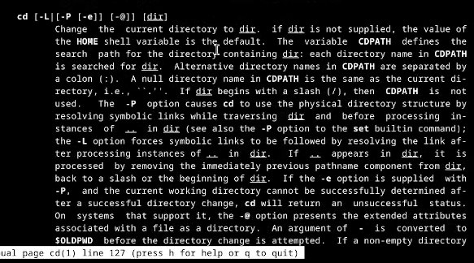{#fig:016 width=70%}

Команда cd служит для перемещения по каталогом. Ее аргумент - директория, в которую хотим переместиться.

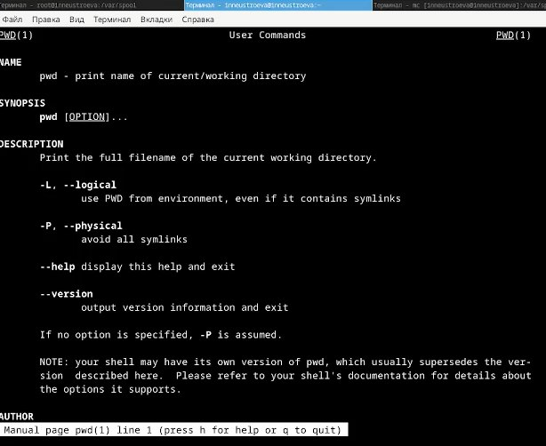{#fig:017 width=70%}

Команда pwd служит для вывода полного названия директории, в которой находится пользователь.

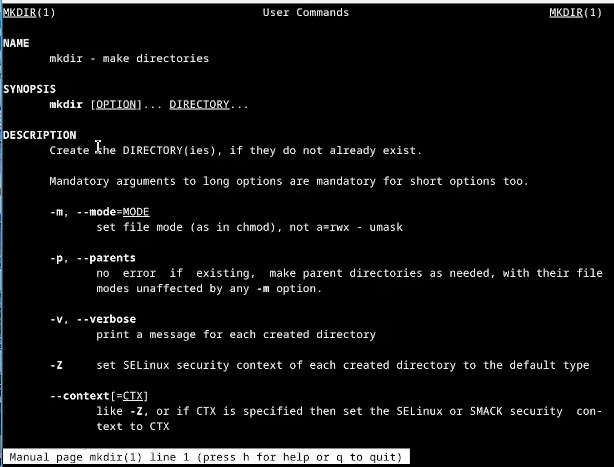{#fig:018 width=70%}

Команда mkdir служит для создания новой директории. Опции: -m устанавливает режим доступа, -v выводит сообщения для каждой созданной директории, -z устанавливает настройки безопасности данной директории

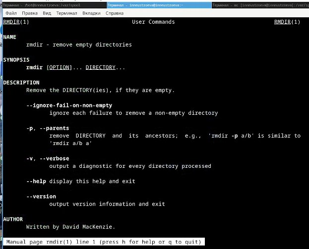{#fig:019 width=70%}

Команда rkdir служит для удаления пустых каталогов. Опции -п удаляет не только данную директорию, но и родительскую директорию.

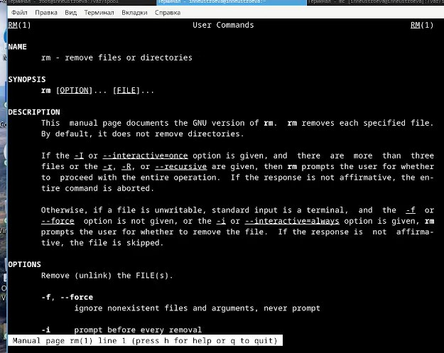{#fig:020 width=70%}

Команда rm служит для удаления файлов или каталогов. Опции -f не даёт показки для удаления, -i даёт подсказки при удалении.

7. При помощи команды history (рис. [-@fig:021]). , выполним модификацию некоторой команды из буфера команд (рис. [-@fig:022]).

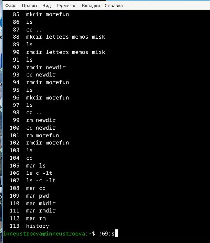{#fig:021 width=70%}

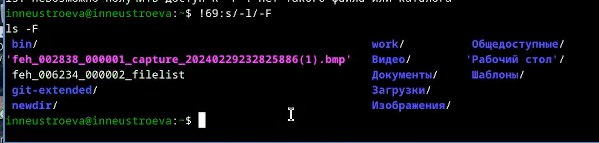{#fig:022 width=70%}

# Вывод

В ходе выполнения лабораторной работы я научилась взаимодействовать с Линуксом на уровне командной строки.

# Контрольные вопросы
1. Что такое командная строка?
В операционной системе типа Linux взаимодействие пользователя с системой обычно
осуществляется с помощью командной строки посредством построчного ввода ко-
манд.
2. При помощи какой команды можно определить абсолютный путь текущего каталога?
Приведите пример.
Для определения абсолютного пути к текущему каталогу используется
команда pwd (print working directory).
Пример (абсолютное имя текущего каталога пользователя dharma):
- pwd
результат:
- /afs/dk.sci.pfu.edu.ru/home/d/h/dharma
3. При помощи какой команды и каких опций можно определить только тип файлов
и их имена в текущем каталоге? Приведите примеры.
ls -F
4. Каким образом отобразить информацию о скрытых файлах? Приведите примеры.
Имена таких файлов начинаются с точки. Для
того, чтобы отобразить имена скрытых файлов, необходимо использовать команду ls
с опцией a:
- ls -a
5. При помощи каких команд можно удалить файл и каталог? Можно ли это сделать
одной и той же командой? Приведите примеры.
rm b rmdir. rm для удаления файлов и каталогов, но если каталог не пустой, нужно использовать опцию -r.
6. Каким образом можно вывести информацию о последних выполненных пользовате-
лем командах? работы?
Для вывода на экран списка ранее выполненных команд исполь-
зуется команда history.
7. Как воспользоваться историей команд для их модифицированного выполнения? При-
ведите примеры.
Выводимые на экран команды в списке нумеруются. К любой
команде из выведенного на экран списка можно обратиться по её номеру в списке,
воспользовавшись конструкцией !<номер_команды>.
Пример:
history
1 ls -a
2 cd
3 pwd ....
 !3:s/a/F
 ls -F
8. Приведите примеры запуска нескольких команд в одной строке.
Если требуется выполнить последовательно несколько
команд, записанный в одной строке, то для этого используется символ точка с запятой
cd;pwd
9. Дайте определение и приведите примера символов экранирования.
Если в заданном контексте встречаются специальные символы (типа «.»,
«/», «*» и т.д.), надо перед ними поставить символ экранирования \ (обратный слэш).
10. Охарактеризуйте вывод информации на экран после выполнения команды ls с опцией
l.
Опция l используется для вывода на экран подробной информации о файлах и каталогах. При этом о каждом файле и каталоге будет выведена следующая
информация:
– тип файла,
– право доступа,
– число ссылок,
– владелец,
– размер,
– дата последней ревизии,
– имя файла или каталога.

::: {#refs}
:::

