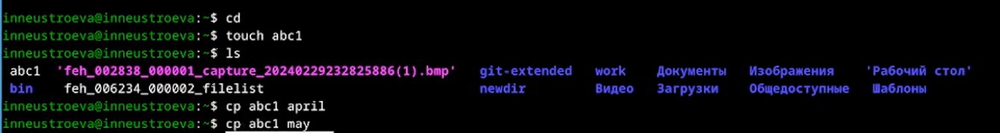
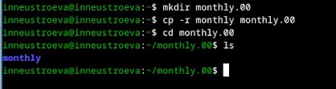
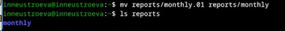
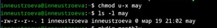
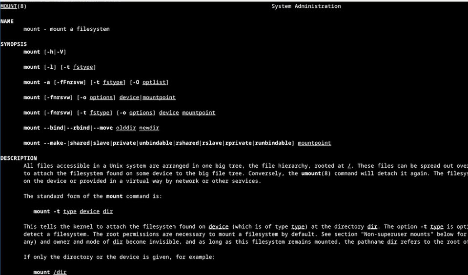

---
## Front matter
lang: ru-RU
title: Перезнтация по лабораторной работе 7
subtitle: Анализ файловой системы Linux. Команды для работы с файлами и каталогами.
author:
  - Неустроева И.Н.
institute:
  - Российский университет дружбы народов, Москва, Россия
date: 21 марта 2024

## i18n babel
babel-lang: russian
babel-otherlangs: english

## Formatting pdf
toc: false
toc-title: Содержание
slide_level: 2
aspectratio: 169
section-titles: true
theme: metropolis
header-includes:
 - \metroset{progressbar=frametitle,sectionpage=progressbar,numbering=fraction}
 - '\makeatletter'
 - '\beamer@ignorenonframefalse'
 - '\makeatother'
 
 ## Fonts
mainfont: PT Serif
romanfont: PT Serif
sansfont: PT Sans
monofont: PT Mono
mainfontoptions: Ligatures=TeX
romanfontoptions: Ligatures=TeX
sansfontoptions: Ligatures=TeX,Scale=MatchLowercase
monofontoptions: Scale=MatchLowercase,Scale=0.9
 
---

# Информация

## Докладчик

:::::::::::::: {.columns align=center}
::: {.column width="70%"}

  * Неустроева Ирина Николаевна
  * студентка группы НБИ 02-23
  * Российский университет дружбы народов
  * <https://inneustroeva.github.io/ru/>

:::
::::::::::::::

# Вводная часть

## Актуальность

Через командную строку работать с файлами и каталогами очень удобно. Я считаю это полезным наыком для IT специалиста. 

## Цели 

Ознакомление с файловой системой Linux, её структурой, именами и содержанием каталогов. Приобретение практических навыков по применению команд для работы с файлами и каталогами, по управлению процессами (и работами), по проверке использования диска и обслуживанию файловой системы.

# Основная часть

## Создание и копирование файлов.
 
 Сначала я узнала, что для создания файла служит команда touch, а для его копирования - команда cp

## Создание и копирование каталогов.

Команда mkdir создает каталоги. Копировать каьталоги можно с помощью- cp

## Переименование и перемещение директорий и файлов.

Для переименования и перемещения каталогов и файлов, служит команда mv

## Изменения прав доступа к файлам.

Чтобы изменить доступ к файлу, применяется команда chmod с различными аргументами. 

## Просмотр используемых в ОС файлов

Для просмотра справки по командам используем - man и аргумент

# Заключительная чаcть.

## Результаты

В ходе выполнения работы, я научилось работать с файлами и каталогами, анализировать файловую  систему.

## Итоговый слайд

Работать с файлами и каталогами через терминал удобно. Научились работать с правами доступа. 
:::

