---
## Front matter
title: "Лабораторная работа 7"
subtitle: "Анализ файловой системы Linux. Команды для работы с файлами и каталогами"
author: "Неустроева Ирина Николаевна"

## Generic otions
lang: ru-RU
toc-title: "Содержание"

## Bibliography
bibliography: bib/cite.bib
csl: pandoc/csl/gost-r-7-0-5-2008-numeric.csl

## Pdf output format
toc: true # Table of contents
toc-depth: 2
lof: true # List of figures
lot: true # List of tables
fontsize: 12pt
linestretch: 1.5
papersize: a4
documentclass: scrreprt
## I18n polyglossia
polyglossia-lang:
  name: russian
  options:
	- spelling=modern
	- babelshorthands=true
polyglossia-otherlangs:
  name: english
## I18n babel
babel-lang: russian
babel-otherlangs: english
## Fonts
mainfont: PT Serif
romanfont: PT Serif
sansfont: PT Sans
monofont: PT Mono
mainfontoptions: Ligatures=TeX
romanfontoptions: Ligatures=TeX
sansfontoptions: Ligatures=TeX,Scale=MatchLowercase
monofontoptions: Scale=MatchLowercase,Scale=0.9
## Biblatex
biblatex: true
biblio-style: "gost-numeric"
biblatexoptions:
  - parentracker=true
  - backend=biber
  - hyperref=auto
  - language=auto
  - autolang=other*
  - citestyle=gost-numeric
## Pandoc-crossref LaTeX customization
figureTitle: "Рис."
tableTitle: "Таблица"
listingTitle: "Листинг"
lofTitle: "Список иллюстраций"
lotTitle: "Список таблиц"
lolTitle: "Листинги"
## Misc options
indent: true
header-includes:
  - \usepackage{indentfirst}
  - \usepackage{float} # keep figures where there are in the text
  - \floatplacement{figure}{H} # keep figures where there are in the text
---

# Цель работы

Ознакомление с файловой системой Linux, её структурой, именами и содержанием каталогов. Приобретение практических навыков по применению команд для работы с файлами и каталогами, по управлению процессами (и работами), по проверке использования диска и обслуживанию файловой системы.

# Задание

1. Выполните все примеры, приведённые в первой части описания лабораторной работы.

2. Выполните следующие действия, зафиксировав в отчёте по лабораторной работе
используемые при этом команды и результаты их выполнения:

* Скопируйте файл /usr/include/sys/io.h в домашний каталог и назовите его equipment. Если файла io.h нет, то используйте любой другой файл в каталоге /usr/include/sys/ вместо него.
* В домашнем каталоге создайте директорию ~/ski.plases.
* Переместите файл equipment в каталог ~/ski.plases.
* Переименуйте файл ~/ski.plases/equipment в ~/ski.plases/equiplist.
* Создайте в домашнем каталоге файл abc1 и скопируйте его в каталог ~/ski.plases, назовите его equiplist2.
* Создайте каталог с именем equipment в каталоге ~/ski.plases.
* Переместите файлы ~/ski.plases/equiplist и equiplist2 в каталог~/ski.plases/equipment.
* Создайте и переместите каталог ~/newdir в каталог ~/ski.plases и назовите его plans.

3. Определите опции команды chmod, необходимые для того, чтобы присвоить перечисленным ниже файлам выделенные права доступа, считая, что в начале таких прав
нет:

* drwxr--r-- ... australia
* drwx--x--x ... play
* -r-xr--r-- ... my_os
* -rw-rw-r-- ... feathers

4. Проделайте приведённые ниже упражнения, записывая в отчёт по лабораторной
работе используемые при этом команды:

* Просмотрите содержимое файла /etc/password.
* Скопируйте файл ~/feathers в файл ~/file.old.
* Переместите файл ~/file.old в каталог ~/play.
* Скопируйте каталог ~/play в каталог ~/fun.
* Переместите каталог ~/fun в каталог ~/play и назовите его games.
* Лишите владельца файла ~/feathers права на чтение.
* Что произойдёт, если вы попытаетесь просмотреть файл ~/feathers командой cat?
* Что произойдёт, если вы попытаетесь скопировать файл ~/feathers?
* Дайте владельцу файла ~/feathers право на чтение.
* Лишите владельца каталога ~/play права на выполнение.
*  Перейдите в каталог ~/play. Что произошло?
* Дайте владельцу каталога ~/play право на выполнение.

5. Прочитайте man по командам mount, fsck, mkfs, kill и кратко их охарактеризуйте,
приведя примеры.

# Выполнение лабораторной работы 

1. Выполните все примеры, приведённые в первой части описания лабораторной работы.

* Скопировали файл ~/abc1 в файл aprilи в файл may (рис. [-@fig:001]).

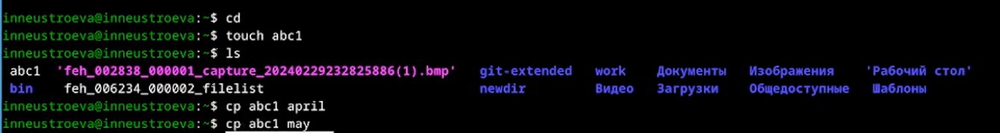{#fig:001 width=70%}

* Скопировали файлы april и may в каталог monthly (рис. [-@fig:002]).

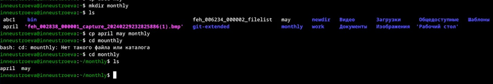{#fig:002 width=70%}

* Скопировали файл monthly/may в файл с именем june (рис. [-@fig:003]).

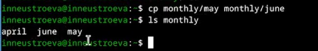{#fig:003 width=70%}

* Скопировали каталог monthly в каталог monthly.00 (рис. [-@fig:004]).

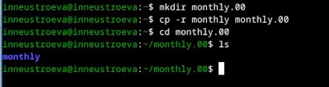{#fig:004 width=70%}

* Скопировали каталог monthly.00 в каталог /tmp (рис. [-@fig:005]).

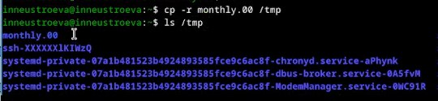{#fig:005 width=70%}

* Изменили название файла april на july в домашнем каталоге (рис. [-@fig:006]).

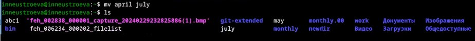{#fig:006 width=70%} 

* Переместили файл july в каталог monthly.00 (рис. [-@fig:007]).

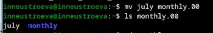{#fig:007 width=70%}

* Следующим шагом, переименовали каталог monthly.00 в monthly.01 (рис. [-@fig:008]).

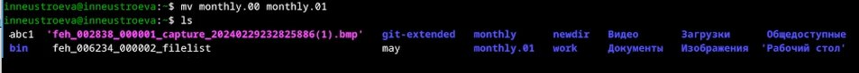{#fig:008 width=70%}

* Далее, переименовали каталог reports/monthly.01 в reports/monthly (рис. [-@fig:009]).

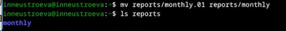{#fig:009 width=70%}

* Создали файл ~/may с правом выполнения для владельца (рис. [-@fig:010]).

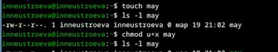{#fig:010 width=70%} 

* Лишили владельца файла ~/may права на выполнение (рис. [-@fig:011]).

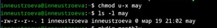{#fig:011 width=70%}

* Создали каталог monthly с запретом на чтение для членов группы и всех остальных пользователей:(рис. [-@fig:012]).

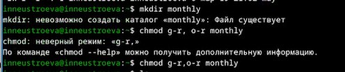{#fig:012 width=70%}

Создали файл ~/abc1 с правом записи для членов группы рис. [-@fig:013]).

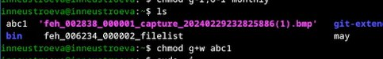{#fig:013 width=70%}

С помощью команды fsck проверяем целостность файловой системы: (рис. [-@fig:014]).

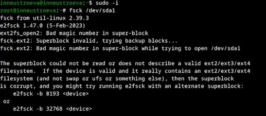{#fig:014 width=70%}

2. Выполните следующие действия

* Скопировали файл /usr/include/sys/io.h в домашний каталог и назовали его equipment(рис. [-@fig:015]).

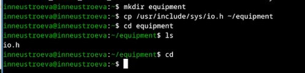{#fig:015 width=70%}

* В домашнем каталоге создали директорию ~/ski.plases. Далее переместили файл equipment в каталог ~ski.plases.(рис. [-@fig:016])

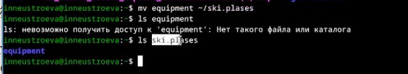{#fig:016 width=70%}

* Переименовали файл ~/ski.plases/equipment в ~/ski.plases/equiplist(рис. [-@fig:017])

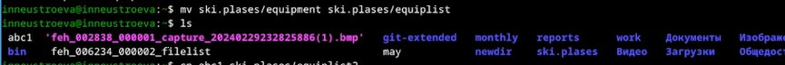{#fig:017 width=70%}

* Создали в домашнем каталоге файл abc1 и скопировали его в каталог ~/ski.plases, назовали его equiplist2.(рис. [-@fig:018])

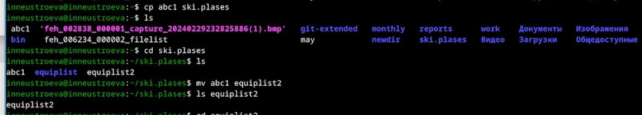{#fig:018 width=70%}

* Создали каталог с именем equipment в каталоге ~/ski.plases. Переместили файлы ~/ski.plases/equiplist и equiplist2 в каталог ~/ski.plases/equipment(рис. [-@fig:019])

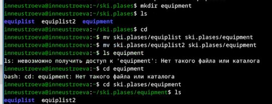{#fig:019 width=70%}

* Создали и переместили каталог ~/newdir в каталог ~/ski.plases и назовали его plans (рис. [-@fig:020]).

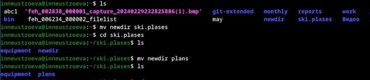{#fig:020 width=70%}

3. Определите опции команды chmod, необходимые для того, чтобы присвоить перечисленным ниже файлам выделенные права доступа, считая, что в начале таких прав нет

* Создали нужные каталоги australia, play, my_os, feathers (рис. [-@fig:021])

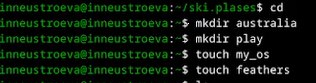{#fig:021 width=70%}

* Далее, изменили необходимые права доступа для созданых файлов на требемые: drwxr--r-- ... australia, drwx--x--x ... play, -r-xr--r-- ... my_os, -rw-rw-r-- ... feathers, с помощью команды chmod (рис. [-@fig:022]).

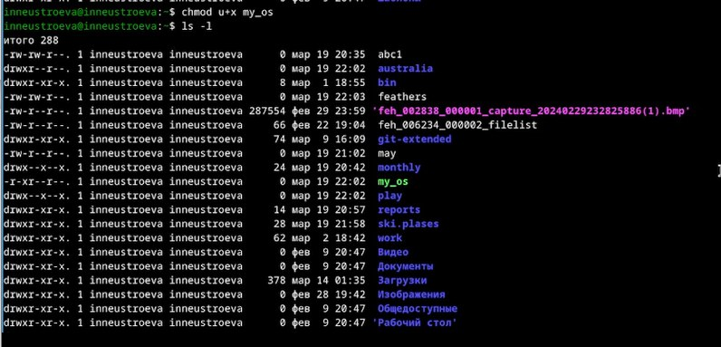{#fig:022 width=70%}

4. Проделайте приведённые ниже упражнения

* Пытались просмотрели содержимое файла /etc/password, но его у нас нет (рис. [-@fig:023])

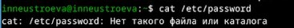{#fig:023 width=70%}

* Скопировали файл ~/feathers в файл ~/file.old (рис. [-@fig:024])

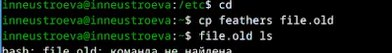{#fig:024 width=70%}

* Переместили файл ~/file.old в каталог ~/play. Скопировали каталог ~/play в каталог ~/fun. Переместили каталог ~/fun в каталог ~/play и назовали его games. (рис. [-@fig:025])

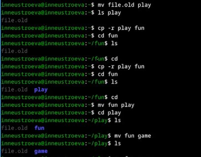{#fig:025 width=70%}

Лишили владельца файла ~/feathers права на чтение. Далее, попытались просмотреть файл ~/feathers командой
cat, нам было отказанно в доступе, потом попытались скопировать файл ~/feathers, тоже было отказанно в доступе. Далее вернули владельцу файла ~/feathers право на чтение (это можно посмотреть на следующей картинке) (рис. [-@fig:026])

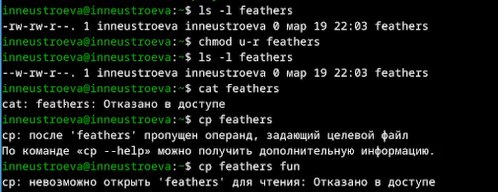{#fig:026 width=70%}

Лишили владельца каталога ~/play права на выполнение. Перешли в каталог ~/play, но было отказанно в доступе.Далее вернули владельцу каталога ~/play право на выполнение. (рис. [-@fig:027])

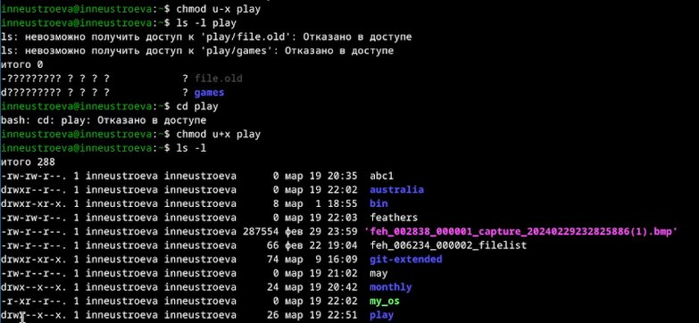{#fig:027 width=70%}

5. Прочитайте man по командам mount, fsck, mkfs, kill и кратко их охарактеризуйте,
приведя примеры.

*  man по команде mount (рис. [-@fig:028])

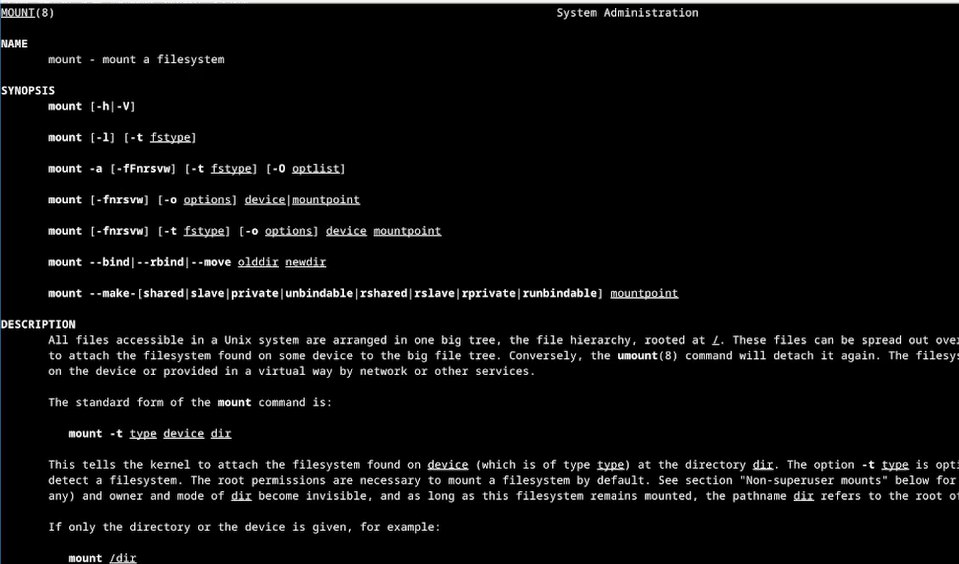{#fig:028 width=70%}

Команда используется для просмотра используемых в операционной системе файловых систем

* man по команде fsck (рис. [-@fig:029])

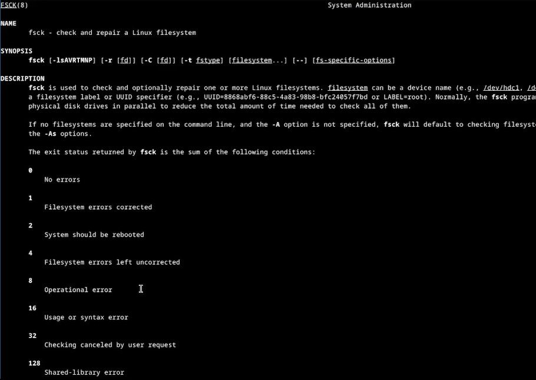{#fig:029 width=70%}

Команда нужна для проверки целосности файловой системы

* man по команде mkfs (рис. [-@fig:030])

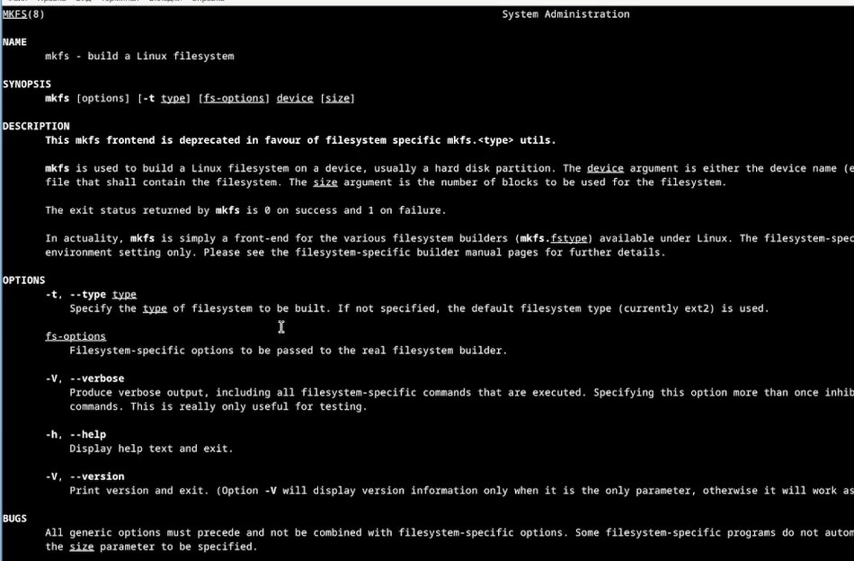{#fig:030 width=70%}

Команда используется для создания файловой системы на некотором устройстве.

* man по команде kill (рис. [-@fig:031])

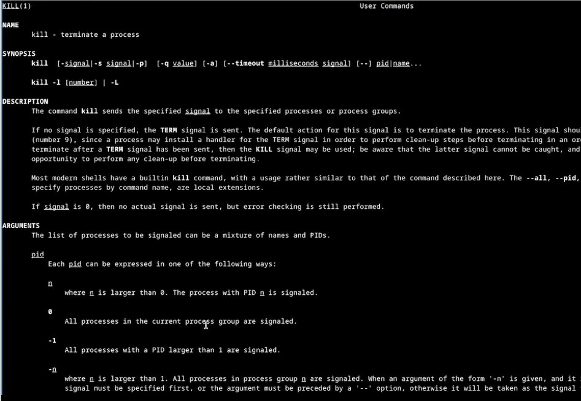{#fig:031 width=70%}

Косанда передаёт сигнал для прекращения процесса.

# Контрольные вопросы

1. Дайте характеристику каждой файловой системе, существующей на жёстком диске компьютера, на котором вы выполняли лабораторную работу.

Долгие годы ext2 была файловой системой по умолчанию в GNU/Linux. Ext2 заменила собой Extended File System (вот откуда появилось “Second” в названии). В “новой” файловой системе были исправлены некоторые проблемы, а также убраны ограничения. Отличная стабильность, комплексные инструментальные средства для спасения удаленных файлов, очень долгое время перезагрузки после аварии, есть вероятность частичной или полной потери данных после аварии. Одним из главных недостатков “традиционных” файловых систем, подобных Ext2FS, является низкая сопротивляемость к резким системным сбоям (сбой питания или авария программного обеспечения)

Ext3 (Расширенная файловая система номер три) - является наследником файловой системы Ext2FS. Ext3 совместима с Ext2, но обладает одной новой и очень интересной особенностью –запись. Процесс сохранения объекта происходит прежде чем запись в журнал. В результате мы получаем всегда последовательную файловую систему. Это приводит к тому, что при появлении проблем, проверка и восстановление происходят очень быстро. Время, потраченное на то, чтобы проверить файловую систему таким образом, пропорционально его фактическому использованию и не больше его размера.
ReiserFS (Это тоже журналируемая файловая система подобно Ext3FS, но их внутренняя структура радикально отличается. В ReiserFS используется концепция бинарных деревьев (binary-tree), позаимствованная из программного обеспечения баз данных.
JFS (журналируемая файловая система). JFS была разработана и использовалась IBM. Вначале JFS была закрытой системой, но недавно IBM решила открыть доступ для движения свободного программного обеспечения. Внутренняя структура JFS близка к ReiserFS. Средняя стабильность, нет комплексных инструментальных средств для спасения удаленных файлов, очень быстрая перезагрузка после аварии, очень хорошее восстановление данных после аварии.

2. Приведите общую структуру файловой системы и дайте характеристику каждой директории первого уровня этой структуры. 

Загрузочный блок занимает первый блок файловой системы. Только корневая файловая система имеет активный загрузочный блок, хотя место для него резервируется в каждой файловой системе.
Суперблок располагается непосредственно за загрузочным блоком и содержит самую общую информацию о ФС (размер ФС, размер области индексных дескрипторов, их число, список свободных блоков, свободные индексные дескрипторы и т. д.). Суперблок всегда находится в оперативной памяти. Различные версии ОСUnix способны поддерживать разные типы файловых систем. Поэтому у структуры суперблока могут быть варианты (сведения о свободных блоках, например, часто хранятся не как список, а как шкала бит), но суперблок всегда располагается за загрузочным блоком. При монтировании файловой системы в оперативной памяти создается копия ее суперблока. Все последующие операции по созданию и удалению файлов влекут изменения копии суперблока в оперативной памяти. Эта копия периодически записывается на магнитный диск. Обычно причиной повреждения файловой системы является отключение электропитания (или зависание ОС) в тот момент, когда система производит копирование суперблока из оперативной памяти на магнитный диск.
	- Область индексных дескрипторов содержит описатели файлов (inode). С каждым файлом связан один inode, но одному inode может соответствовать несколько файлов. Вinode хранится вся информация о файле, кроме его имени. Область индексных дескрипторов имеет фиксированный формат и располагается непосредственно за суперблоком. Общее число описателей и, следовательно, максимальное число файлов задается в момент создания файловой системы. Описатели нумеруются натуральными числами. Первый описатель используется ОС для описания специального файла (файла «Плохих блоков»). То есть поврежденные блоки раздела рассматриваются ОС как принадлежащие к специальному файлу и поэтому считаются «занятыми». Второй – описывает корневой каталог файловой системы.
	- В области данных расположены как обычные файлы, так и файлы каталогов (в том числе корневой каталог). Специальные файлы представлены в ФС только записями в соответствующих каталогах и индексными дескрипторами специального формата, т. е. места в области памяти не занимают.

3. Какая операция должна быть выполнена, чтобы содержимое некоторой файловой системы было доступно операционной системе?

 Команда cat - позволяет вывести на экран содержимое любого файла, однако в таком виде эта команда практически не используется. Если файл слишком большой, то его содержимое пролистается на экране, а Вы увидите только последние строки файла. С помощью этой команды можно комбинировать и объединять копии файлов, а также создавать новые файлы. Если набрать просто в командной строке cat и нажать Enter, то можно вводить (и соответственно видеть) текст на экране. Повторное нажатие клавиши Enter удвоит строку и позволит начать следующую. Когда текст набран, следует одновременно нажать клавиши Ctrl и d.

4. Назовите основные причины нарушения целостности файловой системы. Как устранить повреждения файловой системы?

Некорректность файловой системы может возникать:
В результате насильственного прерывания операций ввода-вывода, выполняемых непосредственно с диском.
В результате нарушения работы дискового кэша. Кэширование данных с диска предполагает, что в течение некоторого времени результаты операций ввода-вывода никак не сказываются на содержимом диска — все изменения происходят с копиями блоков диска, временно хранящихся в буферах оперативной памяти (в этих буферах оседают данные из пользовательских файлов и служебная информация файловой системы, такая как каталоги, индексные дескрипторы, списки свободных, занятых и поврежденных блоков и т. п.)

5. Как создаётся файловая система?

Общее дерево файлов и каталогов системы Linux формируется из отдельных "ветвей", соответствующих различным физическим носителям. В UNIX нет понятия "форматирования диска" (и команды форматирования), а используется понятие "создание файловой системы". Когда мы получаем новый носитель, например, жесткий диск, мы должны создать на нем файловую систему. То есть каждому носителю ставится в соответствие отдельная файловая система. Чтобы эту файловую систему использовать для записи в нее файлов, надо ее вначале подключить в общее дерево каталогов ("смонтировать"). Вот и получается, что можно говорить о монтировании файловых систем или о монтировании носителей (с созданными на них файловыми системами).
	Например, создается файловая система типа ext2fs. Создание файловой системы типа ext2fs подразумевает создание в данном разделе на диске суперблока, таблицы индексных дескрипторов и совокупности блоков данных. Делается все это все с помощью команды mkfs. В простейшем случае достаточно дать эту команду в следующем формате:
	
[root]# mkfs -t ext2 /dev/hda5, где /dev/hda5 надо заменить указанием на соответствующее устройство или раздел. Например, если вы хотите создать файловую систему на дискете, то команда примет вид:

[root]# mkfs -t ext2 /dev/fd0

После выполнения команды mkfs в указанном разделе будет создана файловая система ext2fs. В новой файловой системе автоматически создается один каталог с именем lost+found. Он используется в экстренных случаях программой fsck, поэтому не удаляйте его. Для того, чтобы начать работать с новой файловой системой, необходимо подключить ее в общее дерево каталогов, что делается с помощью команды mount.
В качестве параметров команде mount надо, как минимум, указать устройство и "точку монтирования". Точкой монтирования называется тот каталог в уже существующем и известном системе дереве каталогов, который будет теперь служить корневым каталогом для подключаемой файловой системы
После монтирования файловой системы в каталог /mnt/disk2 прежнее содержимое этого каталога станет для вас недоступно до тех пор, пока вы не размонтируете вновь подключенную файловую систему. Прежнее содержимое не уничтожается, а просто становится временно недоступным. Поэтому в качестве точек монтирования лучше использовать пустые каталоги (заранее заготовленные).

6. Дайте характеристику командам, которые позволяют просмотреть текстовые файлы.

Для просмотра небольших файлов удобно пользоваться командой cat.
Формат команды: cat имя-файла

Для просмотра больших файлов используйте команду less — она позволяет осуществлять постраничный просмотр файлов (длина страницы соответствует размеру экрана).
Формат команды: less имя-файла.

Для просмотра начала файла можно воспользоваться командой head. По умолчанию она выводит первые 10 строк файла.
Формат команды: head [-n] имя-файла, где n — количество выводимых строк.

Команда tail выводит несколько (по умолчанию 10) последних строк файла.
Формат команды: tail [-n] имя-файла, где n — количество выводимых строк.

7. Приведите основные возможности команды cp в Linux.

Копирование отдельных файлов
Для копирования файла следует использовать утилиту cp с аргументами, представленными путями к исходному и целевому файлам.

Копирование файлов в другую директорию
В том случае, если в качестве пути к целевому файлу используется путь к директории, исходные файлы будут скопированы в эту целевую директорию.

Команда cp -r
Для копирования директорий целиком следует использовать команду cp -r (параметр -r позволяет осуществлять рекурсивное копирование всех файлов из всех поддиректорий).

Копирование множества файлов в директорию
Вы также можете использовать утилиту cp для копирования множества файлов в одну директорию. В этом случае последний аргумент (аргумент, указывающий на цель) должен быть представлен путем к директории.

Команда cp -i
Для предотвращения перезаписи существующих файлов в ходе использования утилиты cp следует использовать параметр -i (для активации интерактивного режима копирования).

8. Назовите и дайте характеристику командам перемещения и переименования файлов и каталогов.

Команды mv и mvdir предназначены для перемещения и переименования файлов и каталогов.
Формат команды mv: mv [-опции] старый_файл новый_файл
Примеры: 
* Переименование файлов в текущем каталоге. Изменить название файла april на july в домашнем каталоге: cd mv april july
* Перемещение файлов в другой каталог. Переместить файл july в каталог monthly.00: mv july monthly.00 ls monthly.00 Результат: april july june may. Если необходим запрос подтверждения о перезаписи файла, то нужно использовать опцию i.
* Переименование каталогов в текущем каталоге. Переименовать каталог monthly.00 в monthly.01 mv monthly.00 monthly.01
* Перемещение каталога в другой каталог. Переместить каталог monthly.01в каталог reports: mkdir reports mv monthly.01 reports
*  Переименование каталога, не являющегося текущим. Переименовать каталог reports/monthly.01 в reports/monthly: mv reports/monthly.01 reports/monthly

9. Что такое права доступа? Как они могут быть изменены?
Права доступа — совокупность правил, регламентирующих порядок и условия доступа субъекта к объектам информационной системы (информации, её носителям, процессам и другим ресурсам).
Права доступа к файлу или каталогу можно изменить, воспользовавшись командой chmod. Сделать это может владелец файла (или каталога) или пользователь с правами администратора.
Формат команды: chmod режим имя_файла Режим (в формате команды) имеет следующие компоненты структуры и способ записи: = установить право - лишить права + дать право r чтение w запись x выполнение u (user) владелец файла g (group) группа, к которой принадлежит владелец файла o (others) все остальные В работе с правами доступа можно использовать их цифровую запись (восьмеричное значение) вместо символьной	

# Вывод

В ходе выполнения лабораторной работы мы ознакомились с файловой системой Linux, её структурой, именами и содержанием каталогов. Приобрели практические навыки по применению команд для работы с файлами и каталогами, по управлению процессами (и работами), по проверке исполь- зования диска и обслуживанию файловой системы.

