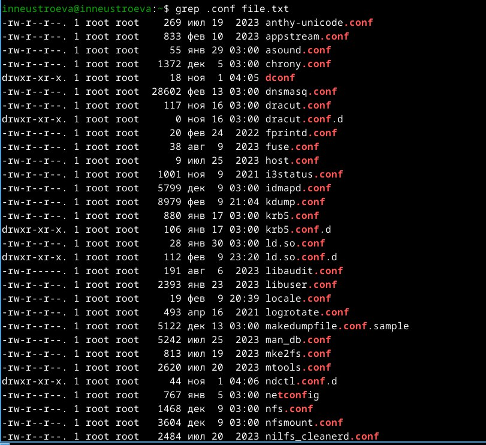
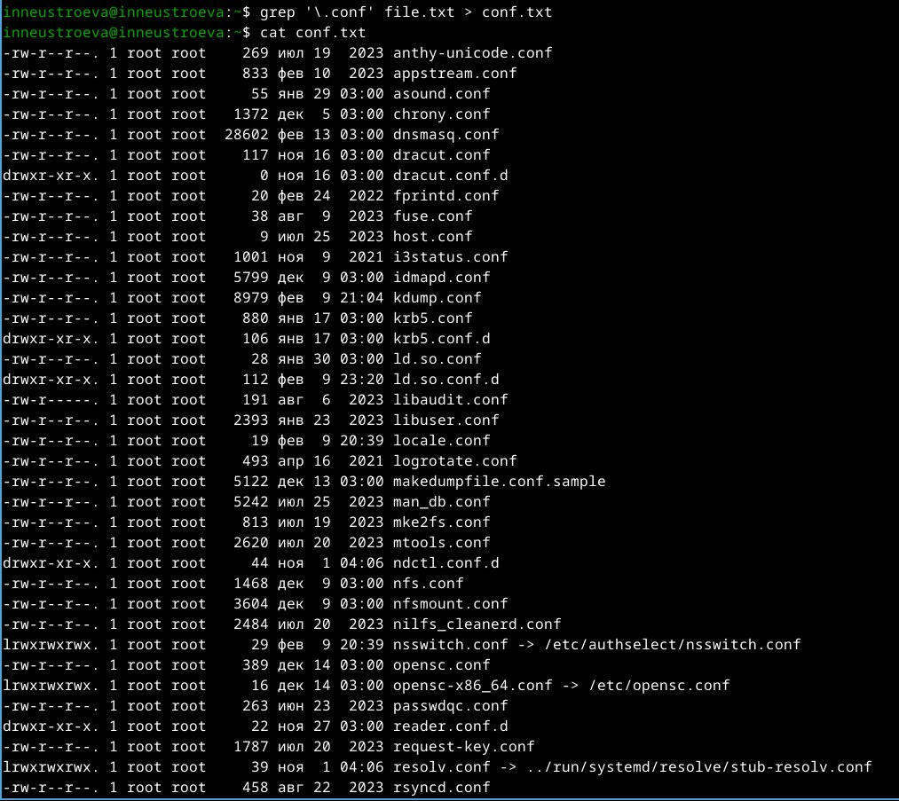
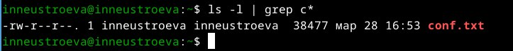
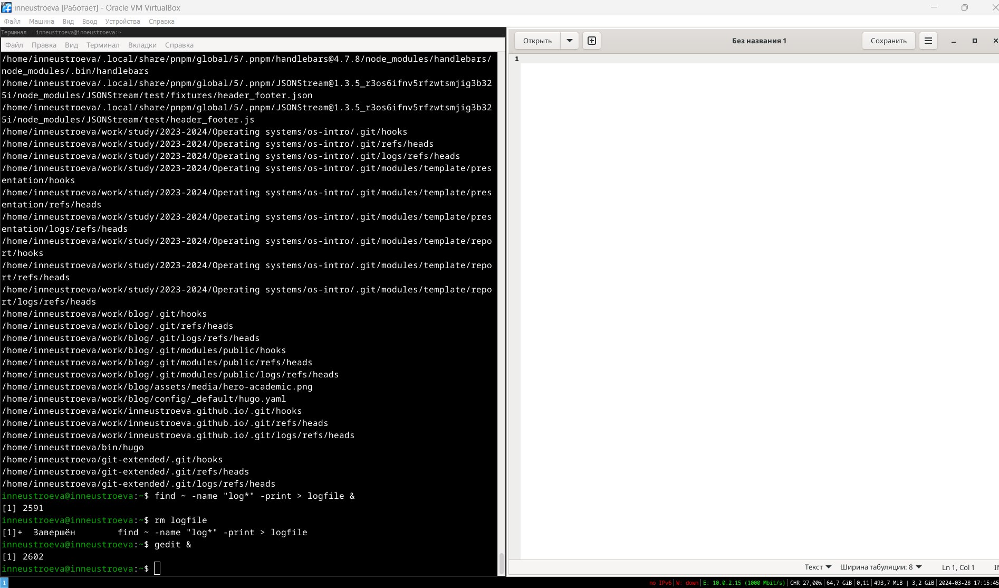
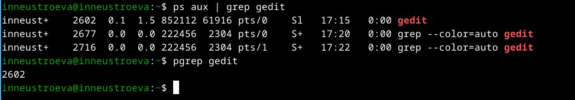
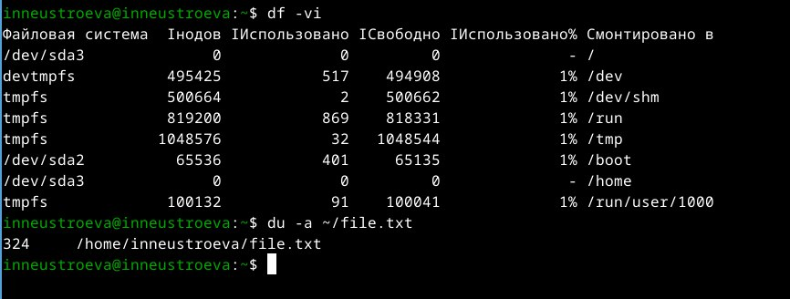
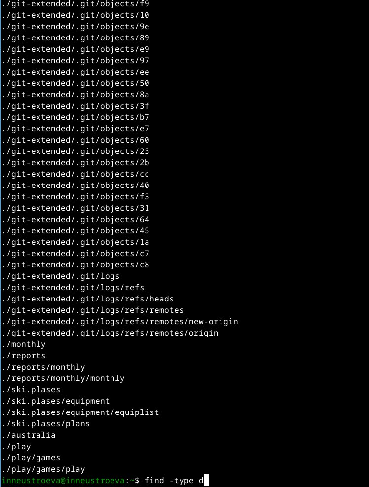

---
## Front matter
lang: ru-RU
title: Перезнтация по лабораторной работе 8
subtitle: Поиск файлов. Перенаправление ввода-вывода. Просмотр запущенных процессов.
author:
  - Неустроева И.Н.
institute:
  - Российский университет дружбы народов, Москва, Россия
date: 28 марта 2024

## i18n babel
babel-lang: russian
babel-otherlangs: english

## Formatting pdf
toc: false
toc-title: Содержание
slide_level: 2
aspectratio: 169
section-titles: true
theme: metropolis
header-includes:
 - \metroset{progressbar=frametitle,sectionpage=progressbar,numbering=fraction}
 - '\makeatletter'
 - '\beamer@ignorenonframefalse'
 - '\makeatother'
 
 ## Fonts
mainfont: PT Serif
romanfont: PT Serif
sansfont: PT Sans
monofont: PT Mono
mainfontoptions: Ligatures=TeX
romanfontoptions: Ligatures=TeX
sansfontoptions: Ligatures=TeX,Scale=MatchLowercase
monofontoptions: Scale=MatchLowercase,Scale=0.9
 
---

# Информация

## Докладчик

:::::::::::::: {.columns align=center}
::: {.column width="70%"}

  * Неустроева Ирина Николаевна
  * студентка группы НБИ 02-23
  * Российский университет дружбы народов
  * <https://inneustroeva.github.io/ru/>

:::
::::::::::::::

# Вводная часть

## Актуальность

Мне, как будущему специалисту в облати информационных технологий, важно научиться работать с ОС Линукс, в частности, работать с файлами через терминал.

# Цели 

Ознакомиться с инструментами поиска файлов и фильтрации текстовых данных. Приобрести практические навыки: по управлению процессами, по проверке использования диска и обслуживанию файловых систем.

# Основная часть

## Вывод имен файлов 
 
Выведем имена всех файлов из file.txt, имеющих расширение .conf
 

## Перенаправление вывода в файл

После чего записали их в новый текстовой файл conf.txt.

## Поиск файлов по началу

Определили, какие файлы в нашем домашнем каталоге имеют имена, начинавшиеся с символа c.

## Запуск процесса в фоновом режиме 

Запустили из консоли в фоновом режиме редактор gedit

## Определение индификатора процесса

Определили идентификатор процесса gedit, используя команду ps, конвейер и фильтр grep

## Завершение процесса 

Использовали команду kill для завершения процесса gedit

## Использование дискового пространства файловой системы и отображение используемых файлов на диске в файловой системе

Выполнили команду df , которая отображает использование дискового пространства файловой системы линукс в целом и команду du, которая показывает использование файлов и каталогов на диске в файловой систеие

## Команда find

Вывели имена всех директорий в домашнем каталоге.

# Заключительная чаcть.

## Результаты

В данной работе мы ознакомились с инструментами поиска файлов и фильтрации текстовых данных. А также приобрели практические навыки по управлению процессами. 

## Итоговый слайд

Выполнение лабораторной работы дало мне новые и полезные навыки.

