---
## Front matter
title: "Лабораторная работа 8"
subtitle: "Поиск файлов. Перенаправление ввода-вывода. Просмотр запущенных процессов"
author: "Неустроева Ирина Николаевна"

## Generic otions
lang: ru-RU
toc-title: "Содержание"

## Bibliography
bibliography: bib/cite.bib
csl: pandoc/csl/gost-r-7-0-5-2008-numeric.csl

## Pdf output format
toc: true # Table of contents
toc-depth: 2
lof: true # List of figures
lot: true # List of tables
fontsize: 12pt
linestretch: 1.5
papersize: a4
documentclass: scrreprt
## I18n polyglossia
polyglossia-lang:
  name: russian
  options:
	- spelling=modern
	- babelshorthands=true
polyglossia-otherlangs:
  name: english
## I18n babel
babel-lang: russian
babel-otherlangs: english
## Fonts
mainfont: PT Serif
romanfont: PT Serif
sansfont: PT Sans
monofont: PT Mono
mainfontoptions: Ligatures=TeX
romanfontoptions: Ligatures=TeX
sansfontoptions: Ligatures=TeX,Scale=MatchLowercase
monofontoptions: Scale=MatchLowercase,Scale=0.9
## Biblatex
biblatex: true
biblio-style: "gost-numeric"
biblatexoptions:
  - parentracker=true
  - backend=biber
  - hyperref=auto
  - language=auto
  - autolang=other*
  - citestyle=gost-numeric
## Pandoc-crossref LaTeX customization
figureTitle: "Рис."
tableTitle: "Таблица"
listingTitle: "Листинг"
lofTitle: "Список иллюстраций"
lotTitle: "Список таблиц"
lolTitle: "Листинги"
## Misc options
indent: true
header-includes:
  - \usepackage{indentfirst}
  - \usepackage{float} # keep figures where there are in the text
  - \floatplacement{figure}{H} # keep figures where there are in the text
---

# Цель работы

Ознакомиться с инструментами поиска файлов и фильтрации текстовых данных. Приобрести практические навыки: по управлению процессами (и заданиями), по
проверке использования диска и обслуживанию файловых систем.

# Задание

1. Осуществите вход в систему, используя соответствующее имя пользователя.

2. Запишите в файл file.txt названия файлов, содержащихся в каталоге /etc. Допишите в этот же файл названия файлов, содержащихся в вашем домашнем каталоге.

3. Выведите имена всех файлов из file.txt, имеющих расширение .conf, после чего запишите их в новый текстовой файл conf.txt.

4. Определите, какие файлы в вашем домашнем каталоге имеют имена, начинавшиеся с символа c? Предложите несколько вариантов, как это сделать.

5. Выведите на экран (по странично) имена файлов из каталога /etc, начинающиеся с символа h.

6. Запустите в фоновом режиме процесс, который будет записывать в файл ~/logfile файлы, имена которых начинаются с log.

7. Удалите файл ~/logfile.

8. Запустите из консоли в фоновом режиме редактор gedit.

9. Определите идентификатор процесса gedit, используя команду ps, конвейер и фильтр
grep. Как ещё можно определить идентификатор процесса?

10. Прочтите справку (man) команды kill, после чего используйте её для завершения
процесса gedit.

11. Выполните команды df и du, предварительно получив более подробную информацию
об этих командах, с помощью команды man.

12. Воспользовавшись справкой команды find, выведите имена всех директорий, имеющихся в вашем домашнем каталоге

# Теоретическое введение 

*Перенаправление ввода-вывода*

1 # Перенаправление stdout (вывода) в файл.
2 # Если файл отсутствовал, то он создаётся,
3 # иначе -- перезаписывается.
4
5 # Создаёт файл, содержащий список дерева каталогов.
6 ls -lR > dir-tree.list
7
8 1>filename
9 # Перенаправление вывода (stdout) в файл "filename".
10 1>>filename
11 # Перенаправление вывода (stdout) в файл "filename",
12 # файл открывается в режиме добавления.
13 2>filename
14 # Перенаправление stderr в файл "filename".
15 2>>filename
16 # Перенаправление stderr в файл "filename",
17 # файл открывается в режиме добавления.
18 &>filename
19 # Перенаправление stdout и stderr в файл "filename"

*Конвейер*

Конвейер (pipe) служит для объединения простых команд или утилит в цепочки, в которых результат работы предыдущей команды передаётся последующей. Синтаксис следующий:

1. команда 1 | команда 2 (означает, что вывод команды 1 передастся на ввод команде 2)

*Поиск файла*

Команда find используется для поиска и отображения на экран имён файлов, соответствующих заданной строке символов. Формат команды:
1. find путь [-опции]

Примеры:  Вывести на экран имена файлов из вашего домашнего каталога и его подкаталогов,
начинающихся на f:

1.  find ~ -name "f*" -print

*Фильтрация текста*

Найти в текстовом файле указанную строку символов позволяет команда grep. Формат команды:

1. grep строка имя_файла

Примеры: Показать строки во всех файлах в вашем домашнем каталоге с именами, начинающимися на f, в которых есть слово begin:

1. grep begin f*

Найти в текущем каталоге все файлы, содержащих в имени «лаб»:

2.  ls -l | grep лаб

*Проверка использования диска*

Команда df показывает размер каждого смонтированного раздела диска. Формат команды:
1.  df [-опции] [файловая_система]

Пример:

1. df -vi

Команда du показывает число килобайт, используемое каждым файлом или каталогом. Формат команды:
1.  du [-опции] [имя_файла...]

Пример.

1. du -a ~/

# Выполнение лабораторной работы 

1. Включаем компьютер, и заходим в учетную запись. 

2. Запишем в файл file.txt названия файлов, содержащихся в каталоге /etc. Допишем в этот же файл названия файлов, содержащихся в нашем домашнем каталоге. (рис. [-@fig:001]).

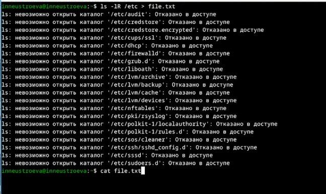{#fig:001 width=70%}

* Допишем в этот же файл названия файлов, содержащихся в нашем домашнем каталоге. (рис. [-@fig:002]).

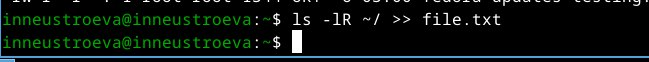{#fig:002 width=70%}

3. Выведем имена всех файлов из file.txt, имеющих расширение .conf, после чего запишем их в новый текстовой файл conf.txt. (рис. [-@fig:003]).

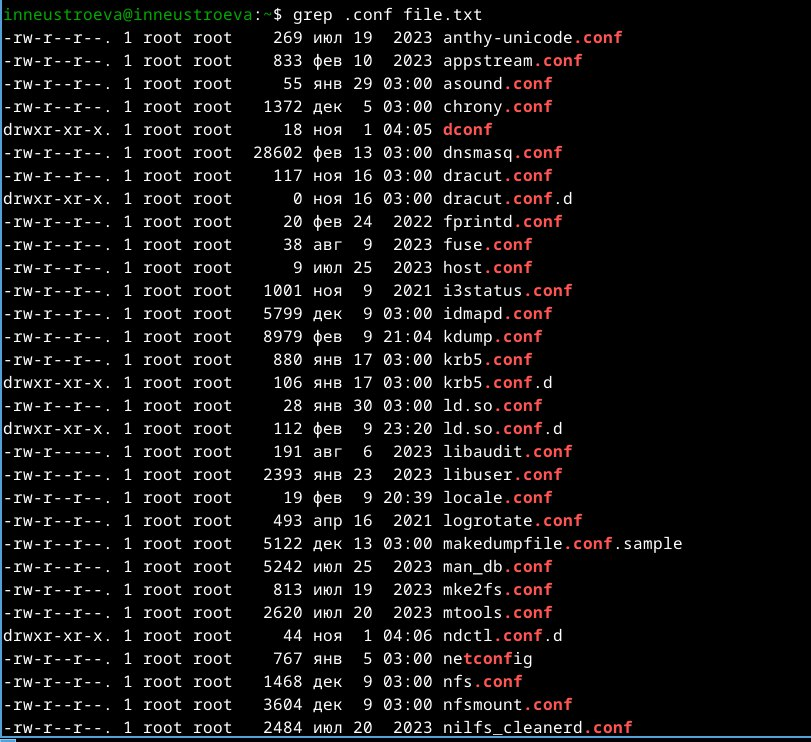{#fig:003 width=70%}

* После чего записали их в новый текстовой файл conf.txt. (рис. [-@fig:004]).

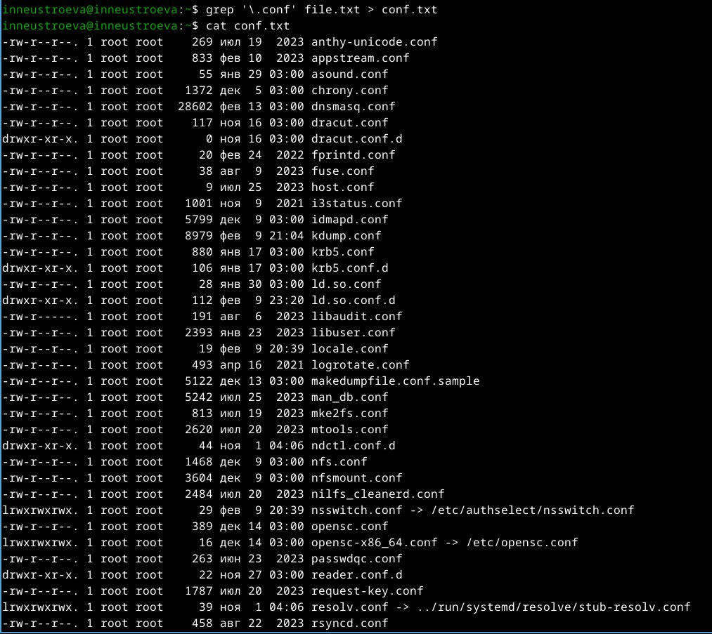{#fig:004 width=70%}

4. Определили, какие файлы в нашем домашнем каталоге имеют имена, начинавшиеся с символа c. (рис. [-@fig:005]).

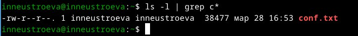{#fig:005 width=70%}

* Второй способ поиска файлов в вашем домашнем каталоге начинающиеся с символа c(рис. [-@fig:006]).

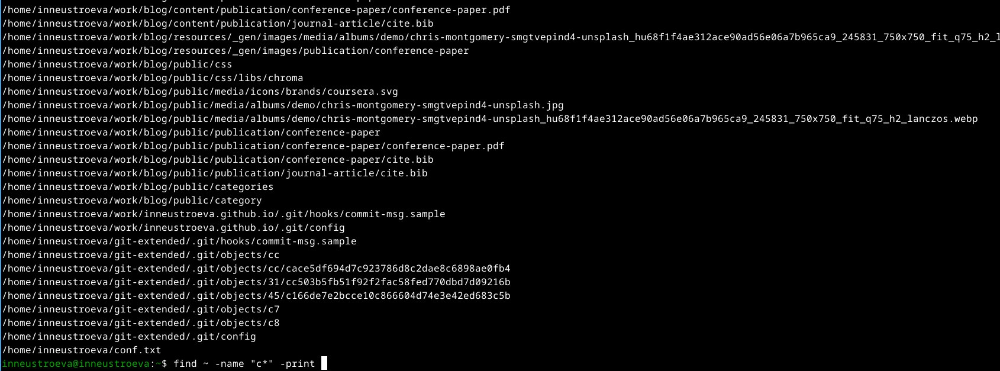{#fig:006 width=70%}

5. Выведем на экран (постранично) имена файлов из каталога /etc, начинающиеся с символа h. (рис. [-@fig:007]).

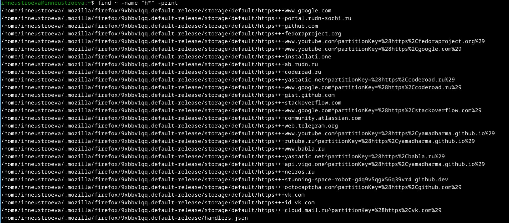{#fig:007 width=70%}

6. Запустили в фоновом режиме процесс, который будет записывать в файл ~/logfile файлы, имена которых начинаются с log. Процесс выполнен (рис. [-@fig:008]).

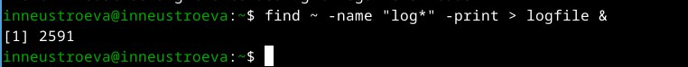{#fig:008 width=70%} 

7. Удаляем файл ~/logfile. (рис. [-@fig:009]).

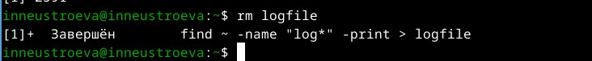{#fig:009 width=70%}

8. Запустили из консоли в фоновом режиме редактор gedit (рис. [-@fig:010]).

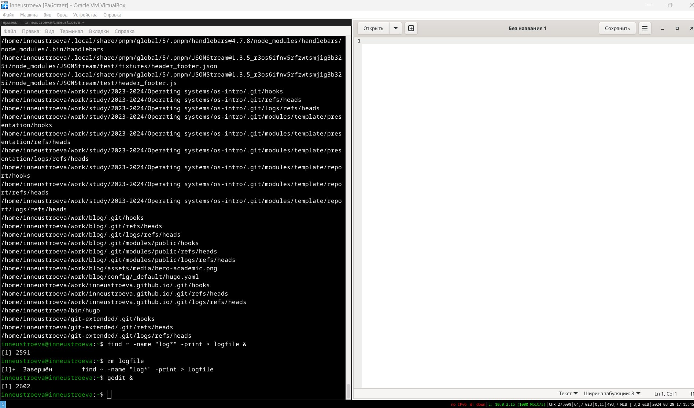{#fig:010 width=70%}

9. Определили идентификатор процесса gedit, используя команду ps, конвейер и фильтр grep двумя способами (рис. [-@fig:011]).

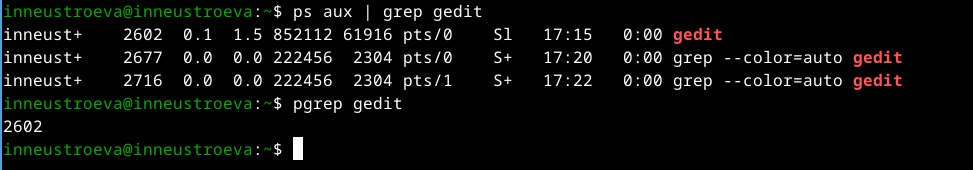{#fig:011 width=70%}

10. Прочитали справку (man) команды kill (рис. [-@fig:012]).

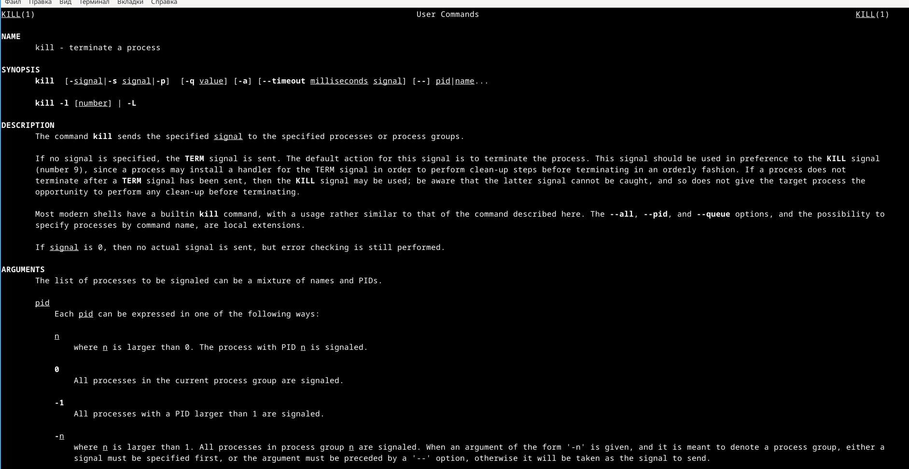{#fig:012 width=70%}

* После чего использовали команду kill для завершения процесса gedit. (рис. [-@fig:013]).

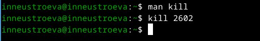{#fig:013 width=70%}

11. Получили более подробную информацию о команде df (рис. [-@fig:014]) и команде du (рис. [-@fig:015]).

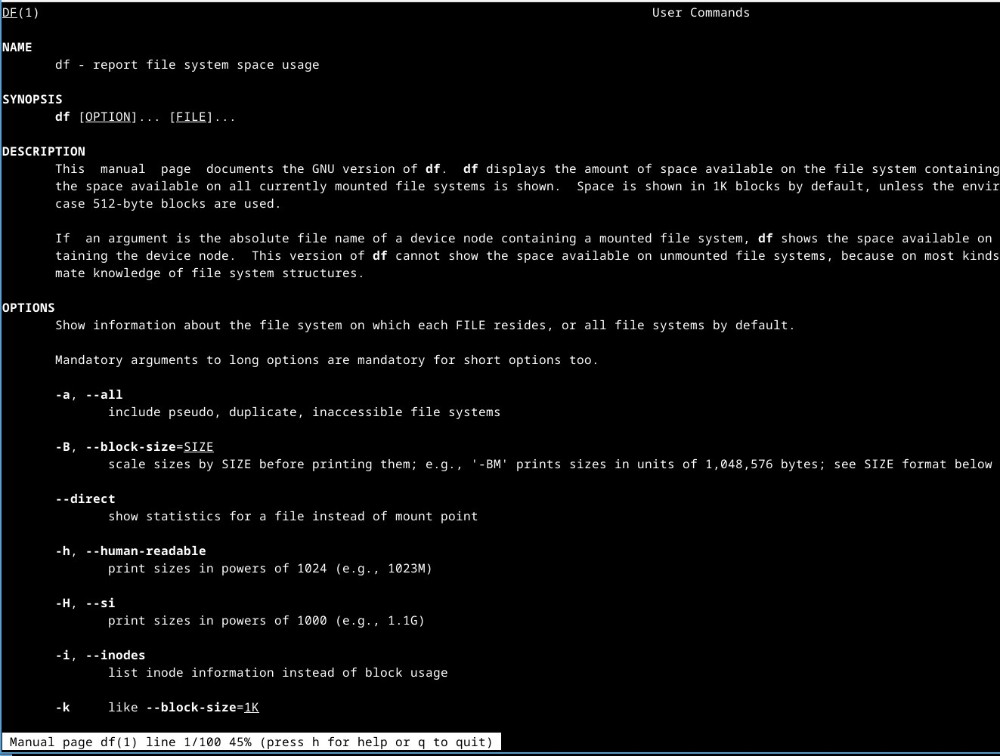{#fig:014 width=70%}

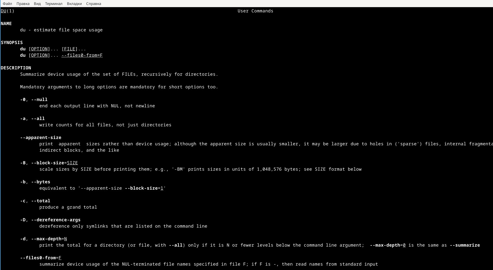{#fig:015 width=70%}

* Выполнили команду df, которая показывает размер каждого смонтированного раздела диска и Выполнили команду du, которая показывает число килобайт, используемое каждым файлом или каталогом.(рис. [-@fig:016])

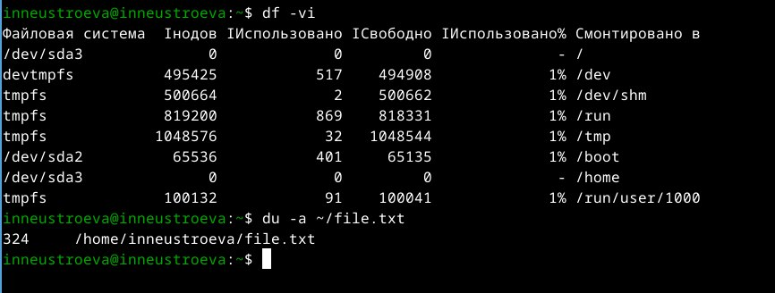{#fig:016 width=70%}

12. Воспользовались справкой по команде find (рис. [-@fig:017])

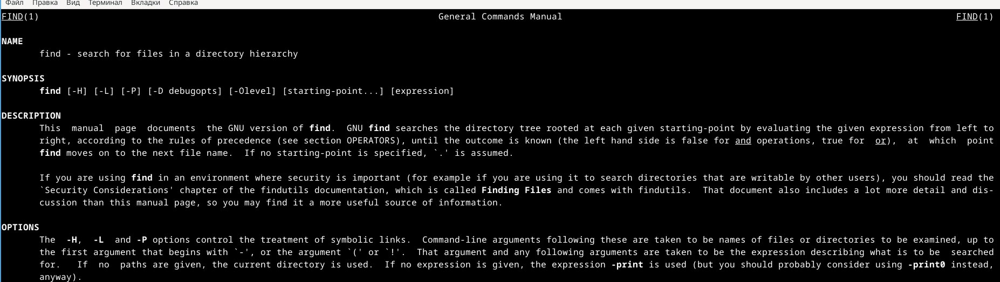{#fig:017 width=70%}

* Вывод имен всех директорий (рис. [-@fig:018])

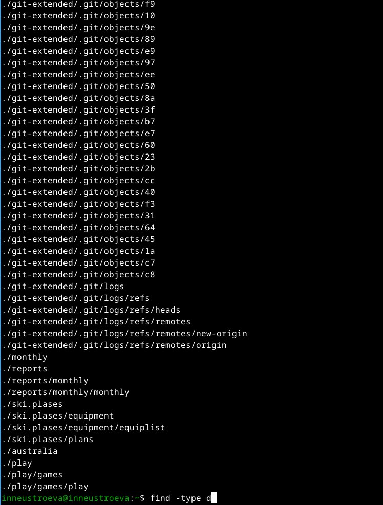{#fig:018 width=70%}

# Вывод

В данной работе мы ознакомились с инструментами поиска файлов и фильтрации текстовых данных. А также приобрели практические навыки по управлению процессами. 

# Контрольные вопросы

1. Какие потоки ввода вывода вы знаете?

a) stdin — стандартный поток ввода (клавиатура),

b) stdout — стандартный поток вывода (консоль),

c) stderr — стандартный поток вывод сообщений об ошибках на экран

2. Объясните разницу между операцией > и >>

Разница заключается в том, что Символ > используется для переназначения стандартного ввода команды, а символ >> используется для присоединения данных в конец файла стандартного вывода команды.

3. Что такое конвейер?

Конвейер – это способ связи между двумя программами. 
Например: конвейер pipe служит для объединения простых команд или утилит в цепочки, в которых результат работы предыдущей команды передается последующей. 
Синтаксис у конвейера  следующий: команда1 | команда 2

4. Что такое процесс? Чем это понятие отличается от программы?

Процесс - это программа, которая выполняется в отдельном виртуальном адресном пространстве независимо от других программ или их пользованию по необходимости. \

5. Что такое PID и GID?

Во первых id — UNIX-утилита, выводящая информацию об указанном пользователе USERNAME или текущем пользователе, который запустил данную команду и не указал явно имя пользователя.
1)	GID – (Group ID) - идентификатор группы 
2)	UID – (User ID) - идентификатор группы
Обычно UID  является — положительным целым число м в диапазоне от 0 до 65535, по которому в системе однозначно отслеживаются действия пользователя

6. Что такое задачи и какая команда позволяет ими управлять?

Запущенные фоном программы называются задачами(процессами) (jobs). Ими можно управлять с помощью команды jobs, которая выводит список запущенных в данный момент процессов. Для завершения процесса необходимо выполнить команду : kill % номер задачи

7. Найдите информацию об утилитах top и htop. Каковы их функции?

Top это консольная команда, которая выводит список работающих в системе процессов и информации о них. По умолчанию она в реальном времени сортирует их по нагрузке на процессор.Htop же является альтернативой программы top она предназначенная для вывода на терминал списка запущенных процессов и информации о них.

8. Назовите и дайте характеристику команде поиска файлов. Приведите примеры использования этой команды.

Команда find используется для поиска и отображения имен файлов, соответствующих заданной строке символов.
Синтаксис: find trek [-options]
Пример:
Задача - Вывести на экран имена файлов из каталога /etc и его подкаталогов, Заканчивающихся на k:
find ~ -name "*k" -print

9. Можно ли по контексту (содержанию) найти файл? Если да, то как?
М
ожно, команда grep способна обрабатывать вывод других файлов. Для этого надо использовать конвейер, связав вывод команды с вводом grep.
Пример:
Задача - показать строки в каталоге /dreams с именами начинающимися на t, в которых есть фраза:  I like of Operating systems
grep I like of Operating systems t*

10. Как определить объем свободной памяти на жёстком диске?

Команда df показывает размер каждого смонтированного раздела диска.
Например команда: df -h

11. Как определить объем вашего домашнего каталога?

Команда du показывает число килобайт, используемое каждым файлом или каталогом.
Например команда: du -sh

12. Как удалить зависший процесс?

Перед тем, как выполнить остановку процесса, нужно определить его PID. Когда известен PID , мы можем убить его командой kill. Команда kill принимает в качестве параметра PID процесса. 
PID можно узнать с помощью команд ps, grep, top или htop

::: {#refs}
:::

