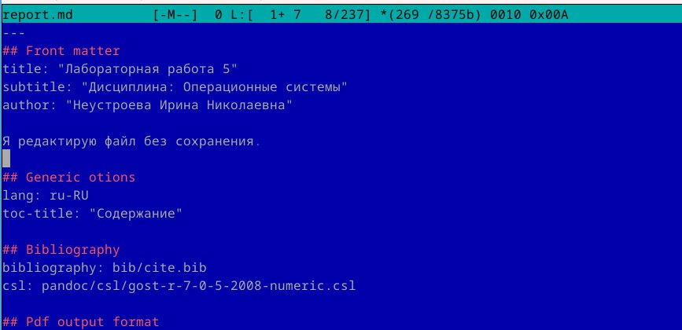
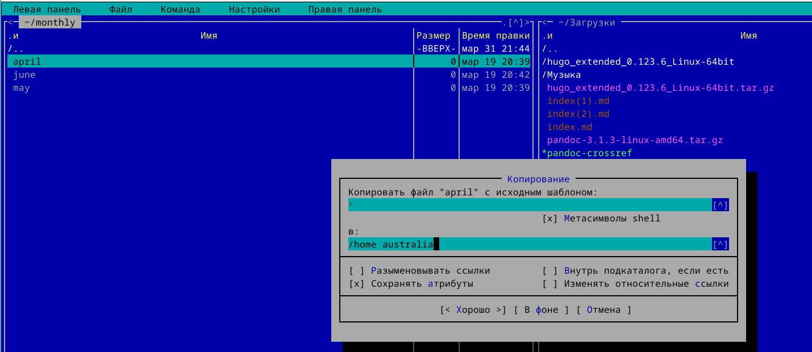
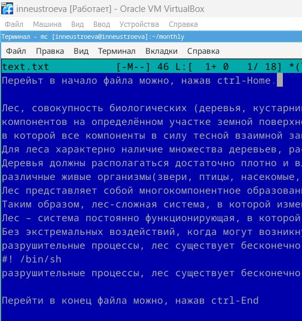
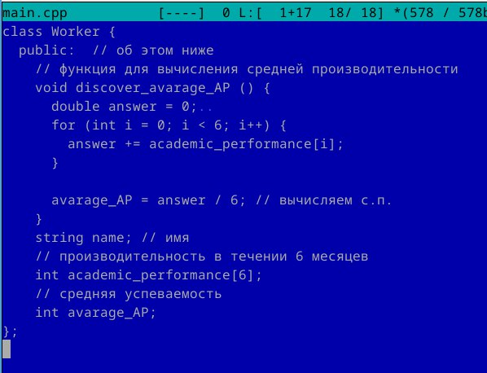

---
## Front matter
lang: ru-RU
title: Перезнтация по лабораторной работе 9
subtitle: Командная оболочка Midnight Commander
author:
  - Неустроева И.Н.
institute:
  - Российский университет дружбы народов, Москва, Россия
date: 30 марта 2024

## i18n babel
babel-lang: russian
babel-otherlangs: english

## Formatting pdf
toc: false
toc-title: Содержание
slide_level: 2
aspectratio: 169
section-titles: true
theme: metropolis
header-includes:
 - \metroset{progressbar=frametitle,sectionpage=progressbar,numbering=fraction}
 - '\makeatletter'
 - '\beamer@ignorenonframefalse'
 - '\makeatother'
 
 ## Fonts
mainfont: PT Serif
romanfont: PT Serif
sansfont: PT Sans
monofont: PT Mono
mainfontoptions: Ligatures=TeX
romanfontoptions: Ligatures=TeX
sansfontoptions: Ligatures=TeX,Scale=MatchLowercase
monofontoptions: Scale=MatchLowercase,Scale=0.9
 
---

# Информация

## Докладчик

:::::::::::::: {.columns align=center}
::: {.column width="70%"}

  * Неустроева Ирина Николаевна
  * студентка группы НБИ 02-23
  * Российский университет дружбы народов
  * <https://inneustroeva.github.io/ru/>

:::
::::::::::::::

# Вводная часть

## Актуальность

Работа с mc и егго встроенным редактором хороший навык, который мне пригодится в будущем.

# Цели 

Освоение основных возможностей командной оболочки Midnight Commander. Приобретение навыков практической работы по просмотру каталогов и файлов; манипуляций с ними

# Основная часть

## Информация об mc

Запустили в терминале mc и посмотрели на интерфейс. в mc есть различные подменю: файл, команда, настройки. Ими весьма удобно пользоваться.
 

## Открытие файла

Для открытия файла на чтение используем клавишу f3 , на редактирование -f4

## Создание каталогов и копирование файлов в него

Для создание каталога служит клавиша f7, для копирование файла - f5

## Работа с встроенным редактором mc

Изменяем текст можно используя горячие клавиши, сохраняем файл

## Текст программ на языках программирования

Для работы с текстом на языках программирования удобно использовать подсветку. Включать/выключать её можно с помощью Ctrl + s

# Заключительная чаcть.

## Результаты

В данной работе я научилась работать с mc и встроенным редактором

## Итоговый слайд

Все поставленные задачи выполнены, цели достигнуты.

