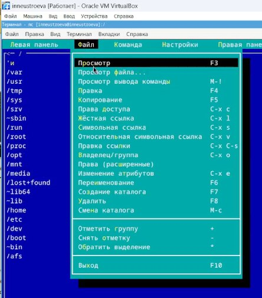
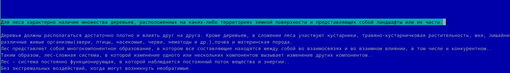

---
## Front matter
title: "Лабораторная работа 9"
subtitle: "Командная оболочка Midnight Commander"
author: "Неустроева Ирина Николаевна"

## Generic otions
lang: ru-RU
toc-title: "Содержание"

## Bibliography
bibliography: bib/cite.bib
csl: pandoc/csl/gost-r-7-0-5-2008-numeric.csl

## Pdf output format
toc: true # Table of contents
toc-depth: 2
lof: true # List of figures
lot: true # List of tables
fontsize: 12pt
linestretch: 1.5
papersize: a4
documentclass: scrreprt
## I18n polyglossia
polyglossia-lang:
  name: russian
  options:
	- spelling=modern
	- babelshorthands=true
polyglossia-otherlangs:
  name: english
## I18n babel
babel-lang: russian
babel-otherlangs: english
## Fonts
mainfont: PT Serif
romanfont: PT Serif
sansfont: PT Sans
monofont: PT Mono
mainfontoptions: Ligatures=TeX
romanfontoptions: Ligatures=TeX
sansfontoptions: Ligatures=TeX,Scale=MatchLowercase
monofontoptions: Scale=MatchLowercase,Scale=0.9
## Biblatex
biblatex: true
biblio-style: "gost-numeric"
biblatexoptions:
  - parentracker=true
  - backend=biber
  - hyperref=auto
  - language=auto
  - autolang=other*
  - citestyle=gost-numeric
## Pandoc-crossref LaTeX customization
figureTitle: "Рис."
tableTitle: "Таблица"
listingTitle: "Листинг"
lofTitle: "Список иллюстраций"
lotTitle: "Список таблиц"
lolTitle: "Листинги"
## Misc options
indent: true
header-includes:
  - \usepackage{indentfirst}
  - \usepackage{float} # keep figures where there are in the text
  - \floatplacement{figure}{H} # keep figures where there are in the text
---

# Цель работы

Освоение основных возможностей командной оболочки Midnight Commander. Приобретение навыков практической работы по просмотру каталогов и файлов; манипуляций с ними

# Задание по mc

1. Изучите информацию о mc, вызвав в командной строке man mc.

2. Запустите из командной строки mc, изучите его структуру и меню

3. Выполните несколько операций в mc, используя управляющие клавиши (операции
с панелями; выделение/отмена выделения файлов, копирование/перемещение файлов, получение информации о размере и правах доступа на файлы и/или каталоги
и т.п.)

4. Выполните основные команды меню левой (или правой) панели. Оцените степень
подробности вывода информации о файлах.

5. Используя возможности подменю Файл , выполните:
– просмотр содержимого текстового файла;
– редактирование содержимого текстового файла (без сохранения результатов
редактирования);
– создание каталога;
– копирование в файлов в созданный каталог.

6. С помощью соответствующих средств подменю Команда осуществите:
– поиск в файловой системе файла с заданными условиями (например, файла
с расширением .c или .cpp, содержащего строку main);
– выбор и повторение одной из предыдущих команд;
– переход в домашний каталог;
– анализ файла меню и файла расширений.

7. Вызовите подменю Настройки . Освойте операции, определяющие структуру экрана mc
(Full screen, Double Width, Show Hidden Files и т.д.)

## Задание по встроенному редактору mc

1. Создайте текстовой файл text.txt.

2. Откройте этот файл с помощью встроенного в mc редактора.

3. Вставьте в открытый файл небольшой фрагмент текста, скопированный из любого
другого файла или Интернета.

4. Проделайте с текстом следующие манипуляции, используя горячие клавиши:

4.1. Удалите строку текста.
4.2. Выделите фрагмент текста и скопируйте его на новую строку.
4.3. Выделите фрагмент текста и перенесите его на новую строку.
4.4. Сохраните файл.
4.5. Отмените последнее действие.
4.6. Перейдите в конец файла (нажав комбинацию клавиш) и напишите некоторый
текст.
4.7. Перейдите в начало файла (нажав комбинацию клавиш) и напишите некоторый
текст.
4.8. Сохраните и закройте файл.

5. Откройте файл с исходным текстом на некотором языке программирования (например C или Java)

6. Используя меню редактора, включите подсветку синтаксиса, если она не включена,
или выключите, если она включена.

# Выполнение лабораторной работы 

1. Изучили информацию о mc, вызвав в командной строке man mc. (рис. [-@fig:025]).

{#fig:025 width=70%}

2. Запустили из командной строки mc, изучили его структуру и меню 

3. Выполнили несколько операций в mc, используя управляющие клавиши: Выделение/отмена выделения файлов F3 (рис. [-@fig:026]), копирование/перемещение файлов (рис. [-@fig:001]), получение информации о размере и правах доступа на файлы и/или каталоги (рис. [-@fig:027]).

{#fig:001 width=70%}

{#fig:026 width=70%}

{#fig:027 width=70%}

4. Выполнили основные команды меню правой панели (рис. [-@fig:003]).

{#fig:003 width=70%}

5. Используя возможности подменю Файл , выполнили:

* просмотрели содержимое текстового файла (рис. [-@fig:004]).

{#fig:004 width=70%}

* Отредактировали содержимое текстового файла (без сохранения результатов редактирования)  (рис. [-@fig:005]).

{#fig:005 width=70%}

* создали каталог (рис. [-@fig:006]).

{#fig:006 width=70%}

* Скопировали файл в созданный каталог (рис. [-@fig:007]).

{#fig:007 width=70%}

6. С помощью соответствующих средств подменю Команда осуществили

* поиск в файловой системе файла с заданными условиями  (рис. [-@fig:008]).

{#fig:008 width=70%} 

* переход в домашний каталог (рис. [-@fig:009]).

{#fig:009 width=70%}

* анализ файла меню (рис. [-@fig:011]). и файла расширений (рис. [-@fig:010]).

{#fig:010 width=70%}

{#fig:011 width=70%}

7. Вызвали подменю Настройки. Освоили операции, определяющие структуру экрана mc
(Full screen, Double Width, Show Hidden Files и т.д.) (рис. [-@fig:012]) (рис. [-@fig:013]).

{#fig:012 width=70%}

{#fig:013 width=70%}

Задание по встроенному редактору mc

1. Создали текстовой файл text.txt.  (рис. [-@fig:014]).

{#fig:014 width=70%}

2. Открыли этот файл с помощью встроенного в mc редактора.(рис. [-@fig:015]).

{#fig:015 width=70%}

3. Вставили в открытый файл небольшой фрагмент текста (рис. [-@fig:016])

{#fig:016 width=70%}

4. Проделали с текстом следующие манипуляции, используя горячие клавиши:

* Удалили строку текста (рис. [-@fig:017])

{#fig:017 width=70%}

* Выделили фрагмент текста и скопировали его на новую строку. (рис. [-@fig:018])

{#fig:018 width=70%}

* Выделили фрагмент текста и перенесли его на новую строку.(рис. [-@fig:019])

{#fig:019 width=70%}

* Сохранили файл. (рис. [-@fig:020])

{#fig:020 width=70%}

* Отменили последнее действие.(рис. [-@fig:021])

{#fig:021 width=70%}

* Перешли в конец файла (нажав комбинацию клавиш ctrl End ) и написали некоторый текст. Перейдите в начало файла (нажав комбинацию клавиш) Ctrl Home и напиcали некоторый текст (рис. [-@fig:022])

{#fig:022 width=70%}

* Сохранили и закрыли файл.

5. Открыли файл с исходным текстом на языке программирования 

6. Используя меню редактора,включили (рис. [-@fig:023]) выключили (рис. [-@fig:024]) подсветку 

{#fig:023 width=70%}

{#fig:024 width=70%}

# Вывод

Освоили основные возможности командной оболочки Midnight Commander. Приобрели навыки практической работы по просмотру каталогов и файлов; манипуляций с ними

# Контрольные вопросы

1. Какие режимы работы есть в mc? Охарактеризуйте их.
Ответ: В командной оболочке mc есть два режима Информация и Дерево. В режиме Информация на панель выводятся сведения о файле и текущей файловой системе, расположенных на активной панели. В режиме Дерево на одной из панелей выводится структура дерева каталогов. Управлять режимами отображения панелей можно через пункты меню mc

2. Какие операции с файлами можно выполнить как с помощью команд shell, так и с помощью меню mc? Привести несколько примеров.
Ответ: Командные интерпретатор Shell и оболочка Midnight Commander имеют похожую структуру и многие одинаковые команды можно выполнить в обоих оболочках вот некоторые из них
a) Системная информация
b) Поиск
c) Копирование

3. Опишите структуру меню левой панели mc, дайте характеристику командам.
Ответ: Меню левой панели mc представляет собой следующую конструкцию:

Где подпункты меню
a) Список файлов показывает файлы в домашнем каталоге.
b) Быстрый просмотр позволяет выполнить быстрый просмотр содержимого панели.
с) Информация позволяет посмотреть информацию о файле или каталоге 
d) Командная оболочка Midnight Commander В меню каждой (левой или правой) панели можно выбрать Формат списка: стандартный, ускоренный, расширенный  и определённый пользователем.
e) Порядок сортировки позволяет задать критерии сортировки при выводе списка файлов и каталогов: без сортировки, по имени, расширенный, время правки, время доступа, время изменения атрибута, размер, узел.

4. Опишите структура меню Файл mc и дайте характеристику командам.
Ответ: Меню Фаил mc представляет собой следующую конструкцию:

Где подпункты меню
a) Просмотр ( F3 )  позволяет посмотреть содержимое текущего файла без возможности редактирования. 
b) – Просмотр вывода команды ( М + ! ) функция запроса команды с параметрами.
c) Правка ( F4 ) открывает текущий (или выделенный) файл для его редактирования. 
d) Копирование ( F5 ) осуществляет копирование одного или нескольких файлов или каталогов в указанное пользователем во всплывающем окне место. 
e) Права доступа ( Ctrl-x c ) позволяет изменить права доступа к одному или нескольким файлам или каталогам.
f)  Права доступа на файлы и каталоги 
g) Жёсткая ссылка ( Ctrl-x l ) позволяет создать жёсткую ссылку к текущему (или выделенному) файлу1 . 
h) Символическая ссылка ( Ctrl-x s ) — позволяет создать символическую ссылку к текущему файлу . 
i) Владелец группы ( Ctrl-x o ) позволяет задать владельца и имя группы для одного или нескольких файлов или каталогов. 
j) Права (расширенные)  позволяет изменить права доступа и владения для одного или нескольких файлов или каталогов. 
k) Переименование ( F6 ) позволяет переименовать один или несколько файлов или каталогов.
l) Создание каталога ( F7 ) позволяет создать каталог. 
m) Удалить ( F8 ) позволяет удалить один или несколько файлов или каталогов. 
n) Выход ( F10 )  завершает работу mc. 

5 Опишите структура меню Команда mc, дайте характеристику командам
Ответ: Ответ: Меню Команда mc представляет собой следующую конструкцию:

Где подпункты меню
a) Дерево каталогов отображает структуру каталогов системы.
b) Поиск файла выполняет поиск файлов по заданным параметрам.
c) Переставить панели меняет местами левую и правую панели. 
d) Сравнить каталоги ( Ctrl-x d ) сравнивает содержимое двух каталогов. 
e) Размеры каталогов отображает размер и время изменения каталога (по умол- чанию в mc размер каталога корректно не отображается).
f) История командной строки выводит на экран список ранее выполненных в оболочке команд. 
g) Каталоги быстрого доступа ( Ctrl-\ ) при вызове выполняется быстрая смена текущего каталога на один из заданного списка. 
h) Восстановление файлов позволяет восстановить файлы на файловых систе- мах ext2 и ext3. 
i) Редактировать файл расширений позволяет задать с помощью определённого синтаксиса действия при запуске файлов с определённым расширением (напри- мер, какое программного обеспечение запускать для открытия или редактирова- ния файлов с расширением .c или .cpp). 
j) Редактировать файл меню позволяет отредактировать контекстное меню поль- зователя, вызываемое по клавише F2 . 
k) Редактировать файл расцветки имён позволяет подобрать оптимальную для пользователя расцветку имён файлов в зависимости от их типа.

6. Опишите структура меню Настройки mc, дайте характеристику командам
Ответ: Меню Настройки mc представляет собой следующую конструкцию:

Где подпункты меню
a) Конфигурация позволяет скорректировать настройки работы с панелями. 
b) Внешний вид и Настройки панелей определяет элементы, отображаемые при вызове mc, а также цветовое выделение. 
c) Биты символов задаёт формат обработки информации локальным термина- лом. 
d) Подтверждение позволяет установить или убрать вывод окна с запросом подтверждения действий при операциях удаления и перезаписи файлов, а также при выходе из программы.
e) Распознание клавиш диалоговое окно используется для тестирования функциональных клавиш, клавиш управления курсором и прочее.
f) Виртуальные ФС настройки виртуальной файловой системы: тайм-аут, пароль и прочее.

7. Назовите и дайте характеристику встроенным командам mc.
Ответ: В командную оболочку mc встроены стандартные команды. Вот некоторые из них.
a) F1 Вызов контекстно-зависимой подсказки.
b) F2 Вызов пользовательского меню с возможностью создания and/or.
c) F3 Просмотр содержимого файла, на который указывает подсветка в активной панели.
d) F4 Вызов встроенного в mc редактора для изменения содержания файла, на который указывает подсветка в активной панели.
d) F5 Копирование одного или нескольких файлов, отмеченных в первой (активной) панели, в каталог, отображаемый на второй панели.
e) F6 Перенос одного или нескольких файлов, отмеченных в первой панели, в каталог, отображаемый на второй панели.
f) F7 Создание подкаталога в каталоге, отображаемом в активной панели.
g) F8 Удаление одного или нескольких файлов, отмеченных в первой панели файлов.
h) Вызов меню mc.
i) F10 Выход из mc.

8 Назовите и дайте характеристику командам встроенного редактора mc.
Ответ: В редактор mc встроено немало команд. Вот некоторые из них.
a) Ctrl+y удалить строку.
b) Ctrl+u отмена последней операции. 
c) Ins вставка/замена.
d)F7 поиск.
d)Shift+F7 повтор последней операции поиска.
e) F4 замена файла.
f) F3 первое нажатие начало выделения, второе это окончание выделения.
g) F5 копировать выделенный фрагмент F6 переместить выделенный фрагмент.
h) F8 удалить выделенный фрагмент.
i) F2 записать изменения в файл.
j) F10 выйти из редактора.

9. Дайте характеристику средствам mc, которые позволяют создавать меню, определяемые пользователем.
Ответ: Один из четырех форматов списка в Midnight Commander -Пользовательский определённый самим пользователем позволяет ему редактировать меню любого из двух списков. А меню пользователя – это меню, состоящее из команд, определенных пользователем. При вызове меню используется файл ~/.mc.menu. Если такого файла нет, то по умолчанию используется системный файл меню /usr/lib/mc/mc.menu. Все строки в этих файлах  , начинающиеся с пробела или табуляции, являются командами, которые выполняются при выборе записи.

10. Дайте характеристику средствам mc, которые позволяют выполнять действия, определяемые пользователем, над текущим файлом
Ответ: Когда мы выделяем файл не являющегося исполняемым, Midnight Commander сравнивает расширение выбранного файла с расширениями, прописанными в «файле расширений» ~/mc.ext. Если в файле расширений найдется подраздел, задающий процедуры обработки файлов с данным расширением, то обработка файла производится в соответствии с заданными в этом подразделе командами и файлами:
a) файл помощи для MC. /usr/lib/mc.hlp
b) файл расширений, используемый по умолчанию. /usr/lib/mc/mc.ext
c)  файл расширений, конфигурации редактора. $HOME/.mc.ext
d) системный инициализационный файл. /usr/lib/mc/mc.ini
e) фаил который содержит основные установки. /usr/lib/mc/mc.lib
g) инициализационный файл пользователя. Если он существует, то системный файл mc.ini игнорируется. $HOME/.mc.ini
h) этот файл содержит подсказки, отображаемые в нижней части экрана. /usr/lib/mc/mc.hint
i) системный файл меню MC, используемый по умолчанию. /usr/lib/mc/mc.menu
j) файл меню пользователя. Если он существует, то системный файл меню игнорируется. $HOME/.mc.menu
k) инициализационный файл пользователя. Если он существует, то системный файл mc.ini игнорируется. $HOME/.mc.tree

::: {#refs}

