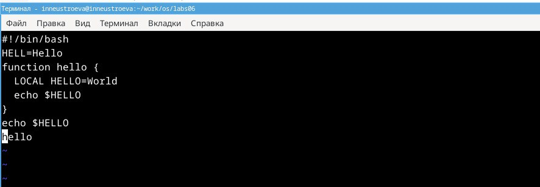
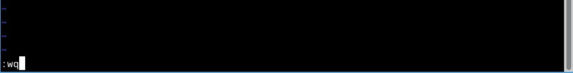
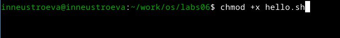
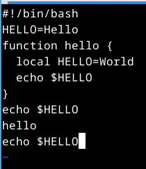
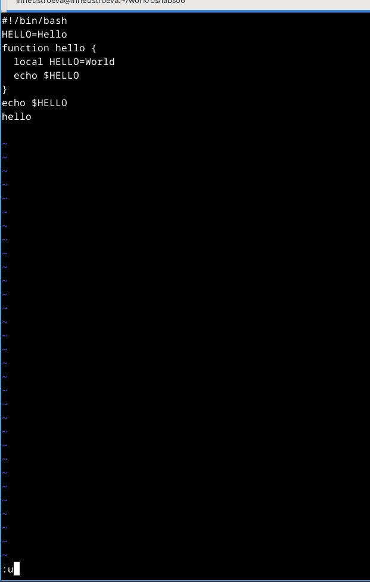

---
## Front matter
lang: ru-RU
title: Перезнтация по Лабораторной работе № 10
subtitle: Текстовой редактор vi
author:
  - Неустроева И.Н.
institute:
  - Российский университет дружбы народов, Москва, Россия
date: 11 апреля 2024

## i18n babel
babel-lang: russian
babel-otherlangs: english

## Formatting pdf
toc: false
toc-title: Содержание
slide_level: 2
aspectratio: 169
section-titles: true
theme: metropolis
header-includes:
 - \metroset{progressbar=frametitle,sectionpage=progressbar,numbering=fraction}
 - '\makeatletter'
 - '\beamer@ignorenonframefalse'
 - '\makeatother'
 
 ## Fonts
mainfont: PT Serif
romanfont: PT Serif
sansfont: PT Sans
monofont: PT Mono
mainfontoptions: Ligatures=TeX
romanfontoptions: Ligatures=TeX
sansfontoptions: Ligatures=TeX,Scale=MatchLowercase
monofontoptions: Scale=MatchLowercase,Scale=0.9
 
---

# Информация

## Докладчик

:::::::::::::: {.columns align=center}
::: {.column width="70%"}

  * Неустроева Ирина Николаевна
  * студентка группы НБИ 02-23
  * Российский университет дружбы народов
  * <https://inneustroeva.github.io/ru/>

:::
::::::::::::::

# Вводная часть

## Актуальность

Текстовый редактор vi, установленн по умолчанию практически во всех дистрибутивах.

# Цели 

Познакомиться с операционной системой Linux. Получить практические навыки работы с редактором vi.
## Основная часть

## Ввод текста в файл

Вводим текст в файлф, который автоматически создан vi

## Запись изменений в файл

Запишем внесенные изменения в файл

## Создание исполняемого файла

Сделаем файл исполняемым, присвоив права на исполнение командой *chmo*

## Редактирование существующих файлов

Поработали с этим же файлом. Открыли на редактирование, нажав i, а затем поменяли текст программы в нем на соответсвующий с указанием в лабораторной работе № 10

## Отмена последнего действия 

Отменим ввод последней строки 

# Заключительная чаcть.

## Результаты

В данной работе я научилась работать с текстовым редактором vi,

## Итоговый слайд

Навыки пригодяться мне в будущем.

