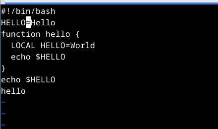

---
## Front matter
title: "Лабораторная работа 10"
subtitle: "Текстовой редактор vi"
author: "Неустроева Ирина Николаевна"

## Generic otions
lang: ru-RU
toc-title: "Содержание"

## Bibliography
bibliography: bib/cite.bib
csl: pandoc/csl/gost-r-7-0-5-2008-numeric.csl

## Pdf output format
toc: true # Table of contents
toc-depth: 2
lof: true # List of figures
lot: true # List of tables
fontsize: 12pt
linestretch: 1.5
papersize: a4
documentclass: scrreprt
## I18n polyglossia
polyglossia-lang:
  name: russian
  options:
	- spelling=modern
	- babelshorthands=true
polyglossia-otherlangs:
  name: english
## I18n babel
babel-lang: russian
babel-otherlangs: english
## Fonts
mainfont: PT Serif
romanfont: PT Serif
sansfont: PT Sans
monofont: PT Mono
mainfontoptions: Ligatures=TeX
romanfontoptions: Ligatures=TeX
sansfontoptions: Ligatures=TeX,Scale=MatchLowercase
monofontoptions: Scale=MatchLowercase,Scale=0.9
## Biblatex
biblatex: true
biblio-style: "gost-numeric"
biblatexoptions:
  - parentracker=true
  - backend=biber
  - hyperref=auto
  - language=auto
  - autolang=other*
  - citestyle=gost-numeric
## Pandoc-crossref LaTeX customization
figureTitle: "Рис."
tableTitle: "Таблица"
listingTitle: "Листинг"
lofTitle: "Список иллюстраций"
lotTitle: "Список таблиц"
lolTitle: "Листинги"
## Misc options
indent: true
header-includes:
  - \usepackage{indentfirst}
  - \usepackage{float} # keep figures where there are in the text
  - \floatplacement{figure}{H} # keep figures where there are in the text
---

# Цель работы

Познакомиться с операционной системой Linux. Получить практические навыки работы с редактором vi, установленным по умолчанию практически во всех дистрибутивах.

# Задание 1 Создание нового файла с использованием v

1. Создайте каталог с именем ~/work/os/lab06.

2. Перейдите во вновь созданный каталог.

3. Вызовите vi и создайте файл hello.sh

4. Нажмите клавишу i и вводите следующий текст

5. Нажмите клавишу Esc для перехода в командный режим после завершения ввода
текста.

6. Нажмите : для перехода в режим последней строки и внизу вашего экрана появится
приглашение в виде двоеточия.

7. Нажмите w (записать) и q (выйти), а затем нажмите клавишу Enter для сохранения
вашего текста и завершения работы.

8. Сделайте файл исполняемым

# Задание 2 Редактирование существующего файла

1. Вызовите vi на редактирование файла

2. Установите курсор в конец слова HELL второй строки.

3. Перейдите в режим вставки и замените на HELLO. Нажмите Esc для возврата в командный режим.

4. Установите курсор на четвертую строку и сотрите слово LOCAL.

5. Перейдите в режим вставки и наберите следующий текст: local, нажмите Esc для
возврата в командный режим.

6. Установите курсор на последней строке файла. Вставьте после неё строку, содержащую
следующий текст: echo $HELLO.

7. Нажмите Esc для перехода в командный режим.

8. Удалите последнюю строку.

9. Введите команду отмены изменений u для отмены последней команды.

10. Введите символ : для перехода в режим последней строки. Запишите произведённые
изменения и выйдите из vi. 

# Выполнение лабораторной работы 

1. Создали каталог с именем lab06 и перешли в него (рис. [-@fig:001]).

{#fig:001 width=70%}

2. Вызвали vi и создали файл hello.sh, далее нажали клавишу i и ввели следующий текст (рис. [-@fig:002]).

{#fig:002 width=70%}

3. Нажали клавишу Esc для перехода в командный режим после Нажали : для перехода в режим последней строки и внизу экрана, написали  w (записать) и q (выйти), а затем нажали клавишу Enter для сохранени текста и завершения работы.(рис. [-@fig:003]).

{#fig:003 width=70%}

4. Сделали файл исполняемым (рис. [-@fig:004]).

{#fig:004 width=70%}

5. Вызвали vi на редактирование файла (рис. [-@fig:005]).

{#fig:005 width=70%}

6. Установили курсор в конец слова HELL второй строки. Перешли в режим вставки и заменили на HELLO. Нажали Esc для возврата в командный режим. (рис. [-@fig:006]).

{#fig:006 width=70%}

7. Установили курсор на четвертую строку и стерли слово LOCAL.  (рис. [-@fig:007]).

{#fig:007 width=70%} 

8. Перешли в режим вставки и набрали следующий текст: local, нажали Esc для возврата в командный режим. (рис. [-@fig:008]).

{#fig:008 width=70%}

9. Установили курсор на последней строке файла. Вставили после неё строку, содержащую следующий текст: echo $HELLO (рис. [-@fig:009]).

{#fig:009 width=70%}

10. Нажали Esc для перехода в командный режим. Удалили последнюю строку.  (рис. [-@fig:010]).

{#fig:010 width=70%}

11. Ввели команду отмены изменений u для отмены последней команды.  (рис. [-@fig:011]).

{#fig:011 width=70%}

12. Команда отмены последних изменений(рис. [-@fig:012]).

{#fig:012 width=70%}

13. Ввели символ : для перехода в режим последней строки. Записали произведённые изменения и вышли из vi (рис. [-@fig:013]).

{#fig:013 width=70%}

# Вывод

В данной работе мы получили практические навыки работы с редактором vi.

::: {#refs}
:::

