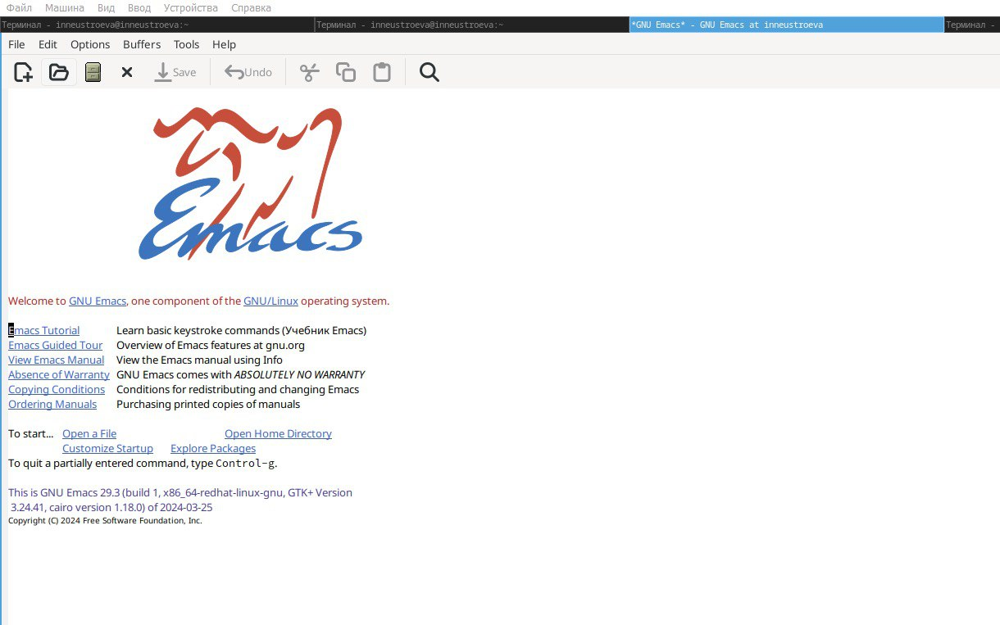
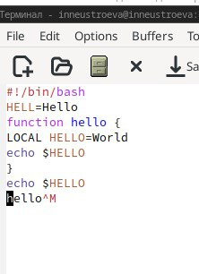
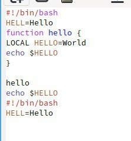
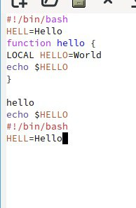
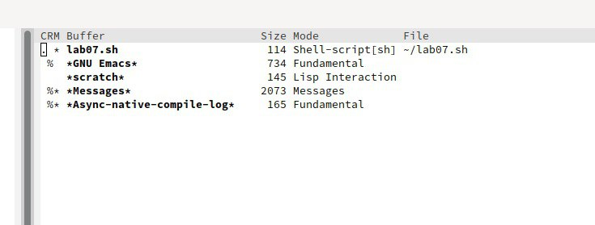
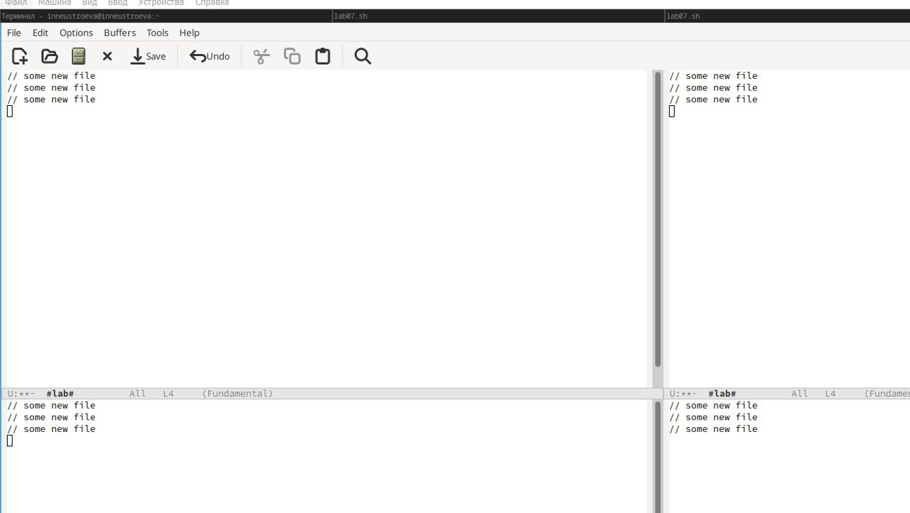
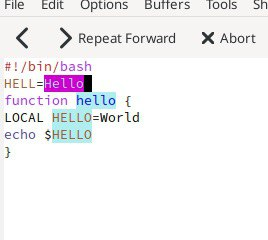
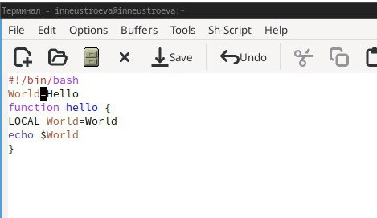
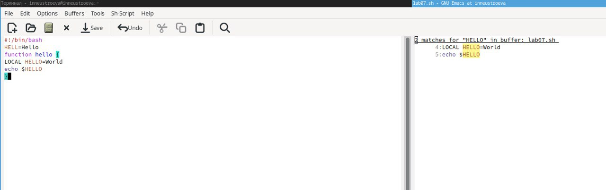

---
## Front matter
lang: ru-RU
title: Перезнтация по Лабораторной работе № 11
subtitle: Текстовой редактор vi
author:
  - Неустроева И.Н.
institute:
  - Российский университет дружбы народов, Москва, Россия
date: 14 апреля 2024

## i18n babel
babel-lang: russian
babel-otherlangs: english

## Formatting pdf
toc: false
toc-title: Содержание
slide_level: 2
aspectratio: 169
section-titles: true
theme: metropolis
header-includes:
 - \metroset{progressbar=frametitle,sectionpage=progressbar,numbering=fraction}
 - '\makeatletter'
 - '\beamer@ignorenonframefalse'
 - '\makeatother'
 
 ## Fonts
mainfont: PT Serif
romanfont: PT Serif
sansfont: PT Sans
monofont: PT Mono
mainfontoptions: Ligatures=TeX
romanfontoptions: Ligatures=TeX
sansfontoptions: Ligatures=TeX,Scale=MatchLowercase
monofontoptions: Scale=MatchLowercase,Scale=0.9
 
---

# Информация

## Докладчик

:::::::::::::: {.columns align=center}
::: {.column width="70%"}

  * Неустроева Ирина Николаевна
  * студентка группы НБИ 02-23
  * Российский университет дружбы народов
  * <https://inneustroeva.github.io/ru/>

:::
::::::::::::::

# Вводная часть

## Актуальность

Знания, полученные в ходе лабораторной работы, будут полезны для моей будущей карьеры, а также для общего развития. 

# Цели 

Познакомиться с операционной системой Linux. Получить практические навыки работы с редактором Emacs.

## Основная часть

## Знакомство с Emacs.

Вот так выглядит стартовая страница

## Создание файла 

Создали файл lab07.sh с помощью комбинации Ctrl-x Ctrl-f и набрали текс, Сохранили файл с помощью комбинации Ctrl-x Ctrl-s

## Работа с текстом

Скопировали область в буфер обмена (Alt-w). Вставили область в конец файла (С-y)

## Перемещение курсора

Переместили курсор в конец буфера (M->). Переместить курсор в начало буфера можно такой комбинацией (M-<)

## Работа с Буферами

Вывели список активных буферов на экран (C-x C-b).

## Управление окнами

Поделили фрейм на 4 части: разделите фрейм на два окна по вертикали (C-x 3), а затем каждое из этих окон на две части по горизонтали (C-x 2).

## Режим поиска 

Переключимся в режим поиска, С-s и найдем слово в тексте. Переключаться между результатами поиска можно, нажимая С-s

## Режим поиска и замены

Перешли в режим поиска и замены (Alt-%), ввели текст, который следует найти и заменили, нажав Enter. Затем ввели текст для замены. После нажали ! для подтверждения замены.

## Другой режим поиска

Используем другой режим поиска, нажав Alt-s. От обычного режима его отличие состоит в том, что он открывает результаты поиска в новом окне.

# Заключительная чаcть.

## Результаты

В данной работе я научилась работать с текстовым редактором Emacs.

## Итоговый слайд

Работать с текстовым редактором Emacs достаточно удобно.

