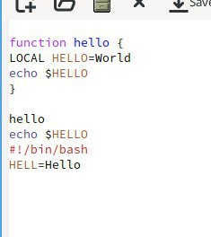

---
## Front matter
title: "Лабораторная работа 11"
subtitle: "Текстовой редактор emacs"
author: "Неустроева Ирина Николаевна"

## Generic otions
lang: ru-RU 
toc-title: "Содержание"

## Bibliography
bibliography: bib/cite.bib
csl: pandoc/csl/gost-r-7-0-5-2008-numeric.csl

## Pdf output format
toc: true # Table of contents
toc-depth: 2
lof: true # List of figures
lot: true # List of tables
fontsize: 12pt
linestretch: 1.5
papersize: a4
documentclass: scrreprt
## I18n polyglossia
polyglossia-lang:
  name: russian
  options:
	- spelling=modern
	- babelshorthands=true
polyglossia-otherlangs:
  name: english
## I18n babel
babel-lang: russian
babel-otherlangs: english
## Fonts
mainfont: PT Serif
romanfont: PT Serif
sansfont: PT Sans
monofont: PT Mono
mainfontoptions: Ligatures=TeX
romanfontoptions: Ligatures=TeX
sansfontoptions: Ligatures=TeX,Scale=MatchLowercase
monofontoptions: Scale=MatchLowercase,Scale=0.9
## Biblatex
biblatex: true
biblio-style: "gost-numeric"
biblatexoptions:
  - parentracker=true
  - backend=biber
  - hyperref=auto
  - language=auto
  - autolang=other*
  - citestyle=gost-numeric
## Pandoc-crossref LaTeX customization
figureTitle: "Рис."
tableTitle: "Таблица"
listingTitle: "Листинг"
lofTitle: "Список иллюстраций"
lotTitle: "Список таблиц"
lolTitle: "Листинги"
## Misc options
indent: true
header-includes:
  - \usepackage{indentfirst}
  - \usepackage{float} # keep figures where there are in the text
  - \floatplacement{figure}{H} # keep figures where there are in the text
---

# Цель работы

Познакомиться с операционной системой Linux. Получить практические навыки работы с редактором Emacs.

# Теоретическое введение

Основные термины Emacs

Определение 1. Буфер — объект, представляющий какой-либо текст.
Буфер может содержать что угодно, например, результаты компиляции программы
или встроенные подсказки. Практически всё взаимодействие с пользователем, в том
числе интерактивное, происходит посредством буферов.

Определение 2. Фрейм соответствует окну в обычном понимании этого слова. Каждый
фрейм содержит область вывода и одно или несколько окон Emacs.

Определение 3. Окно — прямоугольная область фрейма, отображающая один из буферов.
Каждое окно имеет свою строку состояния, в которой выводится следующая информация: название буфера, его основной режим, изменялся ли текст буфера и как далеко вниз
по буферу расположен курсор. Каждый буфер находится только в одном из возможных
основных режимов. Существующие основные режимы включают режим Fundamental
(наименее специализированный), режим Text, режим Lisp, режим С, режим Texinfo
и другие. Под второстепенными режимами понимается список режимов, которые включены в данный момент в буфере выбранного окна.

Определение 4. Область вывода — одна или несколько строк внизу фрейма, в которой
Emacs выводит различные сообщения, а также запрашивает подтверждения и дополнительную информацию от пользователя.

Определение 5. Минибуфер используется для ввода дополнительной информации и всегда отображается в области вывода.
Определение 6. Точка вставки — место вставки (удаления) данных в буфере.

Основы работы в Emacs

Для запуска Emacs необходимо в командной строке набрать emacs (или emacs & для
работы в фоновом режиме относительно консоли).

Для работы с Emacs можно использовать как элементы меню, так и различные сочетания клавиш. Например, для выхода из Emacs можно воспользоваться меню File
и выбрать пункт Quit , а можно нажать последовательно Ctrl-x Ctrl-c (в обозначениях
Emacs: C-x C-c).

Многие рутинные операции в Emacs удобнее производить с помощью клавиатуры, а не
графического меню. Наиболее часто в командах Emacs используются сочетания c клавишами Ctrl и Meta (в обозначениях Emacs: C- и M-; клавиша Shift в Emasc обозначается
как S-). Так как на клавиатуре для IBM PC совместимых ПК клавиши Meta нет, то вместо
неё можно использовать Alt или Esc . Для доступа к системе меню используйте клавишу
F10 .

Клавиши Ctrl , Meta и Shift принято называть префиксными. Например, запись M-x
означает, что надо удерживая клавишу Meta (или Alt ), нажать на клавишу x.Для открытия
файла следует использовать команду C-x C-f (надо, удерживая клавишу Ctrl , нажать на
клавишу x , затем отпустить обе клавиши и снова, удерживая клавишу Ctrl , нажать на
клавишу f ).

По назначению префиксные сочетания клавиш различаются следующим образом:
– C-x — префикс ввода основных команд редактора (например, открытия, закрытии,
сохранения файла и т.д.);
– C-c — префикс вызова функций, зависящих от используемого режима.

Определение 7. Режим — пакет расширений, изменяющий поведение буфера Emacs при
редактировании и просмотре текста (например, для редактирования исходного текста
программ на языках С или Perl).

# Задание 1 Основные команды emacs
1. Открыть emacs.

2. Создать файл lab07.sh с помощью комбинации Ctrl-x Ctrl-f (C-x C-f).

3. Наберите текст:

1 #!/bin/bash
2 HELL=Hello
3 function hello {
4 LOCAL HELLO=World
5 echo $HELLO
6 }
7 echo $HELLO
8 hello

4. Сохранить файл с помощью комбинации Ctrl-x Ctrl-s (C-x C-s).

5. Проделать с текстом стандартные процедуры редактирования, каждое действие должно осуществляться комбинацией клавиш.

* Вырезать одной командой целую строку (С-k).

* Вставить эту строку в конец файла (C-y).

* Выделить область текста (C-space).

* Скопировать область в буфер обмена (M-w).

* Вставить область в конец файла.

* Вновь выделить эту область и на этот раз вырезать её (C-w).

* Отмените последнее действие (C-/).

6. Научитесь использовать команды по перемещению курсора.

* Переместите курсор в начало строки (C-a).

* Переместите курсор в конец строки (C-e).

* Переместите курсор в начало буфера (M-<).

* Переместите курсор в конец буфера (M->).

7. Управление буферами.

* Вывести список активных буферов на экран (C-x C-b)

* Переместитесь во вновь открытое окно (C-x) o со списком открытых буферов и переключитесь на другой буфер.

* Закройте это окно (C-x 0).

* Теперь вновь переключайтесь между буферами, но уже без вывода их списка на
экран (C-x b).

8. Управление окнами.

* Поделите фрейм на 4 части: разделите фрейм на два окна по вертикали (C-x 3),
а затем каждое из этих окон на две части по горизонтали (C-x 2)

* В каждом из четырёх созданных окон откройте новый буфер (файл) и введите несколько строк текста.

9. Режим поиска

* Переключитесь в режим поиска (C-s) и найдите несколько слов, присутствующих в тексте.

* Переключайтесь между результатами поиска, нажимая C-s.

* Выйдите из режима поиска, нажав C-g.

*  Перейдите в режим поиска и замены (M-%), введите текст, который следует найти и заменить, нажмите Enter , затем введите текст для замены. После того как будут подсвечены результаты поиска, нажмите ! для подтверждения замены.

*  Испробуйте другой режим поиска, нажав M-s o. Объясните, чем он отличается от
обычного режима?

# Выполнение лабораторной работы 

1. Открыли emacs (рис. [-@fig:001]).

{#fig:001 width=70%}

2. Создали файл lab07.sh с помощью комбинации Ctrl-x Ctrl-f (рис. [-@fig:002]).

{#fig:002 width=70%}

3. Набрали текс ( (рис. [-@fig:003]).

{#fig:003 width=70%}

4. Сохранили файл с помощью комбинации Ctrl-x Ctrl-s 

5. Проделали с текстом стандартные процедуры редактирования

* Вырезали одной командой целую строку (С-k) (рис. [-@fig:004]).

{#fig:004 width=70%}

* Вставили эту строку в конец файла (C-y) (рис. [-@fig:005]).

{#fig:005 width=70%}

* Выделили область текста (C-space). (рис. [-@fig:006]).

{#fig:006 width=70%}

* Скопировали область в буфер обмена (M-w). Вставили область в конец файла.(рис. [-@fig:007]).

{#fig:007 width=70%} 

* Вновь выделили эту область и на этот раз вырезали её (C-w). (рис. [-@fig:008]).

{#fig:008 width=70%}

* Отменили последнее действие (C-/).(рис. [-@fig:009]).

{#fig:009 width=70%}

6. Научились использовать команды по перемещению курсора.

Переместили курсор в начало строки (C-a). (рис. [-@fig:010]).

{#fig:010 width=70%}

* Переместили курсор в конец строки (C-е). (рис. [-@fig:011]).

{#fig:011 width=70%}

* Переместили курсор в начало буфера (M-<) (рис. [-@fig:012]).

{#fig:012 width=70%}

* Переместили курсор в конец буфера (M->). (рис. [-@fig:013]).

{#fig:013 width=70%}

7. Управление буферами.

* Вывели список активных буферов на экран (C-x C-b). (рис. [-@fig:014]).

{#fig:014 width=70%}

* Переместились во вновь открытое окно (C-x) o со списком открытых буферов и переключились на другой буфер  [-@fig:015]).

{#fig:015 width=70%}

* Закрыли окно (C-x 0). (рис.  [-@fig:016]).

{#fig:016 width=70%}

8. Управление окнами.

* Создали новый файл (рис.  [-@fig:017]).

{#fig:017 width=70%}

* Поделили фрейм на 4 части: разделите фрейм на два окна по вертикали (C-x 3), а затем каждое из этих окон на две части по горизонтали (C-x 2) (рис.  [-@fig:018]).

{#fig:018 width=70%}

* В каждом из четырёх созданных окон открыли новый буфер (файл) и ввели несколько строк текста (рис.  [-@fig:019]).

{#fig:019 width=70%}

9. Режим поиска

* Переключались между результатами поиска, нажимая C-s (рис.  [-@fig:020]).

{#fig:020 width=70%}

* Перешли в режим поиска и замены (M-%), ввели текст, который следует найти и заменили, нажав Enter (рис.  [-@fig:021]).

{#fig:021 width=70%}

* Затем ввели текст для замены. После нажали ! для подтверждения замены. (рис.  [-@fig:022]).

{#fig:022 width=70%}

* Результат замены (рис.  [-@fig:023]).

{#fig:023 width=70%}

* Испробовали другой режим поиска, нажав M-s o. Заметили, что открывается отдельный буфер для поиска.(рис.  [-@fig:024]). 

{#fig:024 width=70%}

# Вывод

В данной работе мы получили практические навыки работы с редактором Emacs.

# Контрольные вопросы:

Кратко охарактеризуйте редактор emacs. Ответ: Emacs представляет собой мощный экранный редактор текста, написанный на языке высокого уровня Elisp.

Какие особенности данного редактора могут сделать его сложным для освоения новичком? Ответ: Сложным освоение данной программы для новичка может сделать незнание комбинации клавиш или английского.

Своими словами опишите, что такое буфер и окно в терминологии emacs’а Ответ: Моими словами буфер это динамическая память, а окно- то, что мы видим

Можно ли открыть больше 10 буферов в одном окне? Ответ: Можно если нет ограничений на систему.

Какие буферы создаются по умолчанию при запуске emacs? Ответ: Буферы, которые открываются по умолчанию: GNU Emacs, scratch, Messages, Quail Completions

Какие клавиши вы нажмёте, чтобы ввести следующую комбинацию C-c | и C-c C-|? Ответ: Сtrl+c, Shift+\ и Ctrl+c Ctrl+\

. Как поделить текущее окно на две части? Ответ: Нажать C-x 3, или C-x 2.

В каком файле хранятся настройки редактора emacs? Ответ: Настройки хранятся в файле ~/.emacs.

Какую функцию выполняет клавиша Backspace и можно ли её переназначить? Ответ: Перемещение курсора

Какой редактор вам показался удобнее в работе vi или emacs? Поясните почему. Ответ: Редактор emacs ,потому что на нем можно работать сразу с несколькими файлами.

::: {#refs}
:::
