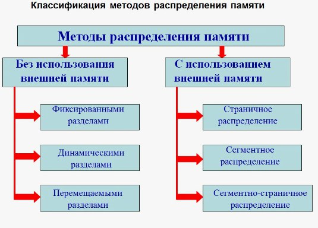
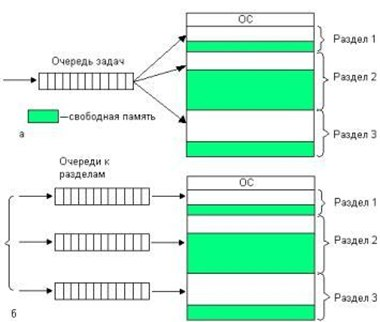
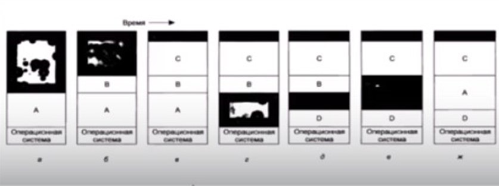
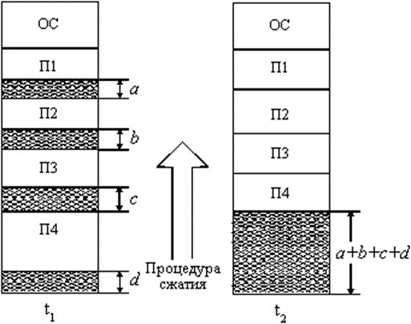
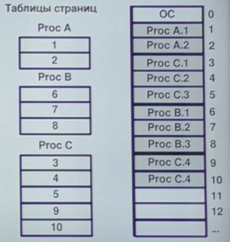
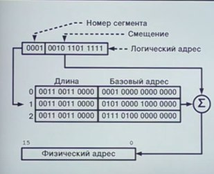
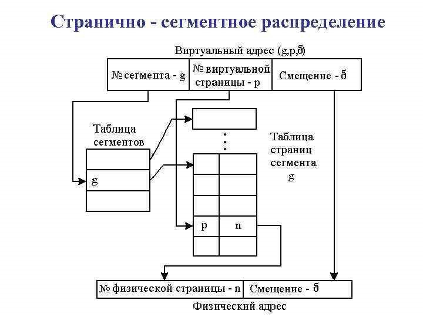

---
## Front matter
lang: ru-RU
title: Доклад по теме - Методы управления памятью в операционных системах.
author:
  - Неустроева И.Н.
institute:
  - Российский университет дружбы народов, Москва, Россия
## i18n babel
babel-lang: russian
babel-otherlangs: english

## Formatting pdf
toc: false
toc-title: Содержание
slide_level: 2
aspectratio: 169
section-titles: true
theme: metropolis
header-includes:
 - \metroset{progressbar=frametitle,sectionpage=progressbar,numbering=fraction}
 - '\makeatletter'
 - '\beamer@ignorenonframefalse'
 - '\makeatother'
 
 ## Fonts
mainfont: PT Serif
romanfont: PT Serif
sansfont: PT Sans
monofont: PT Mono
mainfontoptions: Ligatures=TeX
romanfontoptions: Ligatures=TeX
sansfontoptions: Ligatures=TeX,Scale=MatchLowercase
monofontoptions: Scale=MatchLowercase,Scale=0.9
 
---

# Информация

## Докладчик

:::::::::::::: {.columns align=center}
::: {.column width="70%"}

  * Неустроева Ирина Николаевна
  * студентка группы НБИ 02-23
  * Российский университет дружбы народов
:::
::::::::::::::

## Преподаватель

:::::::::::::: {.columns align=center}
::: {.column width="70%"}

  * Кулябов Дмитрий Сергеевич
  * д.ф.-м.н., профессор
  * профессор кафедры прикладной информатики и теории вероятностей
  * Российский университет дружбы народов
:::
::::::::::::::

# Вводная часть

## Актуальность

Память является важнейшим ресурсом, требующим тщательного управления со стороны операционной системы. В ранних ОС управление памятью сводилось просто к загрузке программы и ее данных из некоторого внешнего накопителя (магнитной ленты, магнитного диска) в память. С появлением мультипрограммирования перед ОС были поставлены новые задачи, связанные с распределением имеющейся памяти между несколькими одновременно выполняющимися программами.

## Цели и задачи

Изучить основные методы управления памятью в операционных системах.

## Материалы и методы

Интернет-ресурсы

# Основная часть 

## Управление памятью 

Управление памятью-это процесс координации памяти компьютера для оптимизации общей производительности системы. Это наиболее важная функция операционной системы, которая управляет основной памятью. Это помогает процессам перемещаться вперед и назад между основной памятью и исполнительным диском. 

Все методы управления памятью могут быть разделены на два класса: методы, которые используют перемещение процессов между оперативной памятью и диском, и методы, которые не делают этого.

## Распределение памяти фиксированными разделами

Память разбивается на несколько разделов областей фиксированной величины.Такое разбиение выполнено вручную человеком во время старта системы.

Подсистема управления памятью в этом случае выполняет следующие задачи:

1. Сравнивает объем памяти, требуемый для процесса, с размерами свободных разделов и выбирает подходящий раздел.
2. Осуществляет загрузку и разгрузку программы в один из разделов. 

## Распределение памяти динамическими разделами

Память машины не делится заранее на разделы. Сначала вся память свободна. Каждому вновь поступающему процессу выделяется вся необходимая ему память. После завершения процесса память освобождается, и на это место может быть загружен другой процесс. Таким образом, в произвольный момент времени оперативная память представляет собой случайную последовательность занятых и свободных участков (разделов) произвольного размера.

Тут возникает проблема Фрагментации - это наличие большого числа участков свободной памяти очень маленького размера (фрагментов) Настолько маленького, что ни одна из вновь поступающих программ не может поместиться ни в одном из участков.

К функциям данного метода относиться: 

- Ведение таблиц свободных и занятых областей
- Загрузка программы в выделенный ей раздел и корректировка таблиц свободных и занятых областей. 

## Перемещаемые разделы

Перемещение всех занятых участков в сторону старших или младших адресов, так, чтобы вся свободная память образовала единую свободную область. В дополнение к функциям, которые выполняет ОС при распределении памяти динамическими разделами в данном случае она должна еще время от времени копировать содержимое разделов из одного места памяти в другое, корректируя таблицы свободных и занятых областей. Эта процедура называется сжатием.

Способы, которые мы рассмотрели, они древние. Современным подходом к управлению памятью является вертуальная память. Наиболее распространенными реализациями виртуальной памяти является страничное, сегментное и странично-сегментное распределение памяти.

## Понятие виртуальной памяти

Виртуальная память - это совокупность программно-аппаратных средств, позволяющих пользователям писать программы, размер которых превосходит имеющуюся оперативную память.

## Страничное распределение

При таком способе все фрагменты программы, на которые она разбивается получаются одинаковыми и называются страницами. Память разбивается на страничные кадры. Размер страницы будет занимать целиком кадр. Память нарезана на странички одинакового размера. Внешняя фрагментация отсутствует, а внутренняя будет не существенна.

## Сегментный способ распределения виртуальной памяти

Существует таблица сегментов, она может находится в регистрах или в ОП и в этой таблице, у нее есть длина сегмента и есть базовый адрес. И когда у нас приходит логический адрес программы, который состоит из смещения и номера сегмента, то операционная система, используя номер сегмента как индекс таблицы, берет базовый адрес к нему прибавляет смещение и проверят, что получившийся адрес не выходит за размер сегмента. Так получается физический адрес.

Внутренняя сегментация отсутствует, потому что сегменты занимают ровно столько, сколько нужно программе, а внешняя фрагментация снижается, тк нам не нужно перемещать сегменты, а достаточно указать их характеристики в этой таблице и процесс будет занимать ровно столько места, сколько мы ему отведем.

## Странично-сегментное распределение

Данный метод сочетает в себе достоинства методов страничного и сегментного. Виртуальное пространство процесса делится на сегменты, а каждый сегмент в свою очередь делится на виртуальные страницы, которые нумеруются в пределах сегмента. Оперативная память делится на физические страницы. 
Загрузка процесса выполняется операционной системой постранично, при этом часть страниц размещается в оперативной памяти, а часть на диске. Для каждого сегмента создается своя таблица страниц, в которой указываются адреса таблиц страниц для всех сегментов данного процесса. Адрес таблицы сегментов загружается в специальный регистр процессора, когда активизируется соответствующий процесс.

## Вывод

Мы рассмотрели основные методы распределения памяти в операционных системах и выяснили, что методы, которые не используют внешнюю память имеют фиксированный объем памяти для процессов пользователя, а методы, которые используют виртуальную память, способны на выполнение многих процессов, которые превышают объем однородной оперативной памяти.

## Список литературы

1. Олифер В. Г. Сетевые операционные системы: учебник для вузов/ В.Г. Олифер, Н.А. Олифер. - СПб.: Питер, 2009. - 539 с.: ил 
2. Попов И.И. Операционные системы, среды и оболочки/ И.И. Попов. - М.: Издательство "ФОРУМ: ИНФА-М", 2010. - 400 с. - (Серия "Профессиональное образование")
3. Глава 3. Управление памятью в операционных системах (studylib.ru)

:::

