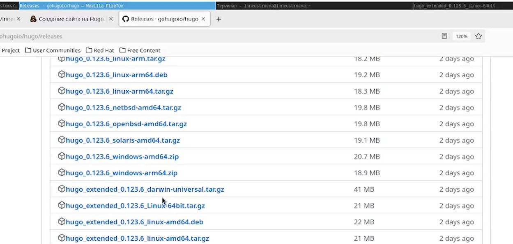
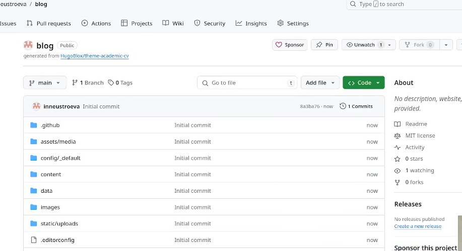
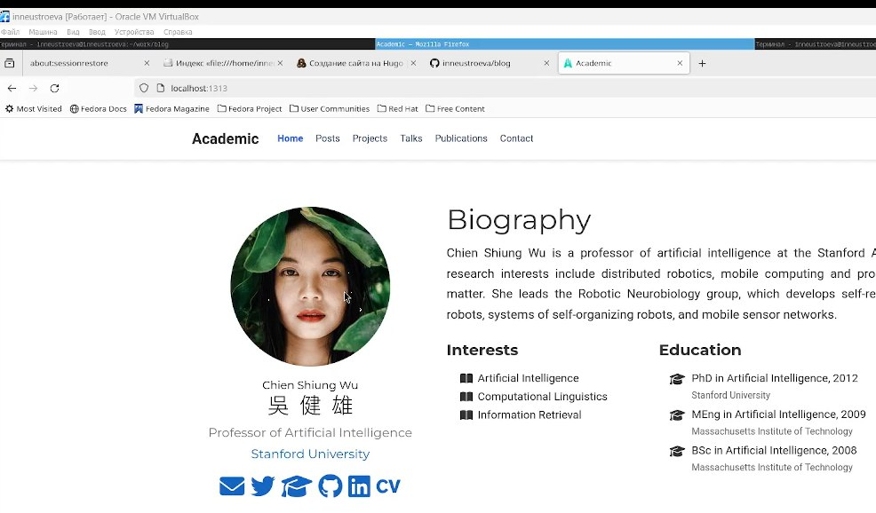
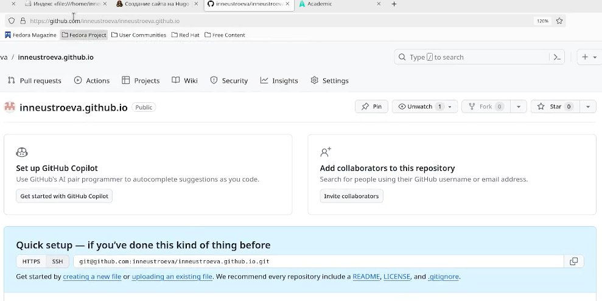

---
## Front matter
lang: ru-RU
title: "Первый этап индивидуального пректа"
subtitle: "Персональный сайт научного работника"
author:
  - Неустроева И. Н.
institute:
  - Российский университет дружбы народов, Москва, Россия
date: 02 марта 2024

## i18n babel
babel-lang: russian
babel-otherlangs: english

## Formatting pdf
toc: false
toc-title: Содержание
slide_level: 2
aspectratio: 169
section-titles: true
theme: metropolis
header-includes:
 - \metroset{progressbar=frametitle,sectionpage=progressbar,numbering=fraction}
 - '\makeatletter'
 - '\beamer@ignorenonframefalse'
 - '\makeatother'
## Fonts
mainfont: PT Serif
romanfont: PT Serif
sansfont: PT Sans
monofont: PT Mono
mainfontoptions: Ligatures=TeX
romanfontoptions: Ligatures=TeX
sansfontoptions: Ligatures=TeX,Scale=MatchLowercase
monofontoptions: Scale=MatchLowercase,Scale=0.9
 
---

# Информация

## Докладчик

:::::::::::::: {.columns align=center}
::: {.column width="70%"}

  * Неустроева Ирина Николаевна
  * студентка группы НБИ-02-23
  * Российский университет дружбы народов
  * <https://inneustroeva.github.io/ru/>

:::
::: {.column width="30%"}

:::
::::::::::::::

# Вводная часть

## Актуальность
 
Создание сайта научного работника хороший навык, который пригодиться мне в будущем для дальнейше работы.

## Цели и задачи

Научиться размещать сайт на github pages для персонального сайта.

# Основная часть

## Установить необходимое ПО

Скачиваю последнюю версию исполняемого файла hugo для своей операционной систем

##  Скачивание шаблона темы

Создаю свой репозиторий blog на основе репозитория с шаблоном темы сайта. В нем будет располагаться сайт, доступный только с этого комппьютера

## Промежуточный результат 

Открываем наш сайт, виден он только с этого компьютера

## Размещение заготовки сайта на Github pages

Далее я создаю новый пустой репозиторий чье имя будет адресом сайта и открытый для доступа всем 

## Открытие сайта в браузере

Теперь на наш сайт есть ссылка, которую можно открыть с любого компьютера 

# Результаты

## Итоги 

Я научилась создавать заготовк сайта, которую можно открыть с любого компьютера , используя генератор хуго, который обладает большой библиотекой шаблонов и готовых тем.

## Итоговый слайд

В этом этапе пректа я создала заготовку сайта.

