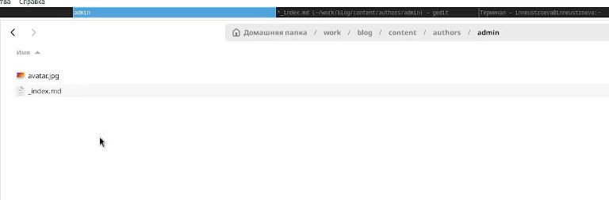
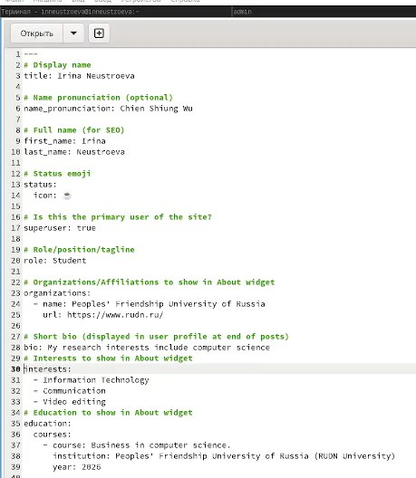
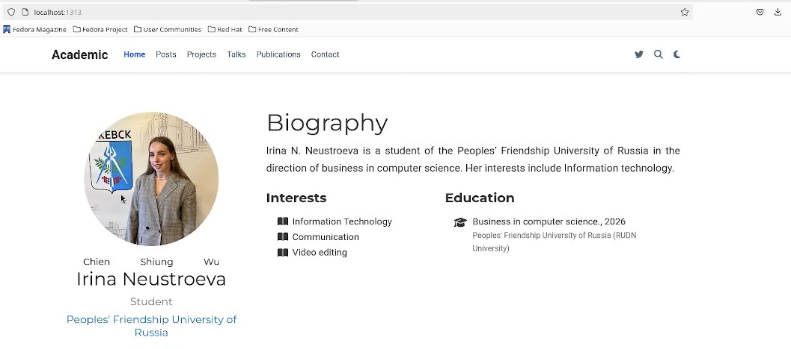
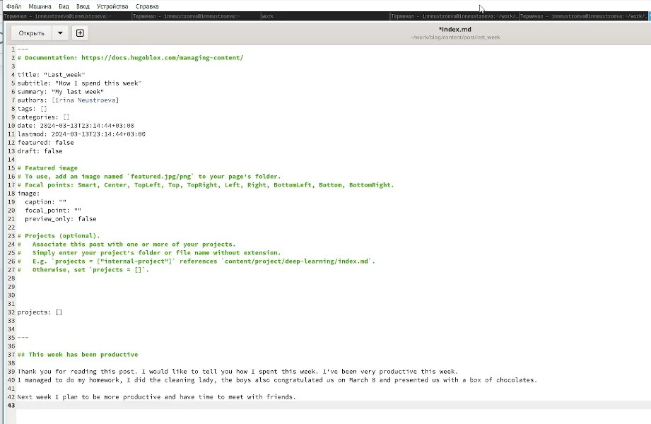
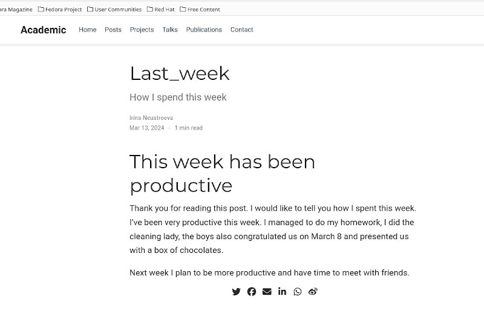
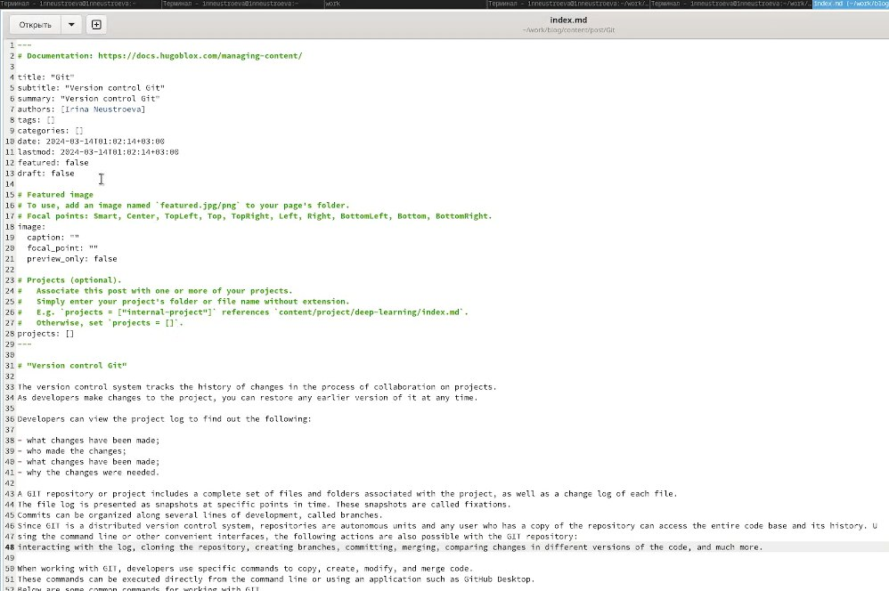
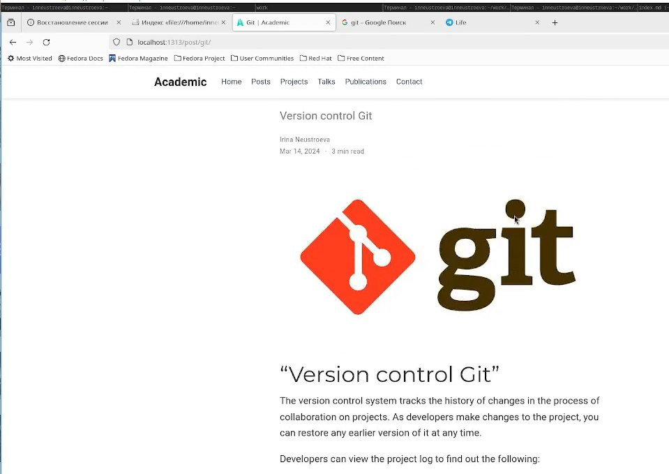
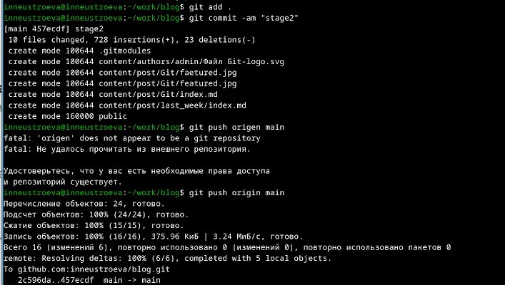
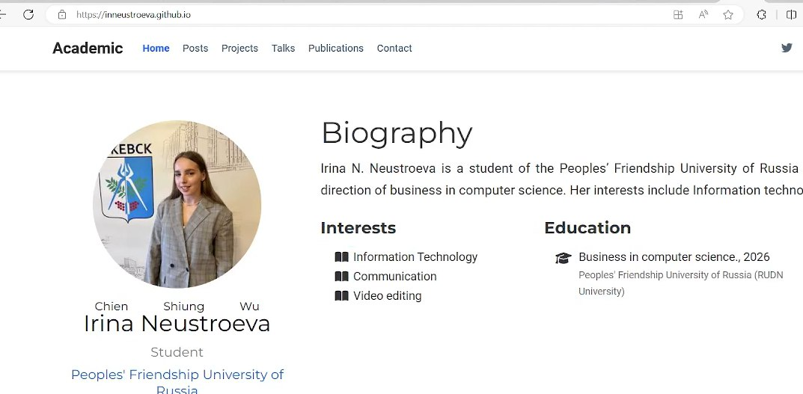

---
## Front matter
lang: ru-RU
title: Презентация по второму этапу индивидуального пректа
subtitle: Персональный сайт
author:
  - Неустроева И.Н.
institute:
  - Российский университет дружбы народов, Москва, Россия
date: 29 февраля 2024

## i18n babel
babel-lang: russian
babel-otherlangs: english

## Formatting pdf
toc: false
toc-title: Содержание
slide_level: 2
aspectratio: 169
section-titles: true
theme: metropolis
header-includes:
 - \metroset{progressbar=frametitle,sectionpage=progressbar,numbering=fraction}
 - '\makeatletter'
 - '\beamer@ignorenonframefalse'
 - '\makeatother'
 
 ## Fonts
mainfont: PT Serif
romanfont: PT Serif
sansfont: PT Sans
monofont: PT Mono
mainfontoptions: Ligatures=TeX
romanfontoptions: Ligatures=TeX
sansfontoptions: Ligatures=TeX,Scale=MatchLowercase
monofontoptions: Scale=MatchLowercase,Scale=0.9
 
---

# Информация

## Докладчик

:::::::::::::: {.columns align=center}
::: {.column width="70%"}

  * Неустроева Ирина Николаевна
  * студентка группы НБИ 02-23
  * Российский университет дружбы народов
  * <https://inneustroeva.github.io/ru/>

:::
::::::::::::::

# Вводная часть

## Актуальность 

Создание своего сайта, важный навык для специалиста по информационным технологиям. Кроме того, это очень интересно и позновательно.

## Цели 

Добавить свои данные на сайт, написать два поста и разместить на сайт.

# Основная часть
 
## Добавление фотографии.

Первым делом необходимо добавить фотографию к своему сайту, для этого я перехожу в каталог ~/work/blog/content/authors/admin.Далее подгружаю свою фотографию вместо нее.

## Добавление информации о себе 

Затем открываю файл _index.md в этой же папке,где мы меняли фотографию, начинаю добовлять информацию: имя, название университета, статус, ссылка на сайт университета,о своих интересах (Interests), об образовании (Education). Также размещаю краткое описание владельца сайта (Biography)

## Проверка изменений на локальном сайте

Получив ссылку на локальный сайт, с помощью команды ~/bin/hugo server, проверяю изменения на локальном сайте. 

## Пост о прошедшей неделе

Далее, создаю пост о прошедшей неделе, с помощью команды ~/bin/hugo new post/Last_week, в папке ~/work/blog, и заполняю его информацией 

## Проверка изменений на локальном сайте

Проверяю изменения на локальном сайте.

## Пост Управление версиями. Git.

Аналогично, создаю пост на тему, Управление версиями Git, с помощью команды ~/bin/hugo new post/Git,  в папке ~/work/blog,  и заполняю его информацией. Сохранила фотографию в папку git feature.jpg 

## Проверка изменений на локальном сайте

Проверяю изменения на локальном сайте.

## Отправка на гитхаб

Следующим шагом, отправляю изменения на гитхаб 

## Отправка на гитхаб

Далее, мы видим, что теперь по сыллке изменения, которые мы внесли отображаются 

## Результаты

В результате я научилась добовлять информацию на сайт и даже добавила два новых поста.

## Итоговый слайд

Работа над собсвенным сайтом мне понравилась. Я считаю, что это полезный навык для меня и моей карьеры.

:::

