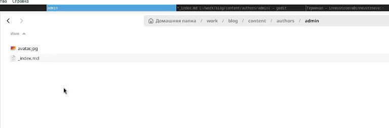
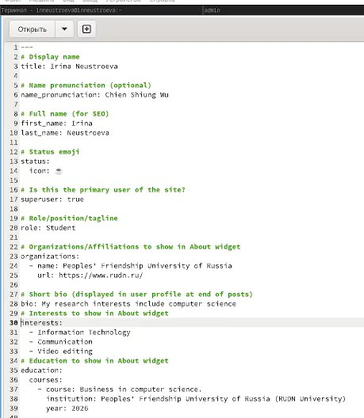
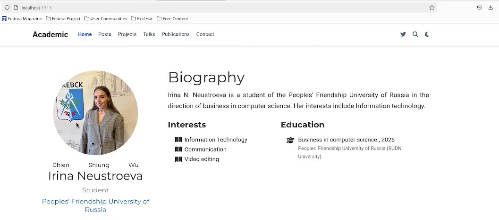
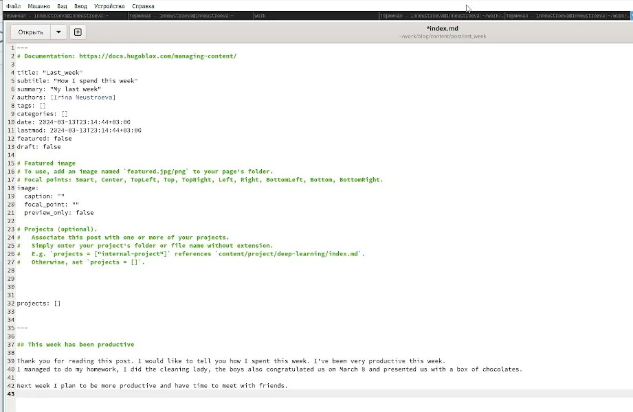
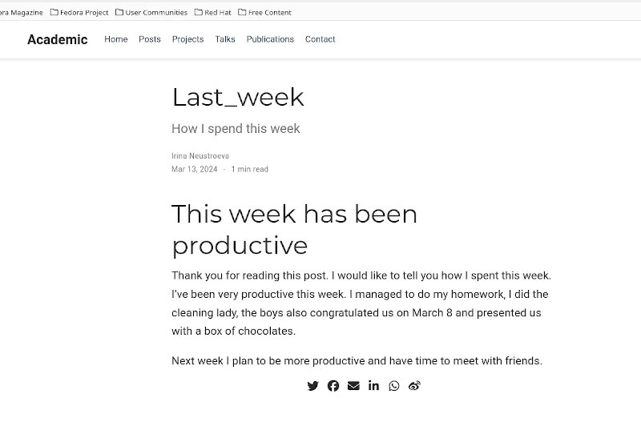
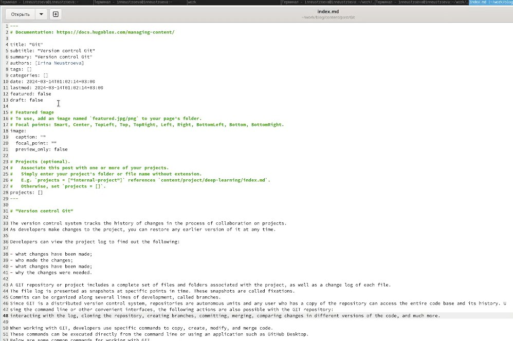
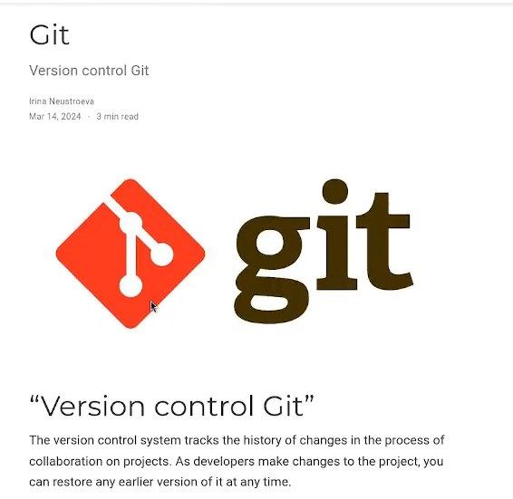
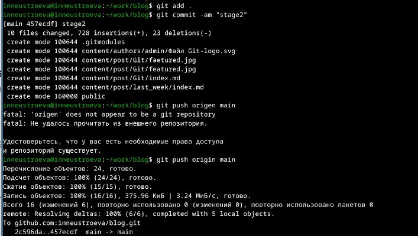
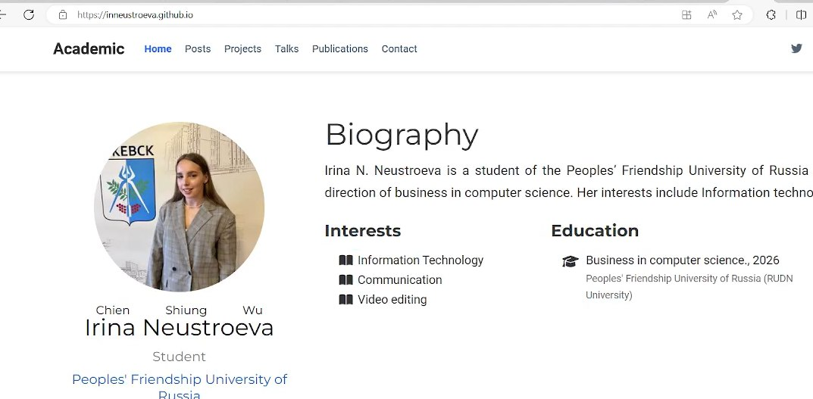

---
## Front matter
title: "Отчет по второму этапу индивидуального проекта"
subtitle: "Персональный сайт"
author: "Неустроева Ирина Николаевна"

## Generic otions
lang: ru-RU
toc-title: "Содержание"

## Bibliography
bibliography: bib/cite.bib
csl: pandoc/csl/gost-r-7-0-5-2008-numeric.csl

## Pdf output format
toc: true # Table of contents
toc-depth: 2
lof: true # List of figures
lot: true # List of tables
fontsize: 12pt
linestretch: 1.5
papersize: a4
documentclass: scrreprt
## I18n polyglossia
polyglossia-lang:
  name: russian
  options:
	- spelling=modern
	- babelshorthands=true
polyglossia-otherlangs:
  name: english
## I18n babel
babel-lang: russian
babel-otherlangs: english
## Fonts
mainfont: PT Serif
romanfont: PT Serif
sansfont: PT Sans
monofont: PT Mono
mainfontoptions: Ligatures=TeX
romanfontoptions: Ligatures=TeX
sansfontoptions: Ligatures=TeX,Scale=MatchLowercase
monofontoptions: Scale=MatchLowercase,Scale=0.9
## Biblatex
biblatex: true
biblio-style: "gost-numeric"
biblatexoptions:
  - parentracker=true
  - backend=biber
  - hyperref=auto
  - language=auto
  - autolang=other*
  - citestyle=gost-numeric
## Pandoc-crossref LaTeX customization
figureTitle: "Рис."
tableTitle: "Таблица"
listingTitle: "Листинг"
lofTitle: "Список иллюстраций"
lotTitle: "Список таблиц"
lolTitle: "Листинги"
## Misc options
indent: true
header-includes:
  - \usepackage{indentfirst}
  - \usepackage{float} # keep figures where there are in the text
  - \floatplacement{figure}{H} # keep figures where there are in the text
---

# Цель работы

Заполнить шаблон сайта своими данными.

# Задание

- Разместить фотографию владельца сайта.
- Разместить краткое описание владельца сайта (Biography).
- Добавить информацию об интересах (Interests).
- Добавить информацию от образовании (Education).
- Сделать пост по прошедшей неделе.
- Добавить пост на тему Управление версиями. Git.

# Выполнение индивидуального проекта.

Первым делом необходимо добавить фотографию к своему сайту, для этого я перехожу в каталог ~/work/blog/content/authors/admin.Далее подгружаю свою фотографию вместо нее (рис. [-@fig:001]).

{#fig:001 width=70%}

Затем открываю файл _index.md в этой же папке,где мы меняли фотографию, начинаю добовлять информацию: имя, название университета, статус, ссылка на сайт университета,о своих интересах (Interests), об образовании (Education). Также размещаю краткое описание владельца сайта (Biography) (рис. [-@fig:002]).

{#fig:002 width=70%}

Получив ссылку на локальный сайт, с помощью команды ~/bin/hugo server, проверяю изменения на локальном сайте. (рис. [-@fig:003]).

{#fig:003 width=70%}

Далее, создаю пост о прошедшей неделе, с помощью команды ~/bin/hugo new post/Last_week, в папке ~/work/blog, и заполняю его информацией (рис. [-@fig:005]).

{#fig:004 width=70%}

Проверяю изменения на локальном сайте. (рис. [-@fig:005]).

{#fig:005 width=70%}

Аналогично, создаю пост на тему, Управление версиями Git, с помощью команды ~/bin/hugo new post/Git,  в папке ~/work/blog,  и заполняю его информацией. Сохранила фотографию в папку git feature.jpg (рис. [-@fig:006]).

{#fig:006 width=70%} 

Проверяю изменения на локальном сайте. (рис. [-@fig:007]).

{#fig:007 width=70%}

Следующим шагом, отправляю изменения на гитхаб (рис. [-@fig:008]).

{#fig:008 width=70%}

Далее, мы видим, что теперь по сыллке изменения, которые мы внесли отображаются (рис. [-@fig:009]).

{#fig:009 width=70%}

# Выводы

В ходе выполнения второго этапа индивидуального проекта, я добавила информацию о себе и разместила несколько постов.

::: {#refs}
:::
