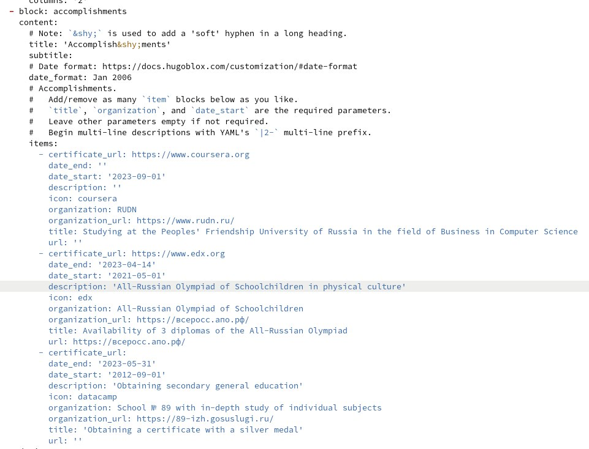
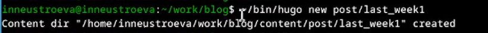
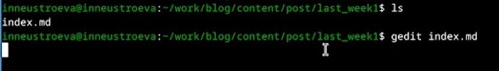
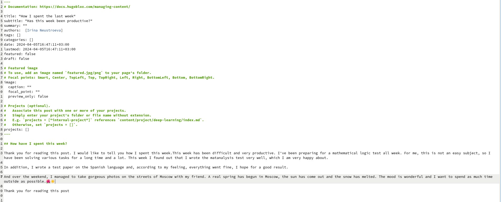
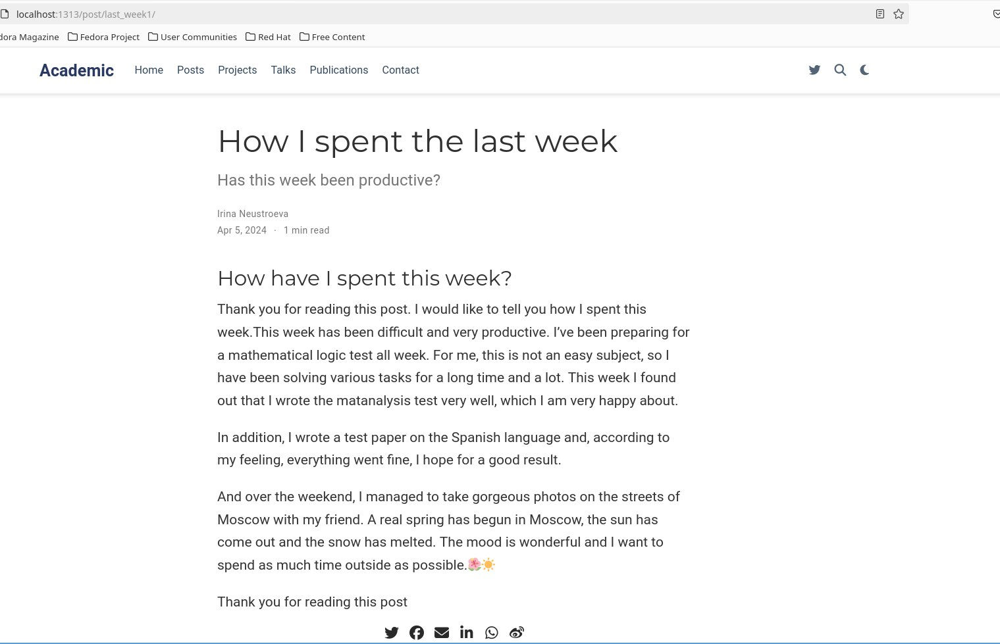
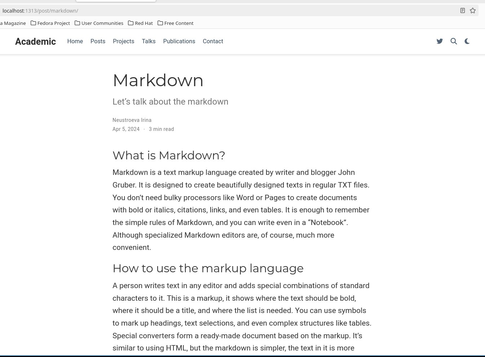

---
## Front matter
lang: ru-RU
title: Перезнтация по третьему этапу индивидуального проекта 
subtitle: Персональный сайт
author:
  - Неустроева И.Н.
institute:
  - Российский университет дружбы народов, Москва, Россия
date: 30 марта 2024

## i18n babel
babel-lang: russian
babel-otherlangs: english

## Formatting pdf
toc: false
toc-title: Содержание
slide_level: 2
aspectratio: 169
section-titles: true
theme: metropolis
header-includes:
 - \metroset{progressbar=frametitle,sectionpage=progressbar,numbering=fraction}
 - '\makeatletter'
 - '\beamer@ignorenonframefalse'
 - '\makeatother'
 
 ## Fonts
mainfont: PT Serif
romanfont: PT Serif
sansfont: PT Sans
monofont: PT Mono
mainfontoptions: Ligatures=TeX
romanfontoptions: Ligatures=TeX
sansfontoptions: Ligatures=TeX,Scale=MatchLowercase
monofontoptions: Scale=MatchLowercase,Scale=0.9
 
---

# Информация

## Докладчик

:::::::::::::: {.columns align=center}
::: {.column width="70%"}

  * Неустроева Ирина Николаевна
  * студентка группы НБИ 02-23
  * Российский университет дружбы народов
  * <https://inneustroeva.github.io/ru/>

:::
::::::::::::::

# Вводная часть

## Актуальность

Создание своего сайта важно для каждого современного человека, в особенности для специалиста в области информационных технологий.

# Цели 

Необходимо добавить к сайту достижения и опубликовать посты 

# Основная часть

## Добавление достижений в файл _index.md

В папке ~/work/blog/content, есть файл index_md, в который мы будем вносить изменения. Добавим информацию о достижениях, опыте и навыках

## Пост о прошедшей неделе

Создали каталог last_week1 

## Пост о прошедшей неделе

Далее открываем c помощью gedit файл index_md

## Пост о прошедшей неделе

Начинаю редактировать пост

## Пост о прошедшей неделе

Вот так изменился сайт

## Пост на тему Язык разметки Markdown

Тоже самое проделываем с другим постом на тему Язык разметки Markdown

## Отправляем изменения на сервер

Отправляем все на гитхаб 

# Заключительная чаcть.

## Результаты

В данной работе я научилась редактировать сайт и добавлять новые посты

## Итоговый слайд

Все поставленные задачи выполнены, цели достигнуты.

