---
## Front matter
title: "Отчет по третьему этапу индивидуального проекта"
subtitle: "Персональный сайт"
author: "Неустроева Ирина Николаевна"

## Generic otions
lang: ru-RU
toc-title: "Содержание"

## Bibliography
bibliography: bib/cite.bib
csl: pandoc/csl/gost-r-7-0-5-2008-numeric.csl

## Pdf output format
toc: true # Table of contents
toc-depth: 2
lof: true # List of figures
lot: true # List of tables
fontsize: 12pt
linestretch: 1.5
papersize: a4
documentclass: scrreprt
## I18n polyglossia
polyglossia-lang:
  name: russian
  options:
	- spelling=modern
	- babelshorthands=true
polyglossia-otherlangs:
  name: english
## I18n babel
babel-lang: russian
babel-otherlangs: english
## Fonts
mainfont: PT Serif
romanfont: PT Serif
sansfont: PT Sans
monofont: PT Mono
mainfontoptions: Ligatures=TeX
romanfontoptions: Ligatures=TeX
sansfontoptions: Ligatures=TeX,Scale=MatchLowercase
monofontoptions: Scale=MatchLowercase,Scale=0.9
## Biblatex
biblatex: true
biblio-style: "gost-numeric"
biblatexoptions:
  - parentracker=true
  - backend=biber
  - hyperref=auto
  - language=auto
  - autolang=other*
  - citestyle=gost-numeric
## Pandoc-crossref LaTeX customization
figureTitle: "Рис."
tableTitle: "Таблица"
listingTitle: "Листинг"
lofTitle: "Список иллюстраций"
lotTitle: "Список таблиц"
lolTitle: "Листинги"
## Misc options
indent: true
header-includes:
  - \usepackage{indentfirst}
  - \usepackage{float} # keep figures where there are in the text
  - \floatplacement{figure}{H} # keep figures where there are in the text
---

# Цель работы

Добавить на пресональный сайт информацию о достижениях, написать пост по прошедшей неделе и разместить пост на тему Язык разметки Markdown.

# Задание

1. Добавить достижения
   - Добавить информацию о навыках (Skills).
   - Добавить информацию об опыте (Experience).
   - Добавить информацию о достижениях (Accomplishments).
2. Сделать пост по прошедшей неделе.
3. Добавить пост на тему Язык разметки Markdown.

# Выполнение индивидуального проекта 

1. Для начала добавили к сайту навыки (Skills) (рис. [-@fig:001]).

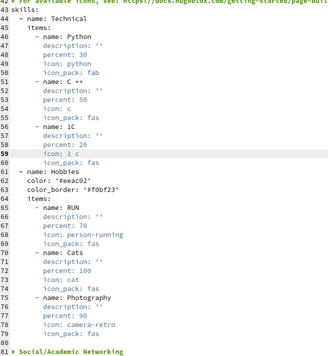{#fig:001 width=70%}

* Можем посмотреть, как изменинлся сайт (рис. [-@fig:002]).

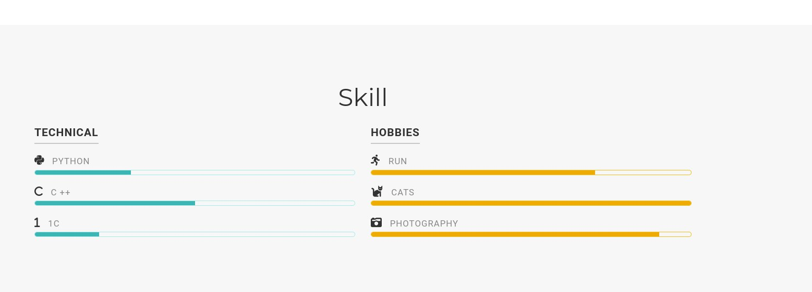{#fig:002 width=70%}

* Далее добавили информацию об опыте (Experience) (рис. [-@fig:003]).

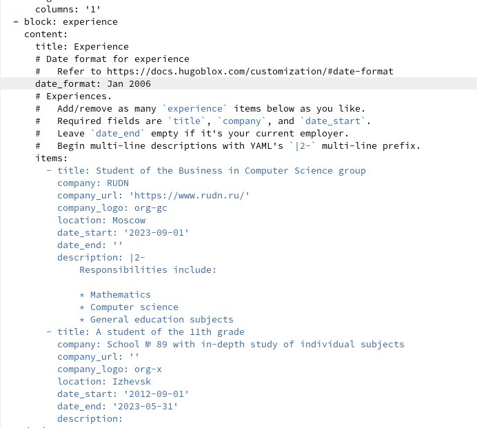{#fig:003 width=70%}

* Можем посмотреть, как изменинлся сайт (рис. [-@fig:004]).

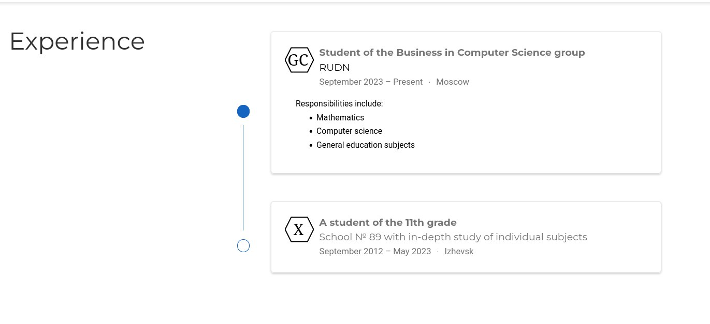{#fig:004 width=70%}

* Потом добавить информацию о достижениях (Accomplishments)  (рис. [-@fig:005]).

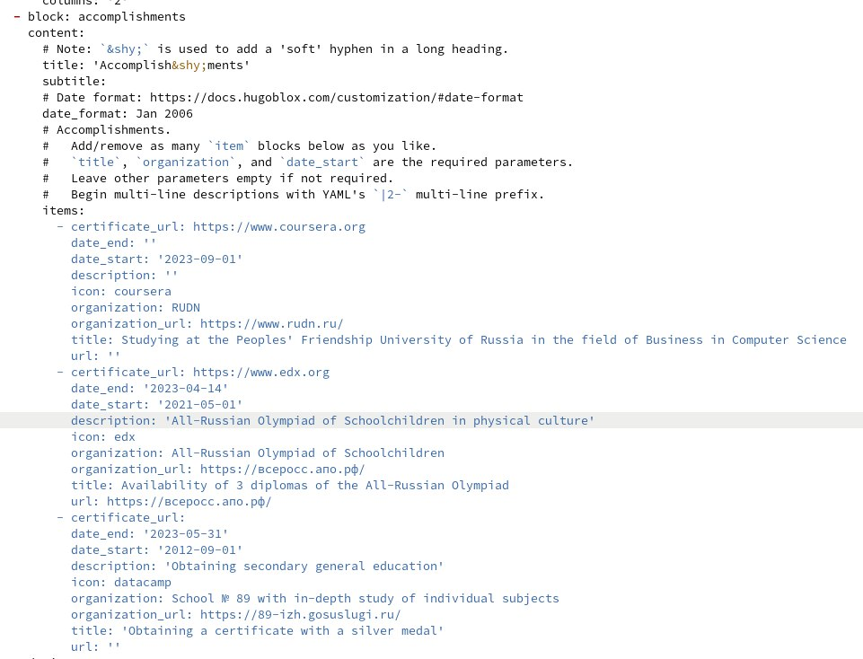{#fig:005 width=70%}

* Можем посмотреть, как изменинлся сайт (рис. [-@fig:006]).

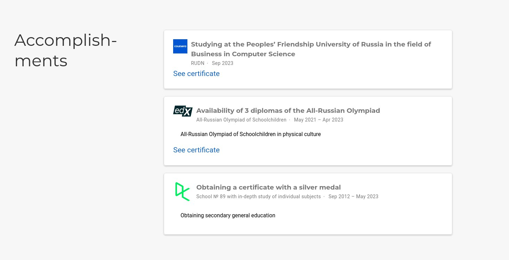{#fig:006 width=70%}

2. Переходим к созданию поста, для этого я создаю каталог last_week1 (рис. [-@fig:007]).

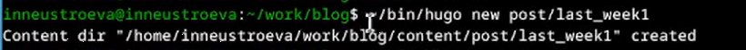{#fig:007 width=70%}

* Далее открываем c помощью gedit файл (рис. [-@fig:008]).

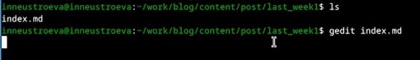{#fig:008 width=70%}

* Редактируем пост о прошедшей неделе. (рис. [-@fig:009]).

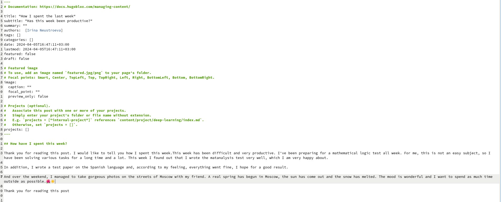{#fig:009 width=70%}

* Можем посмотреть, как изменинлся сайт (рис. [-@fig:010]).

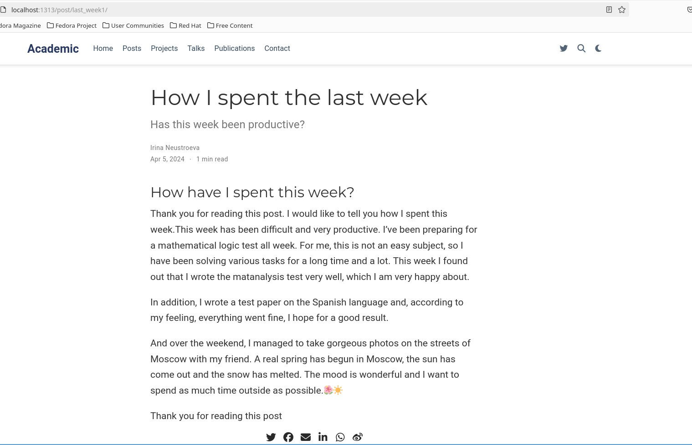{#fig:010 width=70%}

3. Далее, создаю каталог Markdown (рис. [-@fig:011]).

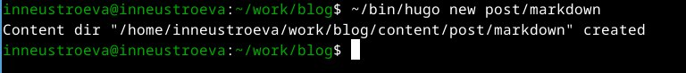{#fig:011 width=70%}

* Редактируем пост на тему Язык разметки Markdown (рис. [-@fig:012]).

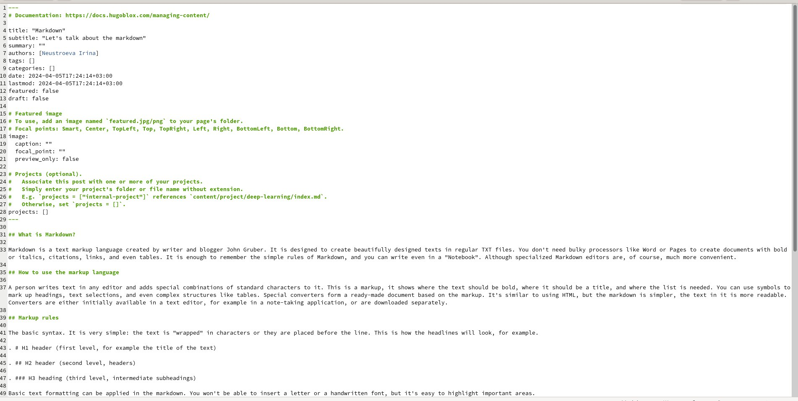{#fig:012 width=70%}

* Можем посмотреть, как изменинлся сайт (рис. [-@fig:013]).

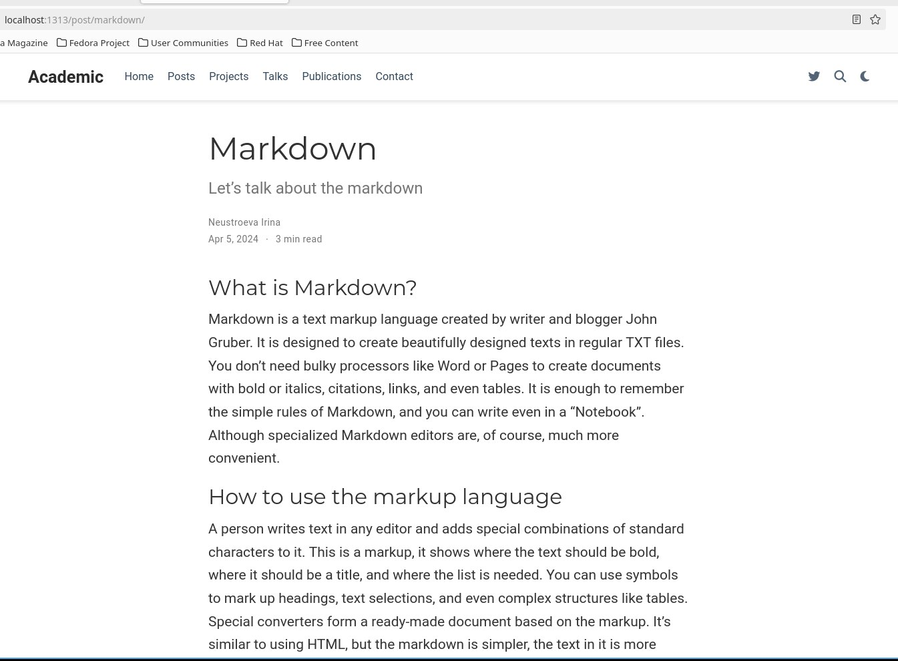{#fig:013 width=70%}

* Далее, отправляем изменения на сервер (рис. [-@fig:014]).

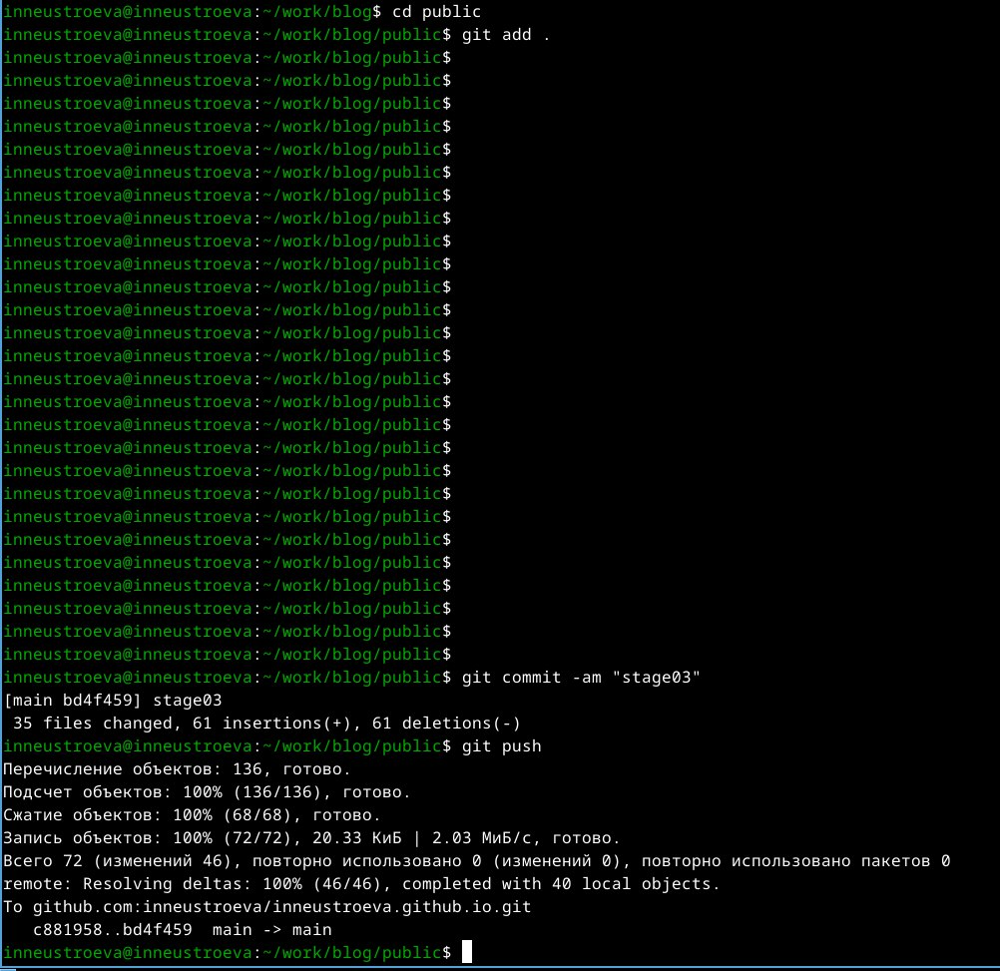{#fig:014 width=70%}

# Вывод

В данной работе мы отредактировали достижения и добавили два новых поста на наш персональный сайт 

::: {#refs}
:::
