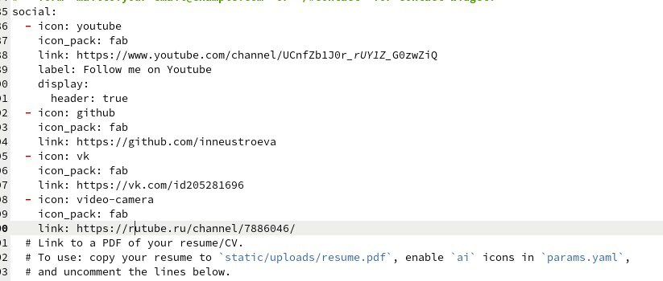
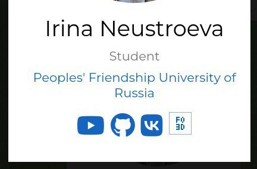
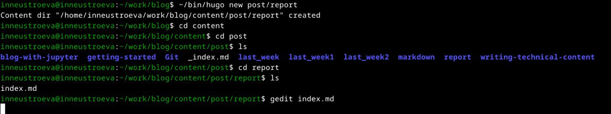
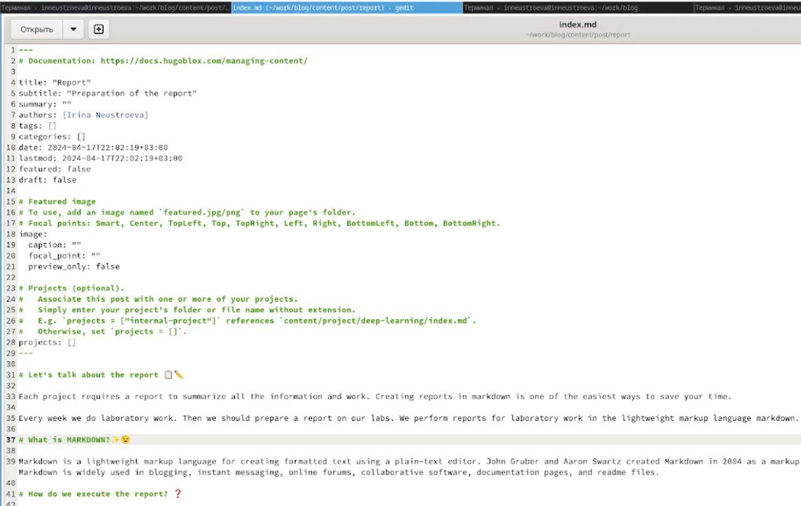
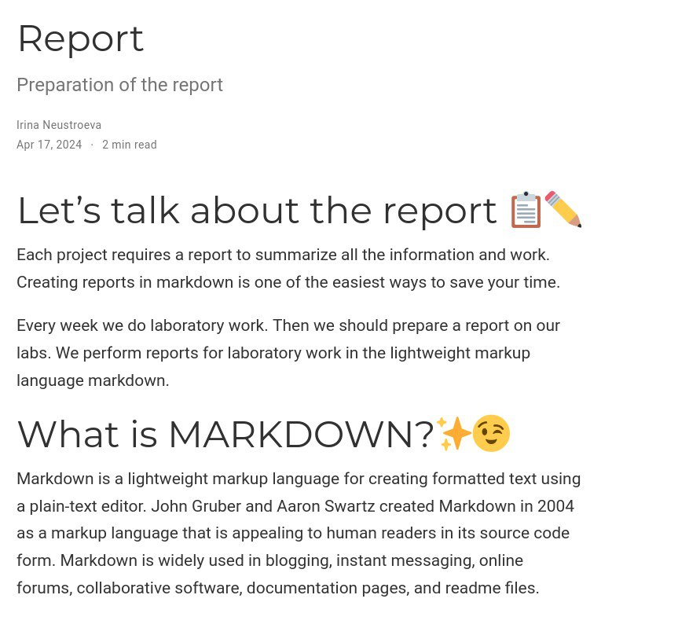
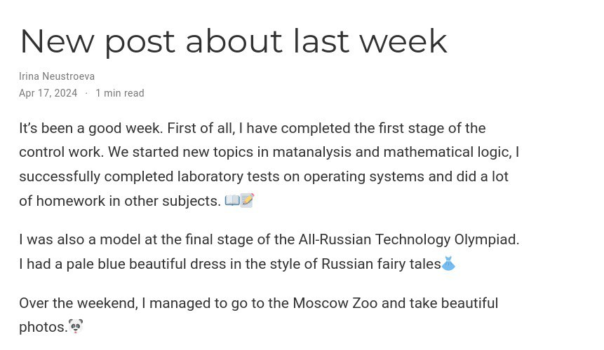

---
## Front matter
lang: ru-RU
title: Перезнтация по индивидуальному проект, 4 этап
subtitle: Персональный сайт
author:
  - Неустроева И.Н.
institute:
  - Российский университет дружбы народов, Москва, Россия
date: 17 апреля 2024

## i18n babel
babel-lang: russian
babel-otherlangs: english

## Formatting pdf
toc: false
toc-title: Содержание
slide_level: 2
aspectratio: 169
section-titles: true
theme: metropolis
header-includes:
 - \metroset{progressbar=frametitle,sectionpage=progressbar,numbering=fraction}
 - '\makeatletter'
 - '\beamer@ignorenonframefalse'
 - '\makeatother'
 
 ## Fonts
mainfont: PT Serif
romanfont: PT Serif
sansfont: PT Sans
monofont: PT Mono
mainfontoptions: Ligatures=TeX
romanfontoptions: Ligatures=TeX
sansfontoptions: Ligatures=TeX,Scale=MatchLowercase
monofontoptions: Scale=MatchLowercase,Scale=0.9
 
---

# Информация

## Докладчик

:::::::::::::: {.columns align=center}
::: {.column width="70%"}

  * Неустроева Ирина Николаевна
  * студентка группы НБИ 02-23
  * Российский университет дружбы народов
  * <https://inneustroeva.github.io/ru/>

:::
::::::::::::::

# Вводная часть

## Актуальность

Создание своего сайта очень важно для каждого современного человека и особенно aктуально для специалиста в области информационных технологий. 

# Цели 

Целью моей работы было: добавить ссылки на сайт и написать два поста.

## Основная часть

## Добавление ссылок на сайт

В папке ~/work/blog/content/authors/admin есть файл _ index.md, в который мы внесли изменения и добавили ссылки. 

## Сайт

Добавили иконки, нажав на них мы сможем перейти по ссылке на соответсвующий сайт.

## Создание поста

Создали новый пост на тему: оформление отчёта. В каталоге ~/work/blog, с помощью ~/bin/hugo new post/название.

## Редактирование поста 

Перешли в новую папку и отредактировали её. 

## Пост 

Так выглядит наш пост на сайте 

## Пост по прошедшей неделе

Добавили пост по прошедшей неделе

# Заключительная чаcть.

## Результаты

В данной работе я научилась добавлять ссылки на сайт и вспомнила как добавлять новые посты.

## Итоговый слайд

Работа над индивидуальным проектом увлекательна для меня.

