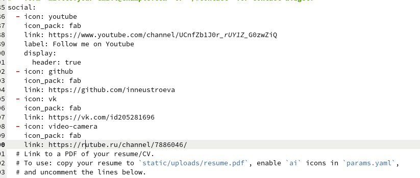
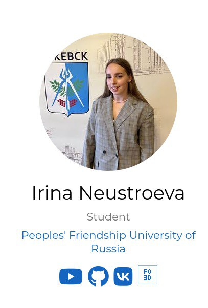
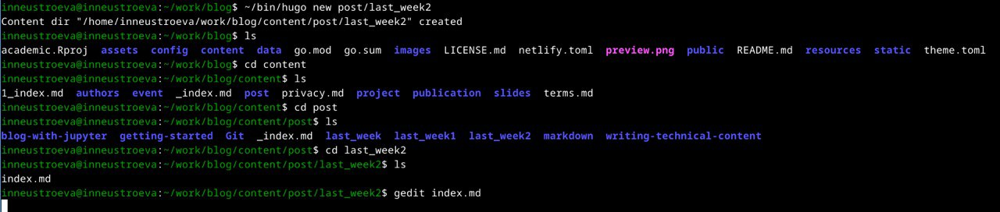
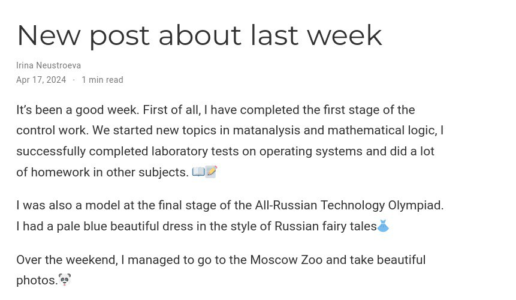
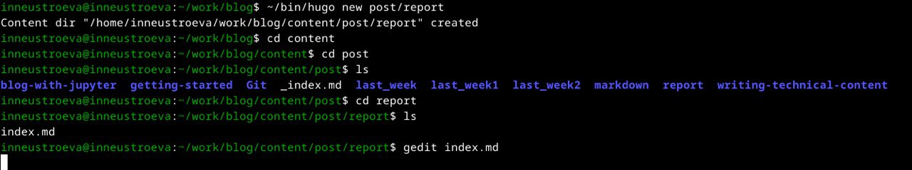
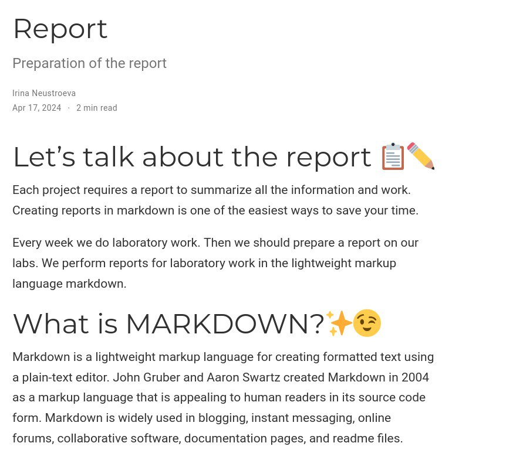
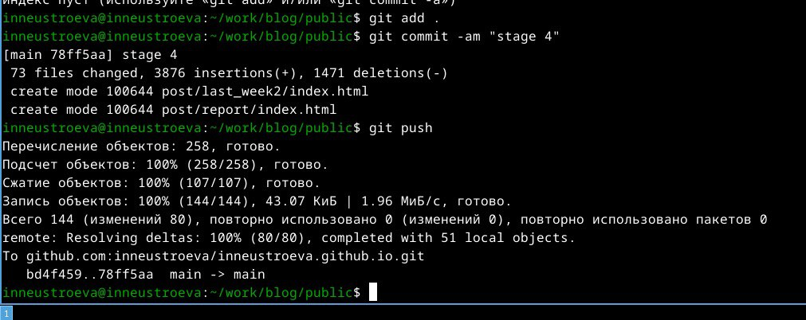

---
## Front matter
title: "Индивидуальный проект этап 4"
subtitle: "Персональный сайт"
author: "Неустроева Ирина Николаевна"

## Generic otions
lang: ru-RU 
toc-title: "Содержание"

## Bibliography
bibliography: bib/cite.bib
csl: pandoc/csl/gost-r-7-0-5-2008-numeric.csl

## Pdf output format
toc: true # Table of contents
toc-depth: 2
lof: true # List of figures
lot: true # List of tables
fontsize: 12pt
linestretch: 1.5
papersize: a4
documentclass: scrreprt
## I18n polyglossia
polyglossia-lang:
  name: russian
  options:
	- spelling=modern
	- babelshorthands=true
polyglossia-otherlangs:
  name: english
## I18n babel
babel-lang: russian
babel-otherlangs: english
## Fonts
mainfont: PT Serif
romanfont: PT Serif
sansfont: PT Sans
monofont: PT Mono
mainfontoptions: Ligatures=TeX
romanfontoptions: Ligatures=TeX
sansfontoptions: Ligatures=TeX,Scale=MatchLowercase
monofontoptions: Scale=MatchLowercase,Scale=0.9
## Biblatex
biblatex: true
biblio-style: "gost-numeric"
biblatexoptions:
  - parentracker=true
  - backend=biber
  - hyperref=auto
  - language=auto
  - autolang=other*
  - citestyle=gost-numeric
## Pandoc-crossref LaTeX customization
figureTitle: "Рис."
tableTitle: "Таблица"
listingTitle: "Листинг"
lofTitle: "Список иллюстраций"
lotTitle: "Список таблиц"
lolTitle: "Листинги"
## Misc options
indent: true
header-includes:
  - \usepackage{indentfirst}
  - \usepackage{float} # keep figures where there are in the text
  - \floatplacement{figure}{H} # keep figures where there are in the text
---

# Цель работы

Целью моей работы было: добавить ссылки на сайт и написать два поста.

# Задание 

1. Зарегистрироваться на соответствующих ресурсах и разместить на них ссылки на сайте

2. Сделать пост по прошедшей неделе.

3. Добавить пост на тему по выбору

# Выполнение лабораторной работы 

1. Для начала перешли в папку ~/work/blog/content/authors/admin и открыли папку _ index.md, затем поменяли нужные нам ссылки и поменяли иконки (рис. [-@fig:001]).

{#fig:001 width=70%}

* Вот так выглядит наш сайт теперь (рис. [-@fig:002]).

{#fig:002 width=70%}

2. Далее создали новый пост по прошедшей неделе, в каталоге ~/work/blog, с помощью ~/bin/hugo new post/название. Перешли в новый каталог, открыли папку в маркдауне и отредактировали её, нажали кнопку сохранить.( (рис. [-@fig:003]).

{#fig:003 width=70%}

* Теперь наш пост выглядит на сайте так (рис. [-@fig:004]).

{#fig:004 width=70%}

3. Тоже самое проделываем для поста на тему оформление отчёта (рис. [-@fig:005]).

{#fig:005 width=70%}

* Теперь можем посмотреть отредактированный пост на сайте (рис. [-@fig:006]).

{#fig:006 width=70%}

Далее отправляем наши изменения на сервер (рис. [-@fig:007]).

{#fig:007 width=70%} 

# Вывод

В данной работе мы написали новые посты и оставили ссылки на ресурсы.

::: {#refs}
:::
